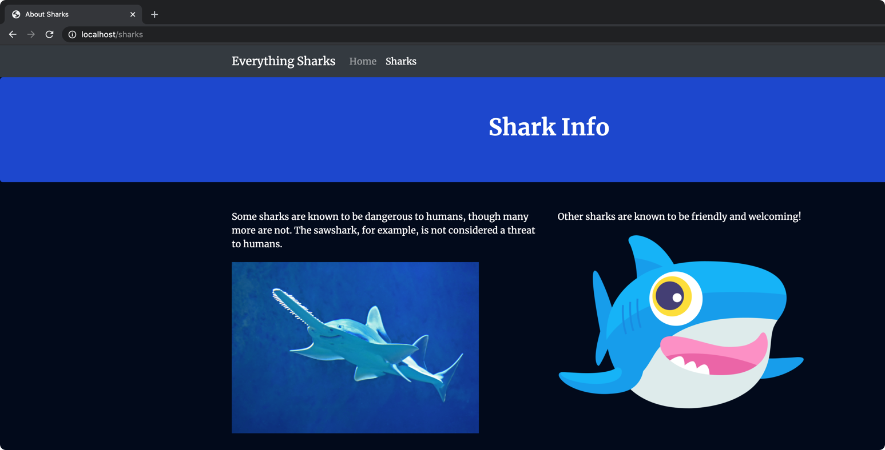

### Build a Node.js Application with Docker

[Docs](https://www.digitalocean.com/community/tutorials/how-to-build-a-node-js-application-with-docker)

- Check the versions

```bash
$ npm --version
7.5.0

$ node --version
v15.8.0
```


- Create required dirs

```bash
$ mkdir node_project
$ cd node_project
```

- Install the dependencies

```bash
$ npm install                        

added 50 packages, and audited 51 packages in 4s

found 0 vulnerabilities
```


- Run the app using

```bash
$ node app.js
Example app listening on port 8080!
/GET
/GET
/GET
/GET
^C
```


- Create Docker file

```bash
touch Dockerfile
touch .dockerignore
```

- Build the dockerfile

```bash
$ docker build -t codeaprendiz/nodejs-image-demo .
$ docker build -t codeaprendiz/nodejs-image-demo .
Sending build context to Docker daemon  46.59kB
Step 1/9 : FROM node:10-alpine
 ---> 3ac6f53a4041
Step 2/9 : RUN mkdir -p /home/node/app/node_modules && chown -R node:node /home/node/app
 ---> Running in a5d9c5f2163e
Removing intermediate container a5d9c5f2163e
 ---> 619cfbdb3074
Step 3/9 : WORKDIR /home/node/app
 ---> Running in de1346ff4728
Removing intermediate container de1346ff4728
 ---> 8844ddc9732d
Step 4/9 : COPY package*.json ./
 ---> 23eec42f9175
Step 5/9 : USER node
 ---> Running in f2ec865dc42f
Removing intermediate container f2ec865dc42f
 ---> 2c83bf0aca18
Step 6/9 : RUN npm install
 ---> Running in 93a7b6e8cf88
npm WARN read-shrinkwrap This version of npm is compatible with lockfileVersion@1, but package-lock.json was generated for lockfileVersion@2. I'll try to do my best with it!
npm WARN nodejs-image-demo@1.0.0 No repository field.

added 50 packages from 37 contributors and audited 50 packages in 2.046s
found 0 vulnerabilities

Removing intermediate container 93a7b6e8cf88
 ---> 81316b37fd6a
Step 7/9 : COPY --chown=node:node . .
 ---> a44fcf015b61
Step 8/9 : EXPOSE 8080
 ---> Running in 03e07b6e3971
Removing intermediate container 03e07b6e3971
 ---> ee7122769051
Step 9/9 : CMD [ "node", "app.js" ]
 ---> Running in fdea219aeebc
Removing intermediate container fdea219aeebc
 ---> f681017dfcdf
Successfully built f681017dfcdf
Successfully tagged codeaprendiz/nodejs-image-demo:latest
```

- check the image built

```bash
$ docker images | grep codeaprendiz
codeaprendiz/nodejs-image-demo                  latest                                                  f681017dfcdf   2 minutes ago   85.9MB
```

- create a container with the image

```bash
$ docker run --name nodejs-image-demo -p 8080:8080 -d codeaprendiz/nodejs-image-demo
a28285829e5d0c7f9d838af40ba06575ef3950846e7426b4ca2536157864e927

$ docker ps | grep nodejs-image
a28285829e5d   codeaprendiz/nodejs-image-demo   "docker-entrypoint.s…"   31 seconds ago   Up 30 seconds   0.0.0.0:80->8080/tcp   nodejs-image-demo
```

- Check if the application is up

```bash
$ curl --write-out '%{http_code}' --silent --output /dev/null http://localhost:80                                                                                              
200
```

- Login to you dockerhub

```bash
$ docker login -u codeaprendiz                                                    
Password: 
Login Succeeded
```

- Push the image to dockerhub

```bash
$ docker push codeaprendiz/nodejs-image-demo                          
```


- Images

  - Home page


  - Info page




