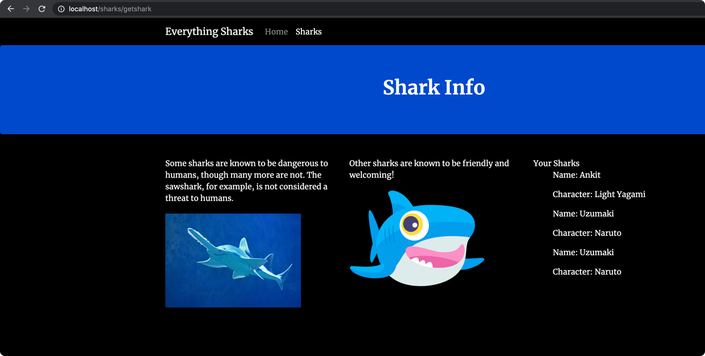

### Nodejs Application with Mongo DB in docker-compose

[docs](https://www.digitalocean.com/community/tutorials/containerizing-a-node-js-application-for-development-with-docker-compose)

- Start the application

```bash
$ docker-compose up     
Creating network "node_project_app-network" with driver "bridge"
Building nodejs
Step 1/9 : FROM node:10-alpine
10-alpine: Pulling from library/node
0a6724ff3fcd: Pull complete
21d01549d399: Pull complete
35acd139872d: Pull complete
a0b37be8639d: Pull complete
Digest: sha256:b3f5295bb1478401473cfa1a70ba5c0a0a258d3c8e9ebffdd16be4ae1a30e772
Status: Downloaded newer image for node:10-alpine
 ---> 188ff29d9659
Step 2/9 : RUN mkdir -p /home/node/app/node_modules && chown -R node:node /home/node/app
 ---> Running in 12097d62878b
Removing intermediate container 12097d62878b
 ---> 07502bb16866
Step 3/9 : WORKDIR /home/node/app
 ---> Running in 9b9e8e40eb17
Removing intermediate container 9b9e8e40eb17
 ---> 48afd4fe6bbb
Step 4/9 : COPY package*.json ./
 ---> 32425971ecdd
Step 5/9 : USER node
 ---> Running in f81e114c1900
Removing intermediate container f81e114c1900
 ---> 437741bfbc19
Step 6/9 : RUN npm install
 ---> Running in 7f8e1f6a20e0
npm WARN deprecated chokidar@2.1.8: Chokidar 2 will break on node v14+. Upgrade to chokidar 3 with 15x less dependencies.
npm WARN deprecated fsevents@1.2.13: fsevents 1 will break on node v14+ and could be using insecure binaries. Upgrade to fsevents 2.
npm WARN deprecated resolve-url@0.2.1: https://github.com/lydell/resolve-url#deprecated
npm WARN deprecated urix@0.1.0: Please see https://github.com/lydell/urix#deprecated

> nodemon@1.19.4 postinstall /home/node/app/node_modules/nodemon
> node bin/postinstall || exit 0

Love nodemon? You can now support the project via the open collective:
 > https://opencollective.com/nodemon/donate

npm WARN optional SKIPPING OPTIONAL DEPENDENCY: fsevents@^1.2.7 (node_modules/chokidar/node_modules/fsevents):
npm WARN notsup SKIPPING OPTIONAL DEPENDENCY: Unsupported platform for fsevents@1.2.13: wanted {"os":"darwin","arch":"any"} (current: {"os":"linux","arch":"x64"})

added 287 packages from 179 contributors and audited 288 packages in 13.376s
found 2 vulnerabilities (1 low, 1 high)
  run `npm audit fix` to fix them, or `npm audit` for details
Removing intermediate container 7f8e1f6a20e0
 ---> 852b4d956908
Step 7/9 : COPY --chown=node:node . .
 ---> ea730c31e066
Step 8/9 : EXPOSE 8080
 ---> Running in f9d9aae2ab97
Removing intermediate container f9d9aae2ab97
 ---> ac83696cbdd7
Step 9/9 : CMD [ "node", "app.js" ]
 ---> Running in 959e92feeb3f
Removing intermediate container 959e92feeb3f
 ---> 7dadf531639a

Successfully built 7dadf531639a
Successfully tagged nodejs:latest
WARNING: Image for service nodejs was built because it did not already exist. To rebuild this image you must use `docker-compose build` or `docker-compose up --build`.
Pulling db (mongo:4.1.8-xenial)...
4.1.8-xenial: Pulling from library/mongo
34667c7e4631: Pull complete
d18d76a881a4: Pull complete
119c7358fbfc: Pull complete
2aaf13f3eff0: Pull complete
f7833eaffdda: Pull complete
8287cb5b9daf: Pull complete
ea00040a145a: Pull complete
eeb70119a2ba: Pull complete
0a445e1756be: Pull complete
7a527014d843: Pull complete
7a95456e941d: Pull complete
d62f8c91d32b: Pull complete
36393ea51932: Pull complete
Digest: sha256:a7288360aad5e559e85bbc46ae48d6f27ca9f21b9fb6f4337d9ec93f718db94c
Status: Downloaded newer image for mongo:4.1.8-xenial
Creating db     ... done
Creating nodejs ... done
Attaching to db, nodejs
db        | 2021-02-24T18:27:39.203+0000 I CONTROL  [main] Automatically disabling TLS 1.0, to force-enable TLS 1.0 specify --sslDisabledProtocols 'none'
db        | 2021-02-24T18:27:39.205+0000 I CONTROL  [initandlisten] MongoDB starting : pid=1 port=27017 dbpath=/data/db 64-bit host=e1438b51bf11
db        | 2021-02-24T18:27:39.205+0000 I CONTROL  [initandlisten] db version v4.1.8
db        | 2021-02-24T18:27:39.205+0000 I CONTROL  [initandlisten] git version: 530a26bc5387de3dd131a18801a6c3253c4f3220
db        | 2021-02-24T18:27:39.205+0000 I CONTROL  [initandlisten] OpenSSL version: OpenSSL 1.0.2g  1 Mar 2016
db        | 2021-02-24T18:27:39.205+0000 I CONTROL  [initandlisten] allocator: tcmalloc
db        | 2021-02-24T18:27:39.205+0000 I CONTROL  [initandlisten] modules: none
db        | 2021-02-24T18:27:39.205+0000 I CONTROL  [initandlisten] build environment:
db        | 2021-02-24T18:27:39.205+0000 I CONTROL  [initandlisten]     distmod: ubuntu1604
db        | 2021-02-24T18:27:39.205+0000 I CONTROL  [initandlisten]     distarch: x86_64
db        | 2021-02-24T18:27:39.205+0000 I CONTROL  [initandlisten]     target_arch: x86_64
db        | 2021-02-24T18:27:39.205+0000 I CONTROL  [initandlisten] options: { net: { bindIp: "*" }, security: { authorization: "enabled" } }
db        | 2021-02-24T18:27:39.206+0000 I STORAGE  [initandlisten] Detected data files in /data/db created by the 'wiredTiger' storage engine, so setting the active storage engine to 'wiredTiger'.
db        | 2021-02-24T18:27:39.206+0000 I STORAGE  [initandlisten] 
db        | 2021-02-24T18:27:39.206+0000 I STORAGE  [initandlisten] ** WARNING: Using the XFS filesystem is strongly recommended with the WiredTiger storage engine
db        | 2021-02-24T18:27:39.206+0000 I STORAGE  [initandlisten] **          See http://dochub.mongodb.org/core/prodnotes-filesystem
db        | 2021-02-24T18:27:39.206+0000 I STORAGE  [initandlisten] wiredtiger_open config: create,cache_size=482M,session_max=20000,eviction=(threads_min=4,threads_max=4),config_base=false,statistics=(fast),log=(enabled=true,archive=true,path=journal,compressor=snappy),file_manager=(close_idle_time=100000),statistics_log=(wait=0),verbose=(recovery_progress),
db        | 2021-02-24T18:27:39.823+0000 I STORAGE  [initandlisten] WiredTiger message [1614191259:823290][1:0x7f13f7659a80], txn-recover: Main recovery loop: starting at 3/5120 to 4/256
db        | 2021-02-24T18:27:39.950+0000 I STORAGE  [initandlisten] WiredTiger message [1614191259:950272][1:0x7f13f7659a80], txn-recover: Recovering log 3 through 4
db        | 2021-02-24T18:27:40.051+0000 I STORAGE  [initandlisten] WiredTiger message [1614191260:51850][1:0x7f13f7659a80], txn-recover: Recovering log 4 through 4
db        | 2021-02-24T18:27:40.113+0000 I STORAGE  [initandlisten] WiredTiger message [1614191260:113181][1:0x7f13f7659a80], txn-recover: Set global recovery timestamp: (0,0)
db        | 2021-02-24T18:27:40.128+0000 I RECOVERY [initandlisten] WiredTiger recoveryTimestamp. Ts: Timestamp(0, 0)
db        | 2021-02-24T18:27:40.138+0000 I STORAGE  [initandlisten] Timestamp monitor starting
db        | 2021-02-24T18:27:40.139+0000 I CONTROL  [initandlisten] 
db        | 2021-02-24T18:27:40.139+0000 I CONTROL  [initandlisten] ** NOTE: This is a development version (4.1.8) of MongoDB.
db        | 2021-02-24T18:27:40.139+0000 I CONTROL  [initandlisten] **       Not recommended for production.
db        | 2021-02-24T18:27:40.139+0000 I CONTROL  [initandlisten] 
db        | 2021-02-24T18:27:40.154+0000 I SHARDING [initandlisten] Marking collection local.system.replset as collection version: <unsharded>
db        | 2021-02-24T18:27:40.156+0000 I SHARDING [initandlisten] Marking collection admin.system.roles as collection version: <unsharded>
db        | 2021-02-24T18:27:40.156+0000 I SHARDING [initandlisten] Marking collection admin.system.version as collection version: <unsharded>
db        | 2021-02-24T18:27:40.157+0000 I SHARDING [initandlisten] Marking collection local.startup_log as collection version: <unsharded>
db        | 2021-02-24T18:27:40.158+0000 I FTDC     [initandlisten] Initializing full-time diagnostic data capture with directory '/data/db/diagnostic.data'
db        | 2021-02-24T18:27:40.160+0000 I NETWORK  [initandlisten] Listening on /tmp/mongodb-27017.sock
db        | 2021-02-24T18:27:40.160+0000 I NETWORK  [initandlisten] Listening on 0.0.0.0
db        | 2021-02-24T18:27:40.160+0000 I SHARDING [LogicalSessionCacheRefresh] Marking collection config.system.sessions as collection version: <unsharded>
db        | 2021-02-24T18:27:40.160+0000 I NETWORK  [initandlisten] waiting for connections on port 27017
db        | 2021-02-24T18:27:40.902+0000 I NETWORK  [listener] connection accepted from 192.168.96.3:40523 #1 (1 connection now open)
db        | 2021-02-24T18:27:40.902+0000 I NETWORK  [conn1] end connection 192.168.96.3:40523 (0 connections now open)
nodejs    | [nodemon] 1.19.4
nodejs    | [nodemon] to restart at any time, enter `rs`
nodejs    | [nodemon] watching dir(s): *.*
nodejs    | [nodemon] watching extensions: js,mjs,json
nodejs    | [nodemon] starting `node app.js`
nodejs    | Example app listening on 8080!
db        | 2021-02-24T18:27:41.652+0000 I NETWORK  [listener] connection accepted from 192.168.96.3:55470 #2 (1 connection now open)
db        | 2021-02-24T18:27:41.667+0000 I NETWORK  [conn2] received client metadata from 192.168.96.3:55470 conn2: { driver: { name: "nodejs", version: "3.1.13" }, os: { type: "Linux", name: "linux", architecture: "x64", version: "4.19.121-linuxkit" }, platform: "Node.js v10.24.0, LE, mongodb-core: 3.1.11" }
db        | 2021-02-24T18:27:41.667+0000 I SHARDING [conn2] Marking collection admin.system.users as collection version: <unsharded>
db        | 2021-02-24T18:27:41.697+0000 I ACCESS   [conn2] Successfully authenticated as principal sammy on admin
nodejs    | MongoDB is connected
nodejs    | { name: 'Ankit', character: 'Light Yagami' }
db        | 2021-02-24T18:28:54.199+0000 I SHARDING [conn2] Marking collection sharkinfo.sharks as collection version: <unsharded>
db        | 2021-02-24T18:28:54.199+0000 I STORAGE  [conn2] createCollection: sharkinfo.sharks with generated UUID: 44f02943-e62c-41cc-bfdd-571db68b40fb
db        | 2021-02-24T18:28:54.205+0000 I INDEX    [conn2] index build: done building index _id_ on ns sharkinfo.sharks
nodejs    | { name: 'Uzumaki', character: 'Naruto' }
nodejs    | { name: 'Uzumaki', character: 'Naruto' }

```


- Images

  - Shark adding screen
  


  - After adding sharks to db
  
