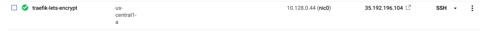
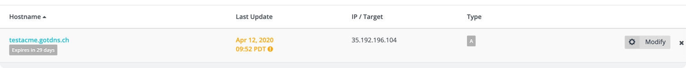

# Let's Encrypt TLS Challenge
[acme-tls](https://docs.traefik.io/user-guides/docker-compose/acme-tls/)

Steps

- Create a VM on any cloud provider (like google cloud)



- Install docker-compose

- Create a DNS record like [here](https://www.noip.com/) and assing it to the public ip of the VM created.




- The following is the `docker-compose` file

```yaml
version: "3.3"

services:

  traefik:
    image: "traefik:v2.2"
    container_name: "traefik"
    command:
      - "--log.level=DEBUG"
      - "--api.insecure=true"
      - "--providers.docker=true"
      - "--providers.docker.exposedbydefault=false"
      - "--entrypoints.websecure.address=:443"
      - "--certificatesresolvers.myresolver.acme.tlschallenge=true"
      #- "--certificatesresolvers.myresolver.acme.caserver=https://acme-staging-v02.api.letsencrypt.org/directory"
      - "--certificatesresolvers.myresolver.acme.email=ankit.codeaprendiz@company.com"
      - "--certificatesresolvers.myresolver.acme.storage=/letsencrypt/acme.json"
    ports:
      - "443:443"
      - "8080:8080"
    volumes:
      - "./letsencrypt:/letsencrypt"
      - "/var/run/docker.sock:/var/run/docker.sock:ro"

  whoami:
    image: "containous/whoami"
    container_name: "simple-service"
    labels:
      - "traefik.enable=true"
      - "traefik.http.routers.whoami.rule=Host(`testacme.gotdns.ch`)"
      - "traefik.http.routers.whoami.entrypoints=websecure"
      - "traefik.http.routers.whoami.tls.certresolver=myresolver"
```


- Finally run the following command to start the containers

```bash
root@traefik-lets-encrypt:/home/ankit# docker-compose up -d
Creating network ankit_default" with the default driver
Pulling traefik (traefik:v2.2)...
v2.2: Pulling from library/traefik
aad63a933944: Pull complete
f365f1b91ebb: Pull complete
dc367a6045f5: Pull complete
ff697159d003: Pull complete
Digest: sha256:615483752426932469aa2229ef3f0825b33b3ad7e1326dcd388205cb3a74352e
Status: Downloaded newer image for traefik:v2.2
Pulling whoami (containous/whoami:)...
latest: Pulling from containous/whoami
29015087d73b: Pull complete
0109a00d13bc: Pull complete
d3caffff64d8: Pull complete
Digest: sha256:7d6a3c8f91470a23ef380320609ee6e69ac68d20bc804f3a1c6065fb56cfa34e
Status: Downloaded newer image for containous/whoami:latest
Creating traefik        ... done
Creating simple-service ... done
```

- You can check the logs and verify if the cert is downloaded

```bash
$ docker logs traefik
...
time="2020-04-12T16:55:37Z" level=debug msg="No default certificate, generating one"
time="2020-04-12T16:55:37Z" level=debug msg="Try to challenge certificate for domain [testacme.gotdns.ch] found in HostSNI rule" providerName=myresolver.acme rule="Host(`testacme.gotdns.ch`)" routerName=whoami@docker
time="2020-04-12T16:55:37Z" level=debug msg="Looking for provided certificate(s) to validate [\"testacme.gotdns.ch\"]..." providerName=myresolver.acme rule="Host(`testacme.gotdns.ch`)" routerName=whoami@docker
time="2020-04-12T16:55:37Z" level=debug msg="Domains [\"testacme.gotdns.ch\"] need ACME certificates generation for domains \"testacme.gotdns.ch\"." providerName=myresolver.acme rule="Host(`testacme.gotdns.ch`)" routerName=whoami@docker
time="2020-04-12T16:55:37Z" level=debug msg="Loading ACME certificates [testacme.gotdns.ch]..." routerName=whoami@docker providerName=myresolver.acme rule="Host(`testacme.gotdns.ch`)"
time="2020-04-12T16:55:40Z" level=debug msg="Building ACME client..." providerName=myresolver.acme
time="2020-04-12T16:55:40Z" level=debug msg="https://acme-v02.api.letsencrypt.org/directory" providerName=myresolver.acme
time="2020-04-12T16:55:40Z" level=info msg=Register... providerName=myresolver.acme
time="2020-04-12T16:55:40Z" level=debug msg="legolog: [INFO] acme: Registering account for ankit.codeaprendiz@company.com"
time="2020-04-12T16:55:40Z" level=debug msg="Using TLS Challenge provider." providerName=myresolver.acme
time="2020-04-12T16:55:40Z" level=debug msg="legolog: [INFO] [testacme.gotdns.ch] acme: Obtaining bundled SAN certificate"
time="2020-04-12T16:55:41Z" level=debug msg="legolog: [INFO] [testacme.gotdns.ch] AuthURL: https://acme-v02.api.letsencrypt.org/acme/authz-v3/3918105100"
time="2020-04-12T16:55:41Z" level=debug msg="legolog: [INFO] [testacme.gotdns.ch] acme: use tls-alpn-01 solver"
time="2020-04-12T16:55:41Z" level=debug msg="legolog: [INFO] [testacme.gotdns.ch] acme: Trying to solve TLS-ALPN-01"
time="2020-04-12T16:55:41Z" level=debug msg="TLS Challenge Present temp certificate for testacme.gotdns.ch" providerName=acme
time="2020-04-12T16:55:47Z" level=debug msg="legolog: [INFO] [testacme.gotdns.ch] The server validated our request"
time="2020-04-12T16:55:47Z" level=debug msg="TLS Challenge CleanUp temp certificate for testacme.gotdns.ch" providerName=acme
time="2020-04-12T16:55:47Z" level=debug msg="legolog: [INFO] [testacme.gotdns.ch] acme: Validations succeeded; requesting certificates"
time="2020-04-12T16:55:50Z" level=debug msg="legolog: [INFO] [testacme.gotdns.ch] Server responded with a certificate."
time="2020-04-12T16:55:50Z" level=debug msg="Certificates obtained for domains [testacme.gotdns.ch]" providerName=myresolver.acme rule="Host(`testacme.gotdns.ch`)" routerName=whoami@docker
time="2020-04-12T16:55:50Z" level=debug msg="Configuration received from provider myresolver.acme: {\"http\":{},\"tls\":{}}" providerName=myresolver.acme
time="2020-04-12T16:55:50Z" level=debug msg="Adding certificate for domain(s) testacme.gotdns.ch"
...
```

- Also note that the following directory will be created after the execution of command
```bash
# ls
docker-compose.yaml  letsencrypt
# ls letsencrypt/
acme.json
# cat letsencrypt/acme.json | grep -A 5 "Certificates"
    "Certificates": [
      {
        "domain": {
          "main": "testacme.gotdns.ch"
        },
        "certificate": "...
...
```

- Now visit the domain to check if certificate is being generated


