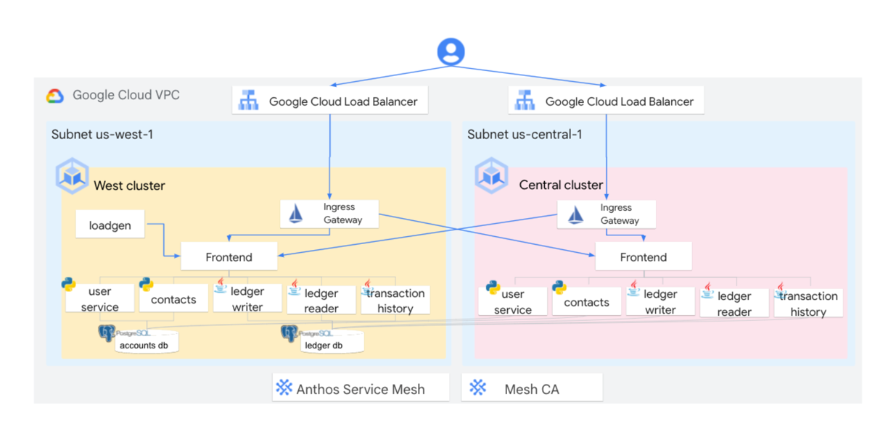
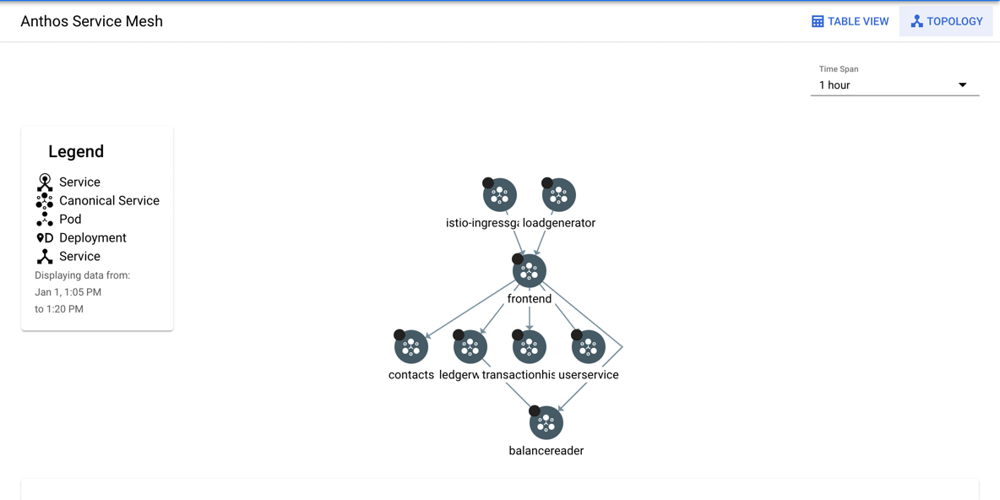

#  Anthos Service Mesh Walkthrough

[https://www.cloudskillsboost.google](https://www.cloudskillsboost.google)

[Select - Cloud Operations and Service Mesh with Anthos Course](https://www.cloudskillsboost.google)

## High Level Objectives

- Navigate Google Cloud and explore Anthos clusters from the Google Cloud Console.
- Perform east-west cross-cluster traffic routing.
- Observe distributed services, view metrics, set up SLOs, and investigate network topology.
- Use the Anthos Service Mesh Dashboards to verify security and encryption configuration.

Anthos Service Mesh (ASM) on Google Kubernetes Engine. Anthos Service Mesh is a managed service based on Istio, the leading open source service mesh

### Intro

Two GKE clusters called gke-central and gke-west have been provisioned in us-centra1 and us-west2. Anthos Service Mesh has been configured across these clusters to provide cross-cluster service discoverability and secure routing so that a microservice pod running on gke-central can seemlessly communicate with a pod on gke-west. Additionally, the Bank of Anthos application has been deployed across these two clusters as shown in the following diagram.

### Explore the app deployed in Anthos clusters

- On the Navigation menu, click Kubernetes Engine > Clusters, and verify that two Anthos clusters are registered.

- To open websites, click on the IP addresses for each of the instances of istio-ingressgateway. This will open the sign-in page for each website.
- Deposit funds or send a payment, which will create a new transaction on the shared database.
- Refresh the pages and confirm that both Transaction History and Current Balance are the same across clusters.

> Notice that even though all services are replicated across clusters, they are both using the same database because the ledger-db is only deployed on one cluster. Anthos Service Mesh routes requests to the available pods regardless of the cluster you are ingressing from. This is called east-west routing.

###  Force cross-cluster traffic routing

- To open the dashboard, click on the frontend deployment in the gke-central cluster.
- On the Actions dropdown, select Scale > Edit replicas.
- Enter 0 replicas, and click Scale.
- Return to the istio-ingressgateways IP addresses that you opened before. The application should continue to work.
- Return to your frontend deployment and scale it back to 1 replica.

### Observe distributed services

- To return to the home page of the Anthos Service Mesh dashboard, on the Navigation menu, click Anthos > Service Mesh.

- Click on the frontend workload node, and note the services called by that workload.
- Click Table view. A list of distributed services in your mesh across your two clusters is displayed.
- Click Health
- Click Create SLO.
- Select Latency as the metric, and click Continue.
- Set the latency threshhold to 350 ms, and click Continue.
- Set the Period length to Calendar day, and set the Goal to 99.5%.

### Verify service mesh security

- From the frontend service ASM Dashboard, open the Security (BETA) tab. The following diagram is displayed:

- Notice that all service to service communication has a green lock. That's because all the communication is encrypted over mutual TLS. Also, notice that an unknown source has an open red lock. That means that an unathenticated agent is accessing the frontend service that is communicating over plain text. This unathenticated agent is the browser.

