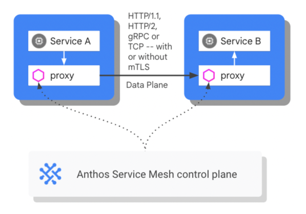
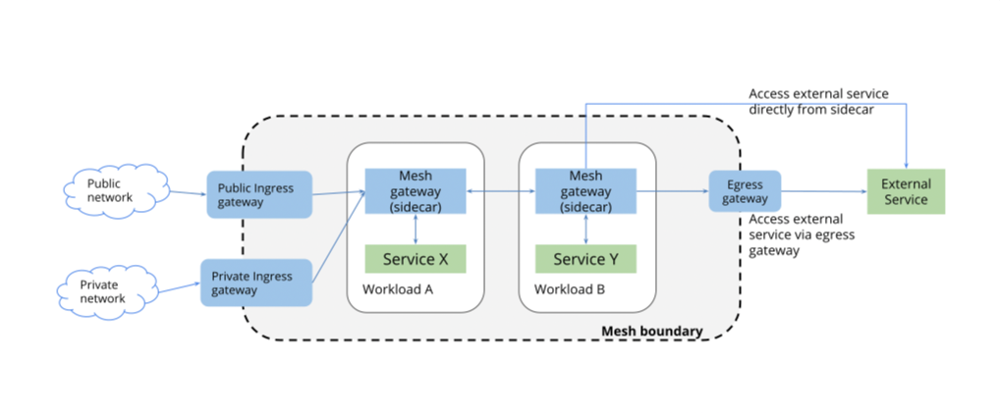

# Managing Traffic Flow with Anthos Service Mesh


[https://www.cloudskillsboost.google](https://www.cloudskillsboost.google)

[Select - Cloud Operations and Service Mesh with Anthos Course](https://www.cloudskillsboost.google)


Anthos Service Mesh’s traffic management model relies on the following two components:
- Control plane: manages and configures the Envoy proxies to route traffic and enforce polices.
- Data plane: encompasses all network communication between microservices performed at runtime by the Envoy proxies.




## Review Traffic Management use cases

- Route traffic to multiple versions of a service.

## Setup

```bash
# In Cloud Shell, set environment variables for the zone and cluster name:
export CLUSTER_NAME=gke
export CLUSTER_ZONE=us-central1-b

# Configure kubectl command line access by running:
export GCLOUD_PROJECT=$(gcloud config get-value project)
gcloud container clusters get-credentials $CLUSTER_NAME \
    --zone $CLUSTER_ZONE --project $GCLOUD_PROJECT
    
# Check that your cluster is up and running:
gcloud container clusters list


# Ensure the Kubernetes pods for the Anthos Service Mesh control plane are deployed:
kubectl get pods -n istio-system


# Ensure corresponding Kubernetes services for the Anthos Service Mesh control plane are deployed:
kubectl get service -n istio-system

# Ensure corresponding Kubernetes pods for the Anthos Service Mesh control plane are deployed, so that telemetry data is displayed in the ASM Dashboard:
kubectl get pods -n asm-system

   
```

- Verify the Bookinfo deployment

```bash
kubectl get pods

# Review running application services:
kubectl get services

```


## Install Gateways to enable ingress

In a Kubernetes environment, the Kubernetes Ingress Resource is used to specify services that should be exposed outside the cluster. In Anthos Service Mesh, a better approach, which also works in Kubernetes and other environments, is to use a Gateway resource. A Gateway allows mesh features such as monitoring, mTLS, and advanced routing capabilities rules to be applied to traffic entering the cluster.




- Install an ingress gateway in your cluster

```bash
kubectl create namespace ingress

# Label the gateway namespace with a revision label for auto-injection:
kubectl label namespace ingress \
  istio.io/rev=$(kubectl -n istio-system get pods -l app=istiod -o json | jq -r '.items[0].metadata.labels["istio.io/rev"]') \
  --overwrite
```

- Download and apply the gateway configuration files. These include the pods and services that will first receive the incoming requests from outside the cluster:

```bash
git clone https://github.com/GoogleCloudPlatform/anthos-service-mesh-packages
kubectl apply -n ingress -f anthos-service-mesh-packages/samples/gateways/istio-ingressgateway
```

- After you create the deployment, verify that the new services are working:

```bash
kubectl get pod,service -n ingress

```

- Deploy the Gateway to specify the port and protocol to be used. In this case, the gateway enables HTTP traffic over port 80:

```yaml
cat <<EOF | kubectl apply -f -
apiVersion: networking.istio.io/v1alpha3
kind: Gateway
metadata:
  name: bookinfo-gateway
  namespace: ingress
spec:
  selector:
    istio: ingressgateway
  servers:
  - port:
      number: 80
      name: http
      protocol: HTTP
    hosts:
    - "*"
EOF
```

- Verify that the Gateway and VirtualService have been created and notice that the VirtualService is pointing to the Gateway:

```bash
kubectl get gateway,virtualservice

# Save this external IP in your Cloud Shell environment:
export GATEWAY_URL=$(kubectl get svc -n ingress istio-ingressgateway \
-o=jsonpath='{.status.loadBalancer.ingress[0].ip}')
echo The gateway address is $GATEWAY_URL
```

- Generate some background traffic

```bash
sudo apt install siege

# Use siege to create traffic against your services:
siege http://${GATEWAY_URL}/productpage

```

- Access the BookInfo application

```bash
# Initialize the new Cloud Shell tab:
export CLUSTER_NAME=gke
export CLUSTER_ZONE=us-central1-b
export GCLOUD_PROJECT=$(gcloud config get-value project)
gcloud container clusters get-credentials $CLUSTER_NAME \
    --zone $CLUSTER_ZONE --project $GCLOUD_PROJECT
export GATEWAY_URL=$(kubectl get svc istio-ingressgateway \
-o=jsonpath='{.status.loadBalancer.ingress[0].ip}' -n ingress)


# Confirm that the Bookinfo application responds by sending a curl request to it from some pod, within the cluster, for example from ratings:
kubectl exec -it \
$(kubectl get pod -l app=ratings -o jsonpath='{.items[0].metadata.name}') \
-c ratings -- curl productpage:9080/productpage \
| grep -o "<title>.*</title>"

# Check that the Bookinfo app responds to a curl request sent to it from outside the cluster, using the external IP saved earlier:
curl -I http://${GATEWAY_URL}/productpage

# Open the Bookinfo application in your browser. Run this command in the Cloud Shell to get the full URL:
echo http://${GATEWAY_URL}/productpage


```

## Use the Anthos Service Mesh dashboard view routing to multiple versions

- Navigation > Anthos > Service Mesh.

