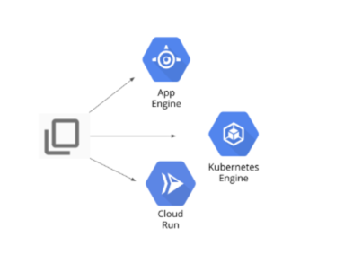

# Deploying same Python app to AppEngine, GKE, CloudRun

[https://www.cloudskillsboost.google](https://www.cloudskillsboost.google)

[Select - DevOps Engineer, SRE Learning Path](https://www.cloudskillsboost.google/paths)

## Objective



```bash
docker build -t test-python .

docker run --rm -p 8080:8080 test-python
```

- Web Preview

## Deploy to App Engine

- Create file app.yaml

```bash
# create App Engine application 
gcloud app create --region=us-central

# Deploy the app using
gcloud app deploy --version=one --quiet
```

- Navigate to App Engine dashboard
- Click on the URL
- Make changes in the `main.py` and run the following

```bash
## The --no-promote parameter tells App Engine to continue serving requests with the old version
gcloud app deploy --version=two --no-promote --quiet
```

- Now visit the URL again. You should see the same version of code.
- Go to versions in the console 
- Click on version 2 link to test it.

- Select split traffic and change to version 2 and save
- Visit the URL again and refresh

## Deploy the Kubernetes

- Create Manual k8s cluster with all defaults set
- Connect to the cluster

```bash
kubectl get nodes
```

- Make changes in `main.py` and run the following

- Create the k8s-manifests.yaml file

- Enter the following commands to use Cloud Build to create the image and store it in Container Registry
```bash
## Check the image tag created in the output
gcloud builds submit --tag gcr.io/$DEVSHELL_PROJECT_ID/devops-image:v0.2 .

## Replace this tag in the k8s-manifests.yaml
```

- Apply the changes

```bash
kubectl apply -f k8s-manifests.yaml

kubectl get pods

kubectl get svc
```

- Visit the external IP created by the service

## Deploy to CloudRun

- Make changes in the `main.py` file

- Trigger build in CloudBuild

```bash
gcloud builds submit --tag gcr.io/$DEVSHELL_PROJECT_ID/cloud-run-image:v0.1 .
```

- Go to Cloudrun in the console

- Give `Service name` as `hello-cloud-run` 
- Autoscaling max 6
- Authentication as `Allow unauthenticated invocations`
- Keep the `Container, Connections, Security ` as Default
- Create
- Visit the URL created


