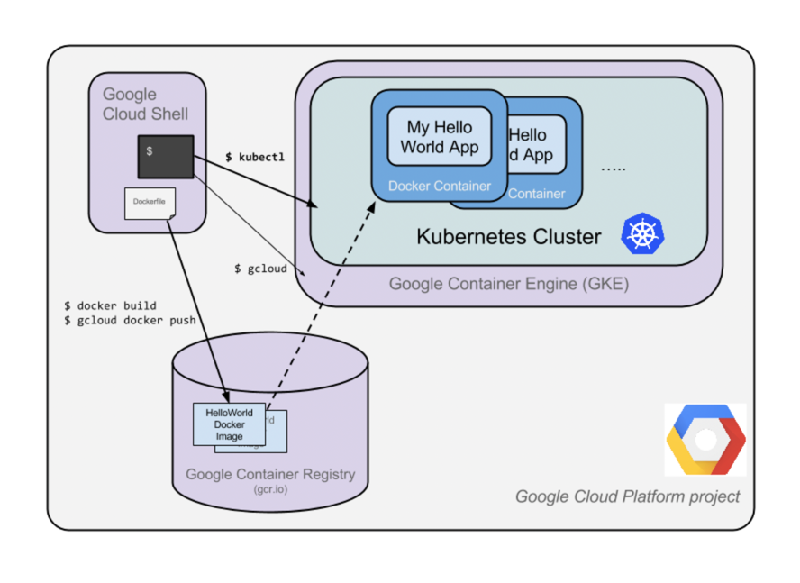

# Hello Node Kubernetes

[https://www.cloudskillsboost.google](https://www.cloudskillsboost.google)

[Select - Lab -  Hello Node Kubernetes](https://www.cloudskillsboost.google/paths)


**High Level Objectives**
- Create a Node.js server.
- Create a Docker container image. 
- Create a container cluster. 
- Create a Kubernetes pod. 
- Scale up your services.


**Skills**
- gcp
- kubernetes
- docker
- nodejs
- pods
- deployments
- services
- scaling
- load balancing


how the pieces fit together with one another




## Create Nodejs application

```bash
touch server.js

# copy the file contents


node server.js    # run the server

# in another terminal session 
curl localhost:8080
```

## Create Dockerfile

```Dockefile
# Use Node.js v6.9.2 as base image
FROM node:6.9.2

# Expose port 8080 for incoming traffic
EXPOSE 8080

# Copy the server.js file from the current directory to the image
COPY server.js .

# Set the default command to run the server.js file with Node.js
CMD node server.js
```

- Build and Run

```bash
export PROJECT_ID=$(gcloud config get-value project -q)

# Build the image with the following, replacing PROJECT_ID with your Project ID
docker build -t gcr.io/$PROJECT_ID/hello-node:v1 .

# Run the following command replacing PROJECT_ID with your Project ID
docker run -d -p 8080:8080 gcr.io/$PROJECT_ID/hello-node:v1

## Test
curl http://localhost:8080


## Check running containers
docker ps

## Stop the container
docker stop <container-id>


## Push
## Run this command, replacing PROJECT_ID with your Project ID,

gcloud auth configure-docker
docker push gcr.io/$PROJECT_ID/hello-node:v1
```

## Create your cluster

```bash
## Replace PROJECT_ID
gcloud config set project $PROJECT_ID

## Create a cluster with two n1-standard-1 nodes (this will take a few minutes to complete):
gcloud container clusters create hello-world \
                --num-nodes 2 \
                --machine-type n1-standard-1 \
                --zone us-central1-a
                
## Check the cluster in the Cloud Console
```

## Create your pod

```bash
# Create a pod with the kubectl run command
## Replace project ID
kubectl create deployment hello-node \
    --image=gcr.io/$PROJECT_ID/hello-node:v1
    
# Check deployment
kubectl get deployments

# pods
kubectl get pods

```

## Allow external traffic

```bash
# From Cloud Shell you can expose the pod to the public internet with the kubectl expose 
# command combined with the --type="LoadBalancer" flag. 
# This flag is required for the creation of an externally accessible IP
kubectl expose deployment hello-node --type="LoadBalancer" --port=8080

# Check services
kubectl get services

# Test application
curl http://<EXTERNAL-IP>:8080
```


## Scale up your service

```bash
# Scale up your service to four replicas
kubectl scale deployment hello-node --replicas=4

# Check deployment
kubectl get deployment

# Check pods
kubectl get pods

```


State of our cluster


## Roll out an upgrade to your service

- Change the server.js file to return a different message

```bash
response.end("Hello Kubernetes World!");
```

- Build and push the new image

```bash
docker build -t gcr.io/$PROJECT_ID/hello-node:v2 .

docker push gcr.io/$PROJECT_ID/hello-node:v2
```

- Edit the deployment to use the new image

```bash
kubectl set image deployment/hello-node hello-node=gcr.io/$PROJECT_ID/hello-node:v2
# OR
kubectl edit deployment hello-node
# change the image to gcr.io/PROJECT_ID/hello-node:v2
```

- Check the deployment

```bash
kubectl get deployments
```


