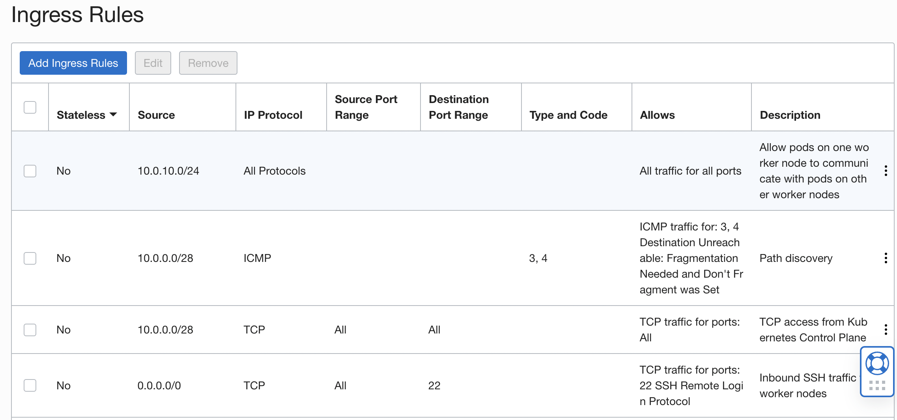
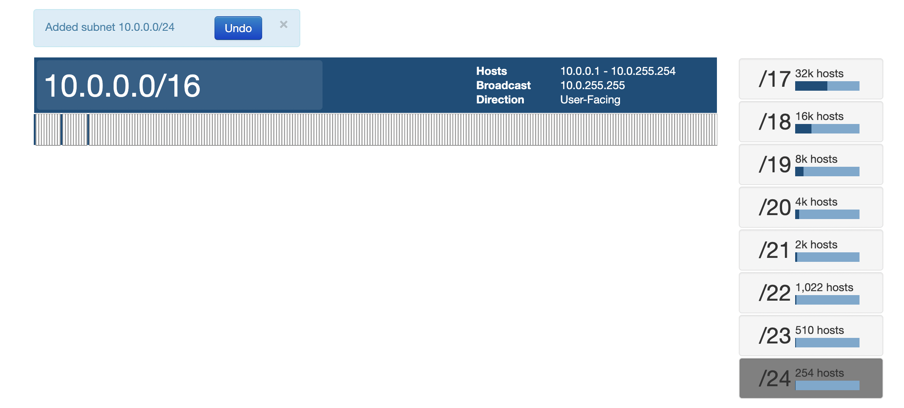

# To create a k8s cluster in OCI using Quick Create feature and understand the network topology required

We can later use this to create our own cluster using terraform

## The VCN Created

oke-vcn-quick-sandbox-k8s-a4bf5e044

- IPV4 CIDR `10.0.0.0/16`
- Default route table `oke-public-routetable-sandbox-k8s-a4bf5e044`
  

## Subnets

oke-nodesubnet-quick-sandbox-k8s-a4bf5e044-regional
- CIDR `10.0.10.0/24`
- Private

### Security List

oke-nodeseclist-quick-sandbox-k8s-a4bf5e044

#### Ingress

- 10.0.10.0/24	--------------All Protocols----->
> All traffic for all ports	
> Allow pods on one worker node to communicate with pods on other worker nodes. Anything from within the subnet can communicate with one another
- 10.0.0.0/28	--------------ICMP ------------->
> Path discovery. Anything from API endpoint subnet can communicate over ICMP 
- Anything coming from API endpoint subnet can communicate over TCP, all source ports to all destination ports
- Anything coming from Internet can communicate over TCP 22 for SSH access

#### Egress

- All ports--------ALL protocols---------> 10.0.10.0/24	(All ports).      
> Anything from within the subnet can communicate with one another. Allow pods on one worker node to communicate with pods on other worker nodes
- ALL Ports--------TCP -------> 10.0.0.0/28	- Port 6443 (API subnet)
> All ports can communicate to port 6443 of API subnet. Access to Kubernetes API Endpoint.
- ALL Ports--------TCP -------> 10.0.0.0/28	- Port 12250 (API subnet)
> All ports can communicate to port 12250 of API subnet. Kubernetes worker to control plane communication
- -----------------ICMP--------> 10.0.0.0/28
> Path Discovery
- All ports ----------------TCP-------------> All BOM Services In Oracle Services Network, 443 port
> Allow nodes to communicate with OKE to ensure correct start-up and continued functioning
-           ----------------ICMP------------> 0.0.0.0/0
> ICMP Access from Kubernetes Control Plane
- All ports  ----------------All protocols---------------> 0.0.0.0/0, All ports
> Worker Nodes access to Internet

### RouteTable

oke-private-routetable-sandbox-k8s-a4bf5e044

oke-k8sApiEndpoint-subnet-quick-sandbox-k8s-a4bf5e044-regional
- CIDR `10.0.0.0/28`
- Public

oke-svclbsubnet-quick-sandbox-k8s-a4bf5e044-regional
- CIDR `10.0.20.0/24`
- Public

