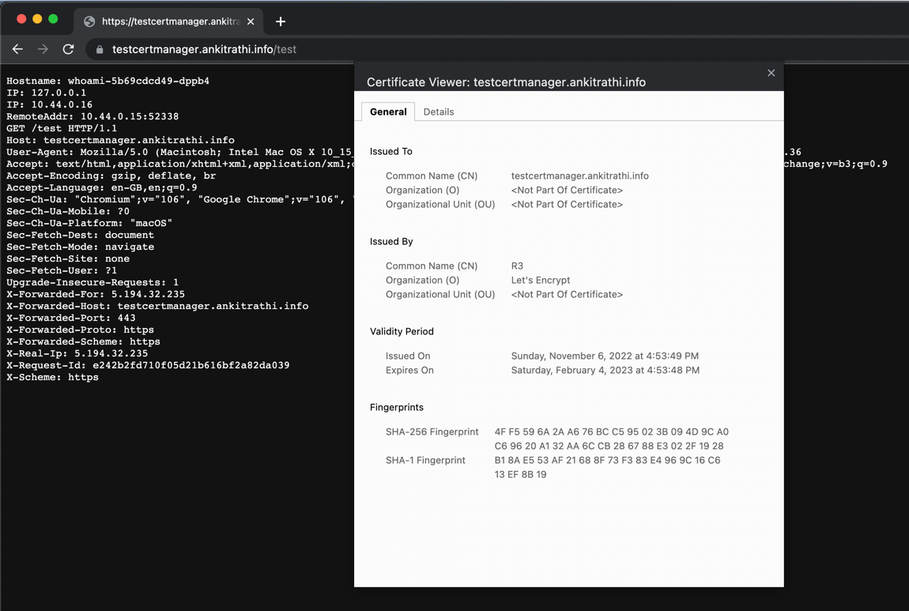

# Let's Encrypt And Cert-Manager


## Cert-Manager Releases

[cert-manager/releases/tag/v1.10.0](https://github.com/cert-manager/cert-manager/releases/tag/v1.10.0)

```bash
## Download the yaml
╰─ wget https://github.com/cert-manager/cert-manager/releases/download/v1.10.0/cert-manager.yaml
╰─ ls
ReadMe.md         cert-manager.yaml
╰─ cat cert-manager.yaml| wc -l                                          
    5518
```

- Deploy cert-manager

```bash
╰─ kubectl apply -f cert-manager.yaml

## Did it work or what ?
╰─ kubectl get all -n cert-manager
NAME                                          READY   STATUS    RESTARTS   AGE
pod/cert-manager-6dc4964c9-jd6mq              1/1     Running   0          7m57s
pod/cert-manager-cainjector-69d4647c6-mhvvf   1/1     Running   0          7m57s
pod/cert-manager-webhook-75f77865c8-52jk4     1/1     Running   0          7m57s

NAME                           TYPE        CLUSTER-IP      EXTERNAL-IP   PORT(S)    AGE
service/cert-manager           ClusterIP   10.96.236.95    <none>        9402/TCP   7m57s
service/cert-manager-webhook   ClusterIP   10.96.250.149   <none>        443/TCP    7m57s

NAME                                      READY   UP-TO-DATE   AVAILABLE   AGE
deployment.apps/cert-manager              1/1     1            1           7m57s
deployment.apps/cert-manager-cainjector   1/1     1            1           7m57s
deployment.apps/cert-manager-webhook      1/1     1            1           7m57s

NAME                                                DESIRED   CURRENT   READY   AGE
replicaset.apps/cert-manager-6dc4964c9              1         1         1       7m57s
replicaset.apps/cert-manager-cainjector-69d4647c6   1         1         1       7m57s
replicaset.apps/cert-manager-webhook-75f77865c8     1         1         1       7m57s


## Okay it did
```


## Let's deploy ingress-controller

You can download the ingress controller from [ingress-nginx/releases/tag/controller-v1.4.0](https://github.com/kubernetes/ingress-nginx/releases/tag/controller-v1.4.0)

```bash
# Deploy from downloaded dir
╰─ ls 
ReadMe.md                           cert-manager.yaml                   ingress-nginx-controller-v1.4.0     ingress-nginx-controller-v1.4.0.zip

╰─ find . -name deploy.yaml | grep cloud
./ingress-nginx-controller-v1.4.0/deploy/static/provider/cloud/deploy.yaml

# The same file is also available as raw content https://raw.githubusercontent.com/kubernetes/ingress-nginx/controller-v1.4.0/deploy/static/provider/cloud/deploy.yaml
╰─ kubectl apply -f https://raw.githubusercontent.com/kubernetes/ingress-nginx/controller-v1.4.0/deploy/static/provider/cloud/deploy.yaml                 


## See if its working
╰─ kubectl get all -n ingress-nginx
NAME                                            READY   STATUS      RESTARTS   AGE
pod/ingress-nginx-admission-create-7blsw        0/1     Completed   0          2m18s
pod/ingress-nginx-admission-patch-58bm7         0/1     Completed   0          2m18s
pod/ingress-nginx-controller-7844b9db77-kptln   1/1     Running     0          2m18s

NAME                                         TYPE           CLUSTER-IP     EXTERNAL-IP   PORT(S)                      AGE
service/ingress-nginx-controller             LoadBalancer   10.96.54.164   <pending>     80:32367/TCP,443:31957/TCP   2m18s
service/ingress-nginx-controller-admission   ClusterIP      10.96.13.5     <none>        443/TCP                      2m18s

NAME                                       READY   UP-TO-DATE   AVAILABLE   AGE
deployment.apps/ingress-nginx-controller   1/1     1            1           2m18s

NAME                                                  DESIRED   CURRENT   READY   AGE
replicaset.apps/ingress-nginx-controller-7844b9db77   1         1         1       2m18s

NAME                                       COMPLETIONS   DURATION   AGE
job.batch/ingress-nginx-admission-create   1/1           18s        2m18s
job.batch/ingress-nginx-admission-patch    1/1           19s        2m18s
```

## Nginx will create a external IP svc. This svc is the one which you should attach to your DNS

```bash
ingress-nginx   ingress-nginx-controller             LoadBalancer   10.48.14.196   34.66.238.103   80:31487/TCP,443:30253/TCP   62s
ingress-nginx   ingress-nginx-controller-admission   ClusterIP      10.48.7.20     <none>          443/TCP

# Let's bind this IP with our domain

$ nslookup testcertmanager.ankitrathi.info                          
Server:         192.168.1.1
Address:        192.168.1.1#53

Non-authoritative answer:
Name:   testcertmanager.ankitrathi.info
Address: 34.66.238.103
```

## Let's add a cluster-isser.yaml

[cert-manager.io/docs/configuration/acme/](https://cert-manager.io/docs/configuration/acme/)


- Apply the changes

```bash
╰─ kubectl apply -f cluster-issuer.yaml                                                                                                  
clusterissuer.cert-manager.io/letsencrypt-staging created

╰─ kubectl get ClusterIssuer              
NAME                  READY   AGE
letsencrypt-staging   False   53s

## Make sure you change with a valid email address
╰─ cat cluster-issuer.yaml| grep email
    # You must replace this email address with your own.
    email: kedesom362@corylan.com

```

- Let's deploy a sample application like [traefik/whoami](https://doc.traefik.io/traefik/getting-started/quick-start-with-kubernetes/)

```bash
╰─ kubectl apply -f dep-whoami.yaml    
deployment.apps/whoami created

╰─ kubectl get pods                
NAME                      READY   STATUS    RESTARTS   AGE
whoami-5dfdf459f4-4nzcd   1/1     Running   0          64s

╰─ kubectl get deployment
NAME     READY   UP-TO-DATE   AVAILABLE   AGE
whoami   1/1     1            1           3m7s

```

- Let's expose the dep using a svc

```bash
$ kubectl apply -f svc.yaml
service/whoami created

$ kubectl get svc
NAME         TYPE        CLUSTER-IP   EXTERNAL-IP   PORT(S)        AGE
kubernetes   ClusterIP   10.48.0.1    <none>        443/TCP        50m
whoami       NodePort    10.48.3.74   <none>        80:32210/TCP   35s
```


- Create Ingress

[configuration/ingress-resources/basic-configuration](https://docs.nginx.com/nginx-ingress-controller/configuration/ingress-resources/basic-configuration/)

- Without `tls` section enabled

```bash
$ kubectl apply -f ingress.yaml
ingress.networking.k8s.io/whoami-ingress created
```

## Let's create a certificate.yaml

[cert-manager.io/docs/concepts/certificate](https://cert-manager.io/docs/concepts/certificate/)


```bash
$ kubectl apply -f certificate.yaml 
``` 

## Seeing the changes

```bash
$ kubectl get certificate
NAME       READY   SECRET       AGE
acme-crt   False   tls-secret   14s

$ kubectl get ingress
NAME                        CLASS    HOSTS                             ADDRESS         PORTS     AGE
cm-acme-http-solver-7qlr4   <none>   testcertmanager.ankitrathi.info   34.66.238.103   80        16s
whoami-ingress              <none>   testcertmanager.ankitrathi.info   34.66.238.103   80, 443   83s

$ kubectl describe ingress cm-acme-http-solver-7qlr4
Name:             cm-acme-http-solver-7qlr4
Labels:           acme.cert-manager.io/http-domain=3409775745
                  acme.cert-manager.io/http-token=1157435119
                  acme.cert-manager.io/http01-solver=true
Namespace:        default
Address:          34.66.238.103
Ingress Class:    <none>
Default backend:  <default>
Rules:
  Host                             Path  Backends
  ----                             ----  --------
  testcertmanager.ankitrathi.info
                                   /.well-known/acme-challenge/jfTh_C4Dr_l-n6UUZUUzYkpU32xSJS-xFpzbWn6oYKw   cm-acme-http-solver-fhkr2:8089 (10.44.0.17:8089)
Annotations:                       kubernetes.io/ingress.class: nginx
                                   nginx.ingress.kubernetes.io/whitelist-source-range: 0.0.0.0/0,::/0
Events:
  Type    Reason  Age                From                      Message
  ----    ------  ----               ----                      -------
  Normal  Sync    21s (x2 over 23s)  nginx-ingress-controller  Scheduled for sync
  
  
$ kubectl get certificate
NAME       READY   SECRET       AGE
acme-crt   True    tls-secret   48s
```


## HTTPS

- Curl req

```bash
$ curl -v https://testcertmanager.ankitrathi.info/test
*   Trying 34.66.238.103:443...
* Connected to testcertmanager.ankitrathi.info (34.66.238.103) port 443 (#0)
* ALPN, offering h2
* ALPN, offering http/1.1
* successfully set certificate verify locations:
*  CAfile: /etc/ssl/certs/ca-certificates.crt
*  CApath: /etc/ssl/certs
* TLSv1.3 (OUT), TLS handshake, Client hello (1):
* TLSv1.3 (IN), TLS handshake, Server hello (2):
* TLSv1.3 (IN), TLS handshake, Encrypted Extensions (8):
* TLSv1.3 (IN), TLS handshake, Certificate (11):
* TLSv1.3 (IN), TLS handshake, CERT verify (15):
* TLSv1.3 (IN), TLS handshake, Finished (20):
* TLSv1.3 (OUT), TLS change cipher, Change cipher spec (1):
* TLSv1.3 (OUT), TLS handshake, Finished (20):
* SSL connection using TLSv1.3 / TLS_AES_256_GCM_SHA384
* ALPN, server accepted to use h2
* Server certificate:
*  subject: CN=testcertmanager.ankitrathi.info
*  start date: Nov  6 12:53:49 2022 GMT
*  expire date: Feb  4 12:53:48 2023 GMT
*  subjectAltName: host "testcertmanager.ankitrathi.info" matched cert's "testcertmanager.ankitrathi.info"
*  issuer: C=US; O=Let's Encrypt; CN=R3
*  SSL certificate verify ok.
* Using HTTP2, server supports multi-use
* Connection state changed (HTTP/2 confirmed)
* Copying HTTP/2 data in stream buffer to connection buffer after upgrade: len=0
* Using Stream ID: 1 (easy handle 0x5640b2aaa2c0)
> GET /test HTTP/2
> Host: testcertmanager.ankitrathi.info
> user-agent: curl/7.74.0
> accept: */*
>
* TLSv1.3 (IN), TLS handshake, Newsession Ticket (4):
* TLSv1.3 (IN), TLS handshake, Newsession Ticket (4):
* old SSL session ID is stale, removing
* Connection state changed (MAX_CONCURRENT_STREAMS == 128)!
< HTTP/2 200
< date: Sun, 06 Nov 2022 13:59:33 GMT
< content-type: text/plain; charset=utf-8
< content-length: 443
< strict-transport-security: max-age=15724800; includeSubDomains
<
Hostname: whoami-5b69cdcd49-dppb4
IP: 127.0.0.1
IP: 10.44.0.16
RemoteAddr: 10.44.0.15:58034
GET /test HTTP/1.1
Host: testcertmanager.ankitrathi.info
User-Agent: curl/7.74.0
Accept: */*
X-Forwarded-For: 35.204.200.191
X-Forwarded-Host: testcertmanager.ankitrathi.info
X-Forwarded-Port: 443
X-Forwarded-Proto: https
X-Forwarded-Scheme: https
X-Real-Ip: 35.204.200.191
X-Request-Id: 8721f6ff5af0e5ade81015554ef8f443
X-Scheme: https

* Connection #0 to host testcertmanager.ankitrathi.info left intact
```

- Browser Req

