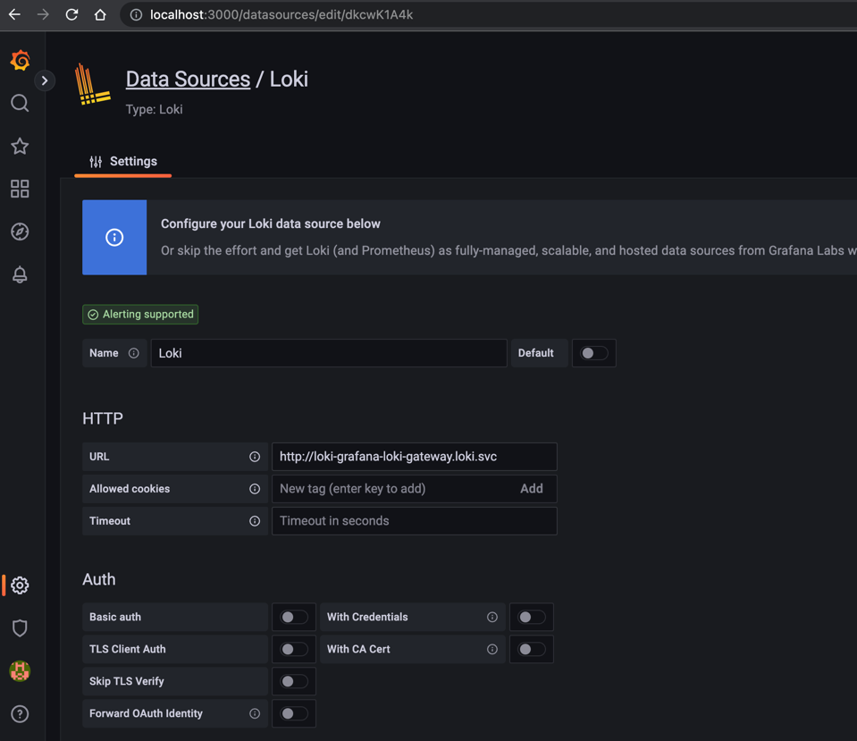

# Loki

[bitnami/grafana-loki](https://github.com/bitnami/charts/tree/main/bitnami/grafana-loki)
[bitnami.com/stack/grafana-loki/helm](https://bitnami.com/stack/grafana-loki/helm)

- Ensure that you have completed the [task-local-039-kind-kube-prometheus--grafana-alertmanager](task-local-039-kind-kube-prometheus--grafana-alertmanager) and we will continue from there

```bash
## Grafana should be up
kubectl --namespace monitoring port-forward svc/grafana 3000
Forwarding from 127.0.0.1:3000 -> 3000
Forwarding from [::1]:3000 -> 3000
```


```bash
$ helm repo add bitnami https://charts.bitnami.com/bitnami

$ helm repo list                                          
NAME    URL                               
bitnami https://charts.bitnami.com/bitnami

$ helm pull bitnami/grafana-loki

$  ls
ReadMe.md              grafana-loki-2.5.6.tgz

$ tar -xvf grafana-loki-2.5.6.tgz

$ ls
ReadMe.md              grafana-loki           grafana-loki-2.5.6.tgz

# To check available versions
$ helm show chart grafana-loki | tail -n 2
version: 2.5.6

$ kubectl create ns loki 

## --create-namespace will create a namespace if it does not exist
## --namespace <namespace-name> to install resources in that specific namespace
## --include-crds : By default, when you install a chart that contains CRDs, Helm only installs the resources defined in the chart's templates directory, and does not install the CRDs themselves. The --include-crds option allows you to explicitly include the CRDs in the chart installation
## --version : The --version option in Helm is used to specify the version of a chart to install
$ helm template loki \
--namespace loki \
--include-crds \
--version v2.5.6 \
grafana-loki > loki.yaml
```

- Apply the manifests

```bash
$ kubectl apply -f loki.yaml 

$ kubectl get pods -n loki                                    
NAME                                               READY   STATUS    RESTARTS      AGE
loki-grafana-loki-compactor-755b48f75c-szkqf       1/1     Running   0             51m
loki-grafana-loki-distributor-54868f7c57-gkzsl     1/1     Running   0             51m
loki-grafana-loki-gateway-6f57fcb59-ltztw          1/1     Running   0             51m
loki-grafana-loki-ingester-0                       1/1     Running   0             51m
loki-grafana-loki-promtail-dbd49                   1/1     Running   0             51m
loki-grafana-loki-querier-0                        1/1     Running   0             51m
loki-grafana-loki-query-frontend-5b5c7f456-82dbf   1/1     Running   1 (49m ago)   51m
loki-memcachedchunks-0                             1/1     Running   0             51m
loki-memcachedfrontend-0                           1/1     Running   0             51m
loki-memcachedindexqueries-0                       1/1     Running   0             51m
```

- Get the svc for loki

```bash
kubectl get svc -n loki | grep gateway
loki-grafana-loki-gateway                   ClusterIP   10.96.33.166    <none>        80/TCP              55m
```


- Now let's add this to Grafana as a datasource. Go to `Settings > Data Sources > Add data source` and in the URL section
  add `http://loki-grafana-loki-gateway.loki.svc` and hit `Save and test` 




- Let's create a pod that creates logs

```yaml
apiVersion: v1
kind: Pod
metadata:
  name: log-generator
spec:
  containers:
    - name: log-generator
      image: alpine
      command:
        - sh
        - -c
        - while true; do echo $(date) Hello World!; sleep 1; done
  restartPolicy: Never
```

- Apply

```bash
$ kubectl apply -f log-generator-pod.yaml 
pod/log-generator created

$ kubectl logs -f log-generator                                                 
Sat Feb 4 16:58:47 UTC 2023 Hello World!
Sat Feb 4 16:58:48 UTC 2023 Hello World!
..

```


- See the logs

- Select `Explore`, ensure that datasource is selected as `Loki`. In the `label filter` select `pod` and in the value select
  `log-generator` and hit `Run Query`


- Remove extra folders if required

```bash
$ rm -rf grafana-loki grafana-loki-2.5.6.tgz 
```