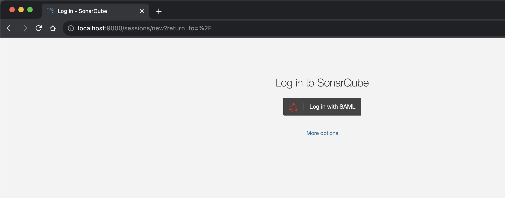
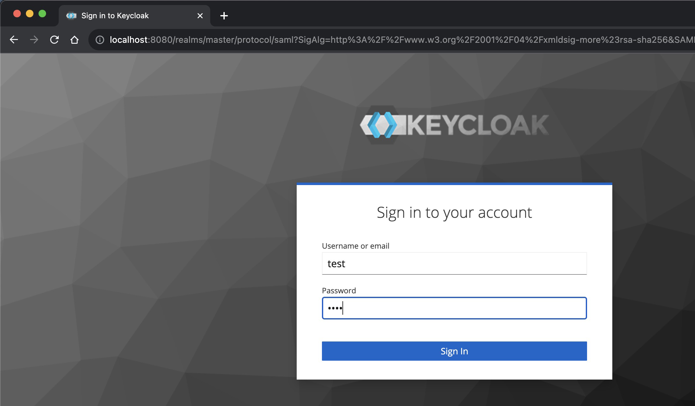
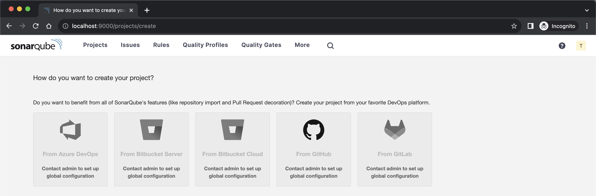
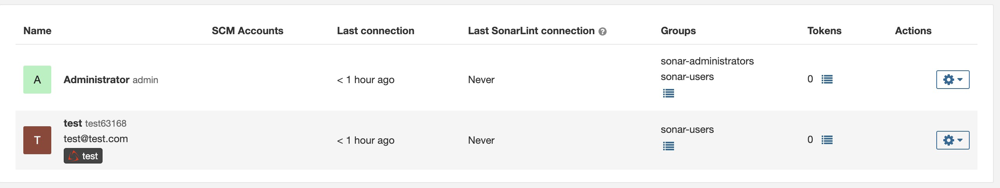
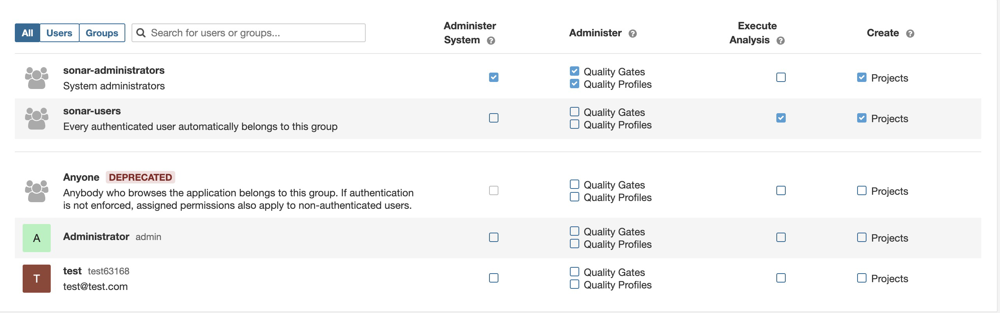
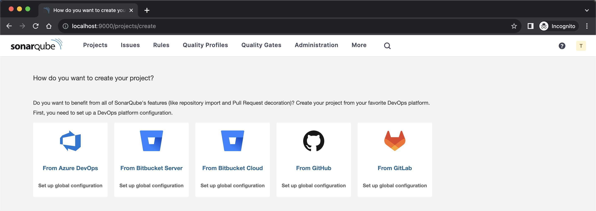

# Sonarqube -- Keycloak -- SAML

- [Sonarqube » v10.1 » Instance administration » Authentication and provisioning » SAML » How to set up Keycloak](https://docs.sonarsource.com/sonarqube/latest/instance-administration/authentication/saml/how-to-set-up-keycloak/)

## High Level Objectives

- Setup SAML-based Authentication
- Generate Keys and Certificates
- Configure Identity Provider (Keycloak) and Service Provider (Sonarqube)

## Theory

The integration of SonarQube with Keycloak using SAML (Security Assertion Markup Language) forms a unified authentication system that allows users to be authenticated by a single identity provider (Keycloak) and gain access to a service provider (SonarQube). Here's an overview of the architecture and a detailed explanation of how the different pieces fit together.

### Identity Provider and Service Provider

In the context of authentication using Security Assertion Markup Language (SAML), the terms "Identity Provider" (IdP) and "Service Provider" (SP) refer to specific roles within the authentication process. Let's look at the definitions and responsibilities of each:

#### Identity Provider (IdP)

The Identity Provider, often abbreviated as IdP, is a system that creates, maintains, and manages identity information for principals (i.e., users) while providing authentication services to relying applications within a federation.

##### What is Federation

Federation, in this context, refers to the establishment of trust and communication between multiple independent systems (or identity domains). In a federation, different organizations or entities (such as companies, universities, government agencies, etc.) maintain their own identity systems, known as Identity Providers (IdPs). These IdPs can communicate and share identity information with each other securely.

For example, consider two organizations, A and B, each having their own IdP. They can establish a federation between their IdPs, allowing users from organization A to access services provided by organization B without needing separate credentials for each domain. When a user from organization A tries to access a service in organization B, they are redirected to their own IdP (IdP of organization A) for authentication. Once authenticated, the user's IdP generates a token (like a SAML assertion) containing identity information, and this token is sent to the service provider (organization B) to grant access.

##### Responsibilities of IdP

- **Authentication**: It authenticates users by verifying their identity, typically through a username and password, but possibly using other methods like multi-factor authentication (MFA).
- **Identity Management**: It stores and manages user identity information, such as usernames, emails, roles, and other attributes.
- **SAML Assertion Generation**: After successful authentication, the IdP generates a SAML assertion containing the user's identity information and potentially additional attributes. This assertion is used to inform the Service Provider that the user has been authenticated.
- **Encryption and Signature**: It may encrypt and sign the SAML assertion to ensure integrity and confidentiality.

In the given configuration, Keycloak is playing the role of the Identity Provider.

#### Service Provider (SP)

The Service Provider, or SP, refers to the entity that provides services, such as a web application, to the user. It relies on the Identity Provider to authenticate users.

##### Responsibilities of SP

- **Redirection for Authentication**: When a user tries to access the service, the SP redirects them to the IdP for authentication, initiating the SAML authentication process.
- **SAML Response Handling**: After the IdP authenticates the user, the SP receives the SAML assertion, verifies it (e.g., by checking the signature), and extracts the necessary information about the user.
- **Authorization**: Based on the information in the SAML assertion, the SP determines what access and privileges the user should have within the application.
- **Creating User Session**: If the SAML assertion is valid, the SP creates a user session, allowing the user to interact with the application.

In the given configuration, SonarQube is acting as the Service Provider.

#### Conclusion

In a SAML-based authentication flow, the Identity Provider is responsible for authenticating users and issuing SAML assertions, while the Service Provider relies on those assertions to grant access to its services. The separation of these roles enables Single Sign-On (SSO) capabilities, allowing users to authenticate once with the IdP and gain access to multiple SPs without re-entering their credentials. It also facilitates the integration of various applications and services within an organization, as they can all rely on a central IdP for authentication.

### 1. High-level Architecture of our local setup

**1.1 SonarQube**: A continuous inspection engine that checks the code quality of various programming languages.

**1.2 Keycloak**: An open-source Identity and Access Management (IAM) tool that provides SAML-based authentication and authorization services.

**1.3 SAML**: A standard for exchanging authentication and authorization data between parties, particularly between an identity provider (Keycloak) and a service provider (SonarQube).

### 2. Key Parts of the Configuration

**2.1 Generating Private Key and Certificate**: This is essential for securing the SAML communication. The keys and certificates are used to sign and encrypt the SAML assertions, ensuring integrity and confidentiality.

**2.2 Starting Keycloak with Docker**: Keycloak is run as a containerized application, making deployment and scaling more manageable.

**2.3 Setting Up Keycloak**: Configuration of Keycloak to recognize SonarQube as a SAML client, importing the generated certificates, and setting up the SAML client details.

**2.4 SonarQube Configuration**: This part involves configuring SonarQube to recognize Keycloak as the SAML identity provider and mapping user attributes.

**2.5 User Management**: Creating users in Keycloak, which can be authenticated to access SonarQube.

### 3. Detailed Workflow

1. **User Initiates Login**: The user clicks on the 'Login with SAML' button on the SonarQube web page.

2. **SAML Authentication Request**: SonarQube generates a SAML authentication request and redirects the user's browser to Keycloak.

3. **Keycloak Authentication**: Keycloak authenticates the user, often through a username/password form, and generates a SAML assertion.

4. **Encrypting and Signing Assertions**: Keycloak encrypts and signs the SAML assertion using the configured keys and certificates.

5. **SAML Response to SonarQube**: Keycloak redirects the browser back to SonarQube with the SAML response containing the encrypted and signed assertion.

6. **SonarQube Validates SAML Response**: SonarQube verifies the signature, decrypts the assertion, and maps the user attributes (login, name, email).

7. **Access Granted**: If the validation is successful, SonarQube grants access to the user, and the user's role and privileges in SonarQube are determined.

8. **Admin Interaction**: Administrators can manage user permissions in SonarQube, and those permissions will reflect in the user's session.

### How and where are we using the keys and certificates?

In the context of SAML authentication between SonarQube (Service Provider, SP) and Keycloak (Identity Provider, IdP), certificates and private keys play crucial roles in ensuring the integrity, authenticity, and confidentiality of the information exchanged. Here's how and when they are used in this task:

#### 1. Generation of Private Key and Certificate

The private key and the corresponding public key certificate are generated using OpenSSL commands. The private key is kept secret, and the corresponding public key is encapsulated within the certificate.

#### 2. Usage in Keycloak (Identity Provider)

##### 2.1 Signing SAML Assertions

- **Private Key**: Keycloak uses the private key to sign SAML assertions. Signing the assertion ensures that it hasn't been tampered with during transit. The recipient (SonarQube) can verify the signature using the corresponding public key contained in the certificate.

- **Certificate**: When configuring Keycloak, the certificate (containing the public key) is imported. This certificate may be shared with the Service Provider or made publicly available, enabling the SP to verify the signature on the SAML assertions.

##### 2.2 Encrypting SAML Assertions

- **Private Key**: If encryption is enabled, the IdP might use the private key for encryption-related processes, such as key exchange mechanisms.

- **Certificate**: The certificate can also be used in encryption mechanisms, allowing the SP to securely communicate encryption keys or encrypt data in a way that only the corresponding private key can decrypt.

#### 3. Usage in SonarQube (Service Provider)

##### 3.1 Verifying SAML Assertions

- **Certificate**: SonarQube uses the certificate (specifically, the public key within it) to verify the signature on the SAML assertions received from Keycloak. By verifying the signature, SonarQube ensures that the assertion is authentic and hasn't been altered.

##### 3.2 Decrypting SAML Assertions

- **Private Key**: If the SAML assertions are encrypted by Keycloak, SonarQube will need the corresponding private key to decrypt them. This ensures that only SonarQube can read the encrypted information.

#### 4. Packaging and Conversion

During the task, you'll notice the private key is converted to PKCS#8 format, and a PKCS#12 keystore is created. These conversions ensure compatibility with various systems and standards.

- **PKCS#8**: This is a standard for private key information, providing a consistent way to store and transport private keys.
- **PKCS#12**: This is a standard for storing multiple cryptography objects (such as a private key and certificate) in a single, password-protected file. It's used in the task to create a keystore containing both the certificate and the private key.

#### Conclusion

The certificates and private keys generated in this task are central to the secure operation of SAML authentication between SonarQube and Keycloak. They are used for signing and verifying SAML assertions, potentially encrypting and decrypting data, and ensuring that the information exchanged is both authentic and confidential. By properly managing these keys and certificates, the integrity and security of the entire authentication process are maintained.

## Task

### Generate Private Key

```bash
$ openssl genpkey -algorithm RSA -out private_key.pem -pkeyopt rsa_keygen_bits:2048 
$ ls
ReadMe.md       private_key.pem

$ openssl req -new -x509 -key private_key.pem -out cert.pem -days 365 -subj "/C=US/ST=California/L=San Francisco/O=My Company/OU=IT/CN=sonarqube.mycompany.com/emailAddress=admin@mycompany.com"

$ openssl pkcs8 -topk8 -inform PEM -outform PEM -nocrypt -in private_key.pem -out private_key_pkcs8.pem
$ ls
ReadMe.md             private_key.pem
cert.pem              private_key_pkcs8.pem

$ openssl pkcs12 -export -in cert.pem -inkey private_key.pem -out keystore.p12 -name myalias # Give password as : pass123
$ ls
ReadMe.md             cert.pem              keystore.p12          private_key.pem       private_key_pkcs8.pem
```

### Start Keycloak using docker

```bash
$ docker run --rm --name keycloak -p 8080:8080 -e KEYCLOAK_ADMIN=admin -e KEYCLOAK_ADMIN_PASSWORD=admin quay.io/keycloak/keycloak:22.0.1 start-dev
.
```

### Setting up Keycloak

- Access at [http://localhost:8080](http://localhost:8080)
- Clients » Create client »
  - Client type : SAML
  - Client ID : sonarqube
  - Valid redirect URLs : `http://localhost:9000/oauth2/callback/saml`
- Clients » Client details »
  - Keys » Client signature required » On
  - Keys » Certificate » Import Key » Select `Certificate PEM` and import the `cert.pem` file and import
  - Encrypt Assertions » On
    - Import : JKS
    - Import the keystore.p12
    - Key alias : `myalias` which you gave in the command
    - Store Password : `pass123` which you gave in the command
  - Client scopes » Delete `role_list`
  - Client scopes » sonarqube-dedicated »
    - Configure a new mapper » User Property
      - Name : `Login`
      - Property : `Username`
      - SAML Attribute Name : `login` and Save
    - Configure a new mapper » User Property
      - Name: `Name`
      - Property : `Username`
      - SAML Attribute Name : `name` and Save
    - Configure a new mapper » User Property
      - Name: `Email`
      - Property: `Email`
      - SAML Attribute Name: `email` and Save

- Realm Setting » SAML 2.0 Identity Provider Metadata » `http://localhost:8080/realms/master/protocol/saml/descriptor` , we will use this later

- You can also create a user in keycloak
  - Username : test
  - Email : test@test.com
  - Email Verified : yes
  - First Name : test
  - Last Name : test
  - Click on `Create`
  - Go to `Credentials` and click on `Set Password` and set the password for the user as `test` and set Temporary to Off

### Sonarqube

```bash
$ docker run --rm --name sonarqube --name sonarqube -p 9000:9000 sonarqube # Login with admin/admin
.
```

You will need the following settings

- Administration » Authentication » SAML » Create Configuration
- Application ID : `sonarqube`
- Provider ID : `http://localhost:8080/realms/master`
- SAML login url : `http://localhost:8080/realms/master/protocol/saml`
- Identity provider certificate: The value you get from Realm Settings > Keys > RS256. Click on **Certificate**.
- SAML user login attribute: login
- SAML user name attribute: name
- SAML user email attribute: email
- Sign requests: Set to true
- Service provider private key : `$ cat private_key_pkcs8.pem | pbcopy`
- Service provider certificate : `$ cat cert.pem| pbcopy`

- Click on Test Configuration and you should see a success message.
- Now you can click on `Enable configuration`

## Validation

### Login as user `test`

- Visit [http://localhost:9000](http://localhost:9000)



- Click on `Login with SAML`



- Login with `test/test`



### Login as user `admin`

- You can login as admin user and check the priviledges of the new user





- You can give me additional permissions and if you do, the login of the user would change accordingly

### Login as user `test` after giving admin priviledges

