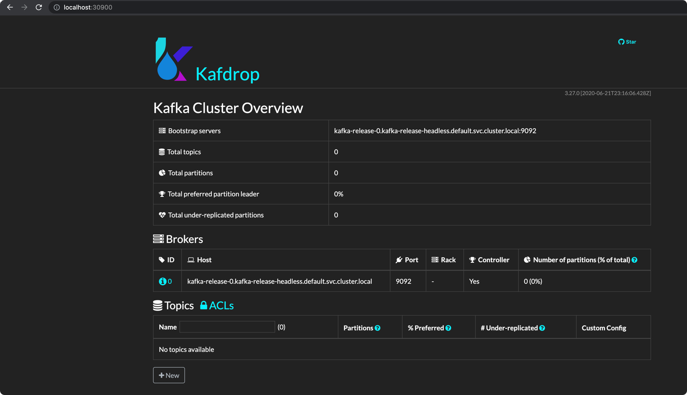

[kafdrop](https://github.com/obsidiandynamics/kafdrop)

```bash
$ git clone https://github.com/obsidiandynamics/kafdrop
$ cp -rfp kafdrop/chart ../
$ rm -rf kafdrop
```

- Deploy

```bash
$ helm upgrade --install -f chart/values.yaml kafdrop-release chart/.           
Release "kafdrop-release" does not exist. Installing it now.
NAME: kafdrop-release
LAST DEPLOYED: Fri Sep 17 13:43:33 2021
NAMESPACE: default
STATUS: deployed
REVISION: 1
TEST SUITE: None
NOTES:
1. Get the application URL by running these commands:
  export NODE_PORT=$(kubectl get --namespace default -o jsonpath="{.spec.ports[0].nodePort}" services kafdrop-release)
  export NODE_IP=$(kubectl get nodes --namespace default -o jsonpath="{.items[0].status.addresses[0].address}")
  echo http://$NODE_IP:$NODE_PORT

$ kubectl get pods                                    
NAME                              READY   STATUS    RESTARTS   AGE
kafdrop-release-976f5c9cb-wxkls   1/1     Running   0          4m53s
kafka-release-0                   1/1     Running   5          39h
kafka-release-zookeeper-0         1/1     Running   0          39h
```

- Generate manifests as well

```bash
$ helm template kafdrop-template ./chart/ -f ./chart/values.yaml > kafdrop-manifests.yaml
```

- Following is the scrrenshot



