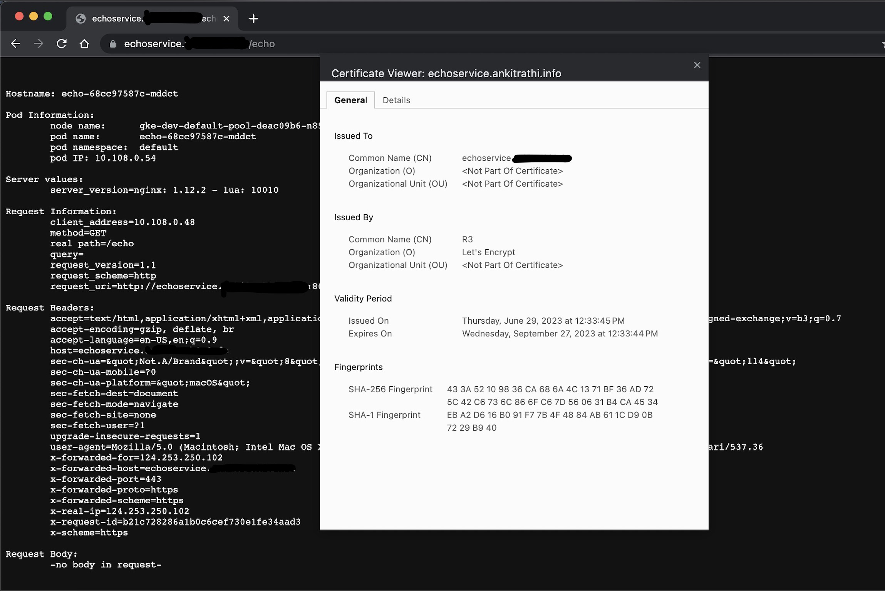
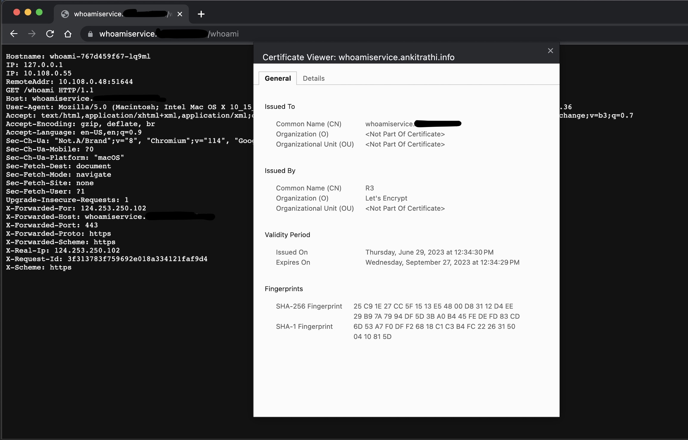

# Cert Manager

- [github.com/cert-manager/cert-manager/releases/tag/v1.12.2](https://github.com/cert-manager/cert-manager/releases/tag/v1.12.2)
- [cert-manager.io/docs/installation/helm](https://cert-manager.io/docs/installation/helm/)
- [tutorials/getting-started-with-cert-manager-on-google-kubernetes-engine-using-lets-encrypt-for-ingress-ssl](https://cert-manager.io/docs/tutorials/getting-started-with-cert-manager-on-google-kubernetes-engine-using-lets-encrypt-for-ingress-ssl/)
- [tutorials/dns-validation](https://cert-manager.io/docs/tutorials/acme/dns-validation)
- [configuration/acme/dns01/route53](https://cert-manager.io/docs/configuration/acme/dns01/route53/)

## Install

```bash
$ helm repo add jetstack https://charts.jetstack.io
.
$ helm repo update
.
```

## Create manifest using helm template command

- [setting-nameservers-for-dns01-self-check](https://cert-manager.io/docs/configuration/acme/dns01/#setting-nameservers-for-dns01-self-check)

The DNS01 challenge provider used by cert-manager (like Let's Encrypt) requires access to DNS servers to be able to resolve the TXT records for the domains it needs to create certificates for. In some environments, especially in private networks, the default DNS servers that the pods use might not have access to public DNS records.

The `--dns01-recursive-nameservers` argument provides a way to override the default DNS servers used by cert-manager. The servers listed here are used to check the propagation of DNS records. This is especially useful in scenarios where the default DNS server (like ones provided by the Kubernetes service) cannot resolve external domains.

In the command you provided, the `--dns01-recursive-nameservers-only` option forces cert-manager to use only the DNS servers provided in the `--dns01-recursive-nameservers` list (Google's public DNS server at 8.8.8.8 and Cloudflare's public DNS server at 1.1.1.1) for DNS01 challenges.

So, the usage of recursive DNS servers helps cert-manager to validate DNS01 challenges accurately even in environments where default DNS configurations are not sufficient or properly setup to reach public DNS records.

```bash
$ helm template cert-manager jetstack/cert-manager \
  --namespace cert-manager \
  --create-namespace \
  --version v1.12.2 \
  --set installCRDs=true \
  --set 'extraArgs={ --dns01-recursive-nameservers-only,--dns01-recursive-nameservers=8.8.8.8:53\,1.1.1.1:53}' > cert-manager.yaml
```

- You can deploy the changes as well

```bash
$ kubectl apply -f cert-manager-vendor.yaml        
.
$ kubectl get pods -n cert-manager        
NAME                                      READY   STATUS    RESTARTS   AGE
cert-manager-65fb9476bd-ht8l9             1/1     Running   0          12m
cert-manager-cainjector-869d958c8-tzkv6   1/1     Running   0          16m
cert-manager-webhook-67cf5854d-hwq5q      1/1     Running   0          16m
```

- Create [IAM Policy](https://cert-manager.io/docs/configuration/acme/dns01/route53) and User/Role as per your requirement in AWS account

- Policy `cert-manager-policy`

```json
{
  "Version": "2012-10-17",
  "Statement": [
    {
      "Effect": "Allow",
      "Action": "route53:GetChange",
      "Resource": "arn:aws:route53:::change/*"
    },
    {
      "Effect": "Allow",
      "Action": [
        "route53:ChangeResourceRecordSets",
        "route53:ListResourceRecordSets"
      ],
      "Resource": "arn:aws:route53:::hostedzone/*"
    },
    {
      "Effect": "Allow",
      "Action": "route53:ListHostedZonesByName",
      "Resource": "*"
    }
  ]
}
```

- Create a user `cert-manager-user` and ensure that you assign the above policy to this user.
- Download the corresponding AWS_ACCESS_KEY and AWS_SECRET_KEY.

- Create kubernetes secret with the credentials you just downloaded

```bash
$ kubectl create secret generic route53-credentials --namespace cert-manager --from-literal=secret-access-key=<secret-access-key> --from-literal=access-key-id=<access-key-id>
.
```

- Create Cluster Issuer with let's encrypt staging URL and change the domains as per your requirement

```bash
$ export DNS_ZONE=<your_dnz_zone>
.
$ sed "s/DNS_ZONE/$DNS_ZONE/g" clusterIssuer-letsEncryptStaging.yaml | kubectl apply -f -
.
```

- Create a certificate

```bash
$ export DOMAIN_NAME=<your_domain_name>        # like example.com
$ sed "s/DOMAIN_NAME/$DOMAIN_NAME/g" certificate-letsEncryptStaging.yaml | kubectl apply -f -
.
```

- Check if the certificate is ready

```bash
$ kubectl get certificate
NAME         READY   SECRET           AGE
ankit-info   True    ankit-info-tls   9m12s

$ kubectl get secret     
NAME             TYPE                DATA   AGE
ankit-info-tls   kubernetes.io/tls   2      12m

# copy tls.crt from this secret to your clipboard
$ pbpaste | openssl x509 -text -noout | egrep "Not|DNS"                      
            Not Before: Jun 28 12:35:16 2023 GMT
            Not After : Sep 26 12:35:15 2023 GMT
                DNS:*.<yourdomain>, DNS:<your_domain>
```

- Once everything is validated, let's do everything for production

```bash
$ mkdir build
.
$ kustomize build base/cert-manager -o build/cert_manager_all.yaml
.

# Let's delete and re-apply everything
$ kubectl delete -f base/cert-manager/.
.
$ kubectl delete -f vendor/cert-manager/cert-manager-vendor.yaml
.
# If the namespace is stuck in terminating state
# https://stackoverflow.com/questions/52369247/namespace-stuck-as-terminating-how-i-removed-it
(
NAMESPACE=your-rogue-namespace
kubectl proxy &
kubectl get namespace $NAMESPACE -o json |jq '.spec = {"finalizers":[]}' >temp.json
curl -k -H "Content-Type: application/json" -X PUT --data-binary @temp.json 127.0.0.1:8001/api/v1/namespaces/$NAMESPACE/finalize
)
  
$ kubectl delete secret ankit-info-tls
.

## Start again

$ kubectl create ns cert-manager
.
$ kubectl create secret generic route53-credentials --namespace cert-manager --from-literal=secret-access-key=<secret-access-key> --from-literal=access-key-id=<access-key-id>
.
$ export DNS_ZONE=<your_dnz_zone>
.
$ export DOMAIN_NAME=<your_domain_name>        # like example.com
.
$ sed -e "s/DNS_ZONE/$DNS_ZONE/g" -e "s/DOMAIN_NAME/$DOMAIN_NAME/g" build/cert_manager_all.yaml | kubectl apply -f -
$ kubectl apply -f build/cert_manager_all.yaml
.

$ kubectl get certificate -n cert-manager
NAME         READY   SECRET           AGE
ankit-info   True    ankit-info-tls   12m

$ kubectl get secret -n cert-manager | egrep "tls|NAME"
NAME                      TYPE                DATA   AGE
ankit-info-tls            kubernetes.io/tls   2      12m

# copy tls.crt from this secret to your clipboard, you should see your_domain instead of example.com
$ pbpaste | openssl x509 -text -noout | egrep "Not|DNS"
            Not Before: Jun 28 14:38:12 2023 GMT
            Not After : Sep 26 14:38:11 2023 GMT
                DNS:*.example.com, DNS:example.com

```

the annotation `cert-manager.io/cluster-issuer: "letsencrypt-prod"` in the Ingress resource tells cert-manager to automatically create a certificate for the specified hosts.

When the Ingress resource is created, cert-manager will automatically create a Certificate resource, which triggers the creation of a certificate by the issuer. Once the certificate is ready, it's stored in a Kubernetes Secret (named as per the `secretName` field in the `tls` block of the Ingress resource).

The NGINX Ingress controller will then automatically detect the Secret and use the certificate it contains for SSL termination of the Ingress.

- Also, make sure that you create a Route53 record for the subdomain for which you want to create a certificate. It should resolve to your load balancer IP.

```bash
$ nslookup whoamiservice.<DOMAIN_NAME>      
Server:         192.168.18.1
Address:        192.168.18.1#53

Non-authoritative answer:
Name:   whoamiservice.<DOMAIN_NAME>
Address: 35.232.7.154
```

- Let's deploy the app on TLS

```bash
$ kustomize build base/app -o build/app_all.yaml
.
## apply
$ sed -e "s/DNS_ZONE/$DNS_ZONE/g" -e "s/DOMAIN_NAME/$DOMAIN_NAME/g" build/app_all.yaml | kubectl apply -f -
.

$ kubectl get certificate       
NAME                 READY   SECRET               AGE
whoami-service-tls   True    whoami-service-tls   24m
.

$ kubectl get secret                  
NAME                 TYPE                DATA   AGE
whoami-service-tls   kubernetes.io/tls   2      24m
```

- Let's create another deployment with a different subdomain i.e. echoservice.<DOMAIN_NAME> (change <DOMAIN_NAME> with your domain)

- Ensure Route53 record exists

```bash
$ nslookup echoservice.<DOMAIN_NAME>  
Server:         192.168.18.1
Address:        192.168.18.1#53

Non-authoritative answer:
Name:   echoservice.<DOMAIN_NAME>
Address: 35.232.7.154
```

```yaml
namespace: default

resources:
  - dep_whoami.yaml
  - ingress_whoami.yaml
  - svc_whoami.yaml
  - dep_echo.yaml
  - ingress_echo.yaml
  - svc_echo.yaml
```

- Build and deploy

```bash
$ kustomize build base/app -o build/app_all.yaml
.
$ sed -e "s/DNS_ZONE/$DNS_ZONE/g" -e "s/DOMAIN_NAME/$DOMAIN_NAME/g" build/app_all.yaml | kubectl apply -f -
.

$ kubectl get certificate
NAME                 READY   SECRET               AGE
echo-service-tls     True    echo-service-tls     31m
whoami-service-tls   True    whoami-service-tls   29m

$ kubectl get secret     
NAME                 TYPE                DATA   AGE
echo-service-tls     kubernetes.io/tls   2      30m
whoami-service-tls   kubernetes.io/tls   2      29m

## For secret echo-service-tls
$ pbpaste | openssl x509 -text -noout | egrep "Not|DNS"
            Not Before: Jun 29 07:03:45 2023 GMT
            Not After : Sep 27 07:03:44 2023 GMT
                DNS:echoservice.<DOMAIN_NAME>

$ pbpaste | openssl x509 -text -noout | egrep "Not|DNS"
            Not Before: Jun 29 07:04:30 2023 GMT
            Not After : Sep 27 07:04:29 2023 GMT
                DNS:whoamiservice.<DOMAIN_NAME>
```

- Let's check our certificates using curl client

```bash
# You should see your domain instead of <DOMAIN_NAME>
$ curl -v https://whoamiservice.<DOMAIN_NAME>/whoami 
*   Trying 35.232.7.154:443...
* Connected to whoamiservice.<DOMAIN_NAME> (35.232.7.154) port 443 (#0)
.........
* Server certificate:
*  subject: CN=whoamiservice.<DOMAIN_NAME>
*  start date: Jun 29 07:04:30 2023 GMT
*  expire date: Sep 27 07:04:29 2023 GMT
*  subjectAltName: host "whoamiservice.<DOMAIN_NAME>" matched cert's "whoamiservice.<DOMAIN_NAME>"
*  issuer: C=US; O=Let's Encrypt; CN=R3
*  SSL certificate verify ok.
.......
> GET /whoami HTTP/2
> Host: whoamiservice.<DOMAIN_NAME>
> user-agent: curl/7.88.1
> accept: */*
> 
< HTTP/2 200 
< date: Thu, 29 Jun 2023 08:40:49 GMT
< content-type: text/plain; charset=utf-8
< content-length: 445
< strict-transport-security: max-age=15724800; includeSubDomains
< 
Hostname: whoami-767d459f67-lq9ml
IP: 127.0.0.1
IP: 10.108.0.55
RemoteAddr: 10.108.0.48:42790
GET /whoami HTTP/1.1
Host: whoamiservice.<DOMAIN_NAME>
User-Agent: curl/7.88.1
Accept: */*
X-Forwarded-For: 124.253.250.102
X-Forwarded-Host: whoamiservice.<DOMAIN_NAME>
X-Forwarded-Port: 443
X-Forwarded-Proto: https
X-Forwarded-Scheme: https
X-Real-Ip: 124.253.250.102
X-Request-Id: 90c67372dc645e17c1ae97fb614a2792
X-Scheme: https


## Let's validate for echo service
$ curl -v https://echoservice.<DOMAIN_NAME>/echo   
*   Trying 35.232.7.154:443...
* Connected to echoservice.<DOMAIN_NAME> (35.232.7.154) port 443 (#0)
..............................
* Server certificate:
*  subject: CN=echoservice.<DOMAIN_NAME>
*  start date: Jun 29 07:03:45 2023 GMT
*  expire date: Sep 27 07:03:44 2023 GMT
*  subjectAltName: host "echoservice.<DOMAIN_NAME>" matched cert's "echoservice.<DOMAIN_NAME>"
*  issuer: C=US; O=Let's Encrypt; CN=R3
*  SSL certificate verify ok.
............................................
> GET /echo HTTP/2
> Host: echoservice.<DOMAIN_NAME>
> user-agent: curl/7.88.1
> accept: */*
> 
< HTTP/2 200 
< date: Thu, 29 Jun 2023 08:43:26 GMT
< content-type: text/plain
< strict-transport-security: max-age=15724800; includeSubDomains
< 


Hostname: echo-68cc97587c-mddct

Pod Information:
        node name:      gke-dev-default-pool-deac09b6-n853
        pod name:       echo-68cc97587c-mddct
        pod namespace:  default
        pod IP: 10.108.0.54

Server values:
        server_version=nginx: 1.12.2 - lua: 10010

Request Information:
        client_address=10.108.0.48
        method=GET
        real path=/echo
        query=
        request_version=1.1
        request_scheme=http
        request_uri=http://echoservice.<DOMAIN_NAME>:8080/echo

Request Headers:
        accept=*/*  
        host=echoservice.<DOMAIN_NAME>  
        user-agent=curl/7.88.1  
        x-forwarded-for=124.253.250.102  
        x-forwarded-host=echoservice.<DOMAIN_NAME>  
        x-forwarded-port=443  
        x-forwarded-proto=https  
        x-forwarded-scheme=https  
        x-real-ip=124.253.250.102  
        x-request-id=6df6c4625944a6b8955ecfa5d3ebcd32  
        x-scheme=https  

Request Body:
        -no body in request-
```

- Checking in browser (domain has been redacted in the image)



