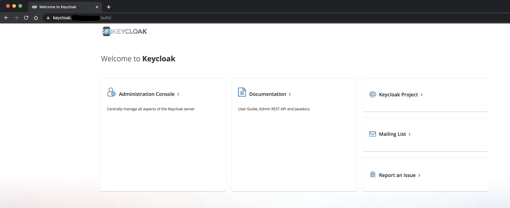
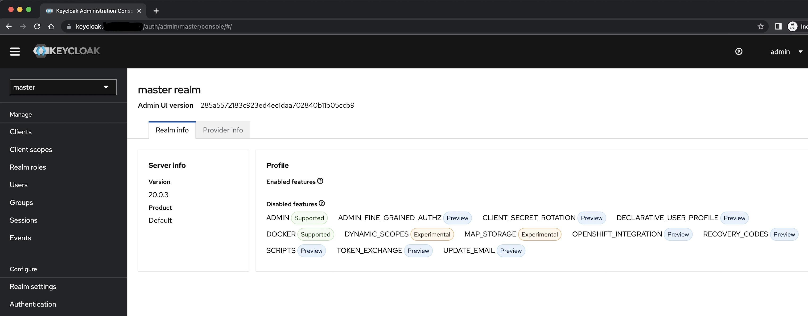

# Keycloak

- [keycloak)](https://github.com/codecentric/helm-charts/tree/master/charts/keycloak)
- [keycloakx](https://github.com/codecentric/helm-charts/tree/master/charts/keycloakx)
- [keycloakx/examples](https://github.com/codecentric/helm-charts/tree/master/charts/keycloakx/examples)
- [Keycloak.X with PostgreSQL](https://github.com/codecentric/helm-charts/blob/master/charts/keycloakx/examples/postgresql/readme.md)
- [keycloak.org/documentation](https://www.keycloak.org/documentation)
- [bitnami/postgresql](https://github.com/bitnami/charts/tree/main/bitnami/postgresql)
- [keycloak.org/docs/latest/server_admin](https://www.keycloak.org/docs/latest/server_admin/)


> WARNING: The configured password will be ignored on new installation in case when previous Posgresql release was deleted through the helm command. In that case, old PVC will have an old password, and setting it through helm won't take effect. Deleting persistent volumes (PVs) will solve the issue.

> Delete the PV and PVC if you are getting the error: "psql: error: could not connect to server: FATAL: password authentication failed for user "keycloak". Spent hours trying to debug the issue. It should be highlighted in the documentation more clearly.

<br>

## GKE Kubernetes Version

```bash
$ kubectl version --short
Client Version: v1.27.3
Kustomize Version: v5.0.1
Server Version: v1.27.2-gke.1200
```

<br>

## Keycloak.X with PostgreSQL

- [doc](https://github.com/codecentric/helm-charts/tree/master/charts/keycloakx/examples/postgresql)

```bash
$ helm repo add bitnami https://charts.bitnami.com/bitnami
.
$ helm repo add codecentric https://codecentric.github.io/helm-charts
.
$ helm repo update
.
```

- Pull repo
- [bitnami/postgresql](https://github.com/bitnami/charts/tree/main/bitnami/postgresql)

```bash
$ export POSTGRES_USER_PASSWORD='<admin_user>'   # Admin user : postgres
$ export KEYCLOAK_USER_PASSWORD='<keycloak_user>'    # Custom user : keycloak

$ cd vendor/postgresql
.
# helm install keycloak-db bitnami/postgresql --values ./keycloak-db-values.yaml, note the bitnami/postgresql is the repo name, you can use this in the helm pull command
$ helm pull bitnami/postgresql                    
$ ls
postgresql-12.6.0.tgz
$ tar -xvf postgresql-12.6.0.tgz
$ ls
postgresql            postgresql-12.6.0.tgz
$ rm -rf postgresql-12.6.0.tgz

# https://github.com/codecentric/helm-charts/tree/master/charts/keycloakx/examples/postgresql
# Get the keycloak-db-values.yaml
```

- Let's first install the PostgreSQL database 

```bash
# https://github.com/codecentric/helm-charts/tree/master/charts/keycloakx/examples/postgresql

# Generate Manifests
helm template keycloak-db postgresql \  
--namespace keycloak \
--create-namespace \
--set global.postgresql.auth.postgresPassword="$POSTGRES_USER_PASSWORD" \
--set global.postgresql.auth.username="keycloak" \
--set global.postgresql.auth.password="$KEYCLOAK_USER_PASSWORD" \
--set global.postgresql.auth.database="keycloak_db" > keycloak-db-manifest-vendor.yaml

<br>

############# OR ############## Install directlry using helm install

$ helm install keycloak-db postgresql \
--namespace keycloak \
--create-namespace \
--set global.postgresql.auth.postgresPassword="$POSTGRES_USER_PASSWORD" \
--set global.postgresql.auth.username="keycloak" \
--set global.postgresql.auth.password="$KEYCLOAK_USER_PASSWORD" \
--set global.postgresql.auth.database="keycloak_db" 
...
NAME: keycloak-db
NAMESPACE: keycloak
CHART NAME: postgresql
CHART VERSION: 12.6.0
APP VERSION: 15.3.0

PostgreSQL can be accessed via port 5432 on the following DNS names from within your cluster:

    keycloak-db-postgresql.keycloak.svc.cluster.local - Read/Write connection

To get the password for "postgres" run:

    export POSTGRES_ADMIN_PASSWORD=$(kubectl get secret --namespace keycloak keycloak-db-postgresql -o jsonpath="{.data.postgres-password}" | base64 -d)

To get the password for "keycloak" run:

    export POSTGRES_PASSWORD=$(kubectl get secret --namespace keycloak keycloak-db-postgresql -o jsonpath="{.data.password}" | base64 -d)

To connect to your database run the following command:

    kubectl run keycloak-db-postgresql-client --rm --tty -i --restart='Never' --namespace keycloak --image docker.io/bitnami/postgresql:15.3.0-debian-11-r17 --env="PGPASSWORD=$POSTGRES_PASSWORD" \
      --command -- psql --host keycloak-db-postgresql -U keycloak -d keycloak_db -p 5432

    > NOTE: If you access the container using bash, make sure that you execute "/opt/bitnami/scripts/postgresql/entrypoint.sh /bin/bash" in order to avoid the error "psql: local user with ID 1001} does not exist"

To connect to your database from outside the cluster execute the following commands:

    kubectl port-forward --namespace keycloak svc/keycloak-db-postgresql 5432:5432 &
    PGPASSWORD="$POSTGRES_PASSWORD" psql --host 127.0.0.1 -U keycloak -d keycloak_db -p 5432

WARNING: The configured password will be ignored on new installation in case when previous Posgresql release was deleted through the helm command. In that case, old PVC will have an old password, and setting it through helm won't take effect. Deleting persistent volumes (PVs) will solve the issue.    
```

<br>

## Apply manifest

```bash
$ kubectl apply -f keycloak-db-manifest-vendor.yaml
.

# Connect to keycloak db using keycloak user
$ kubectl run keycloak-db-postgresql-client --rm --tty -i --restart='Never' --namespace keycloak --image docker.io/bitnami/postgresql:15.3.0-debian-11-r17 --env="PGPASSWORD=$POSTGRES_PASSWORD" \
      --command -- psql --host keycloak-db-postgresql -U keycloak -d keycloak_db -p 5432

keycloak_db=> 
keycloak_db=> \l
                                                  List of databases
    Name     |  Owner   | Encoding |   Collate   |    Ctype    | ICU Locale | Locale Provider |   Access privileges   
-------------+----------+----------+-------------+-------------+------------+-----------------+-----------------------
 keycloak_db | keycloak | UTF8     | en_US.UTF-8 | en_US.UTF-8 |            | libc            | =Tc/keycloak         +
             |          |          |             |             |            |                 | keycloak=CTc/keycloak
 postgres    | postgres | UTF8     | en_US.UTF-8 | en_US.UTF-8 |            | libc            | 
 template0   | postgres | UTF8     | en_US.UTF-8 | en_US.UTF-8 |            | libc            | =c/postgres          +
             |          |          |             |             |            |                 | postgres=CTc/postgres
 template1   | postgres | UTF8     | en_US.UTF-8 | en_US.UTF-8 |            | libc            | =c/postgres          +
             |          |          |             |             |            |                 | postgres=CTc/postgres
(4 rows)

keycloak_db=> 

$ rm -rf postgresql
.
```

- Now let's generate manifests for keycloak

```bash
$ cd vendor/keycloakx
.
```

- Download the file [keycloak-server-values.yaml](https://github.com/codecentric/helm-charts/blob/master/charts/keycloakx/examples/postgresql/keycloak-server-values.yaml)
  
```bash
$ helm install keycloak --namespace keycloak --create-namespace  keycloakx --values ./keycloak-server-values.yaml 
NAME: keycloak
LAST DEPLOYED: Sat Jul  1 21:35:50 2023
NAMESPACE: keycloak
STATUS: deployed
REVISION: 1
TEST SUITE: None
NOTES:
***********************************************************************
*                                                                     *
*                Keycloak.X Helm Chart by codecentric AG              *
*                                                                     *
***********************************************************************

Keycloak was installed with a Service of type ClusterIP

Create a port-forwarding with the following commands:

export POD_NAME=$(kubectl get pods --namespace keycloak -l "app.kubernetes.io/name=keycloakx,app.kubernetes.io/instance=keycloak" -o name)
echo "Visit http://127.0.0.1:8080 to use your application"
kubectl --namespace keycloak port-forward "$POD_NAME" 8080

<br>

#####################################################
#         OR use helm template command              #

$ helm pull codecentric/keycloakx
.
$ tar -xvf keycloakx-2.2.1.tgz
.
$ rm -rf keycloakx-2.2.1.tgz
.
# Generate keycloak-server-manifest-vendor.yaml
helm template keycloak \
--namespace keycloak \
--create-namespace  keycloakx \
--values ./keycloak-server-values.yaml  \
> keycloak-server-manifest-vendor.yaml

# Apply manifest
$ kubeclt apply -f keycloak-server-manifest-vendor.yaml
.
```

- Let's access the keycloak service

```bash
$ kubectl port-forward -n keycloak service/keycloak-keycloakx-http 8080:80

Forwarding from 127.0.0.1:8080 -> 8080
Forwarding from [::1]:8080 -> 8080
```

- You can then access the Keycloak Admin-Console via [http://localhost:8080/auth](http://localhost:8080/auth) with username: admin and password: secret123

- Let's create ingress for keycloak service

```bash
$ cd base/keycloakx
.
$ export DOMAIN_NAME=<DOMAIN_NAME>
.
# Ensure that corresponding DNS is created
$ nslookup keycloak.<DOMAIN_NAME>     
Server:         8.8.8.8
Address:        8.8.8.8#53

Non-authoritative answer:
Name:   keycloak.<DOMAIN_NAME>
Address: 35.232.7.154

$ sed -e "s/DNS_ZONE/$DNS_ZONE/g" -e "s/DOMAIN_NAME/$DOMAIN_NAME/g" ingress_keycloak.yaml |  kubectl apply -f -
ingress.networking.k8s.io/keycloak-ingress created

$ kubectl get secret -n keycloak | grep tls                                                                                  
keycloak-tls                     kubernetes.io/tls    2      13m

# Copy the tls.crt from the secret in clipboard
$ pbpaste | openssl x509 -text -noout | egrep "Not|DNS"
            Not Before: Jul  1 17:16:55 2023 GMT
            Not After : Sep 29 17:16:54 2023 GMT
                DNS:keycloak.<DOMAIN_NAME>
```

- Let's visit the keycloak https URL using curl

```bash
$ curl -v https://keycloak.<DOMAIN_NAME>/auth/ -o /dev/null
...
* Connected to keycloak.<DOMAIN_NAME> (35.232.7.154) port 443 (#0)
...
* SSL connection using TLSv1.3 / AEAD-AES256-GCM-SHA384
...
* Server certificate:
*  subject: CN=keycloak.<DOMAIN_NAME>
*  start date: Jul  1 17:16:55 2023 GMT
*  expire date: Sep 29 17:16:54 2023 GMT
*  subjectAltName: host "keycloak.<DOMAIN_NAME>" matched cert's "keycloak.<DOMAIN_NAME>"
*  issuer: C=US; O=Let's Encrypt; CN=R3
*  SSL certificate verify ok.
...
> GET /auth/ HTTP/2
> Host: keycloak.<DOMAIN_NAME>
> user-agent: curl/7.88.1
> accept: */*
> 
< HTTP/2 200 
< date: Sat, 01 Jul 2023 18:36:43 GMT
< content-type: text/html;charset=utf-8
< content-length: 3882
< referrer-policy: no-referrer
< x-frame-options: SAMEORIGIN
< strict-transport-security: max-age=15724800; includeSubDomains
< x-robots-tag: none
< cache-control: no-cache, must-revalidate, no-transform, no-store
< x-content-type-options: nosniff
< content-security-policy: frame-src 'self'; frame-ancestors 'self'; object-src 'none';
< x-xss-protection: 1; mode=block
```

- Let's also create build files

```bash
$ mkdir build
.
$ kustomize build base/keycloakx -o build/keycloakx_all.yaml
.
$ sed -e "s/DNS_ZONE/$DNS_ZONE/g" -e "s/DOMAIN_NAME/$DOMAIN_NAME/g" build/keycloakx_all.yaml |  kubectl apply -f - 
serviceaccount/keycloak-keycloakx configured
secret/keycloak-keycloakx-admin-creds configured
secret/keycloak-keycloakx-database configured
service/keycloak-keycloakx-headless unchanged
service/keycloak-keycloakx-http unchanged
statefulset.apps/keycloak-keycloakx configured
ingress.networking.k8s.io/keycloak-ingress unchanged
```

- Visit in the browser [https://keycloak.<DOMAIN_NAME>/auth](https://keycloak.<DOMAIN_NAME>/auth)



- Going to admin console, you should be asked to login with username: admin and password: secret123
- After login, you should be able to see the admin console

