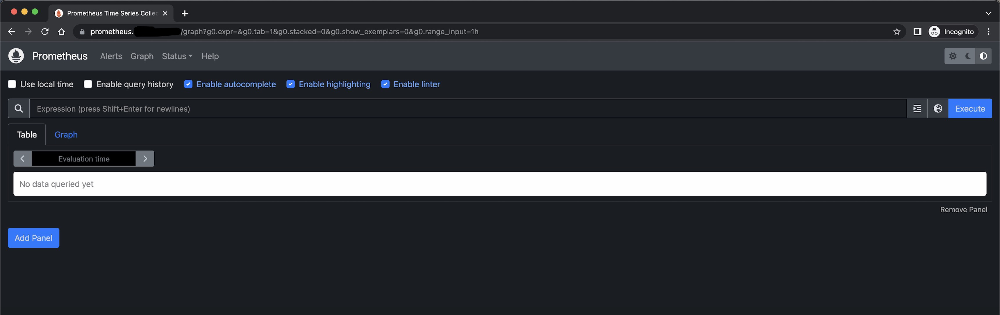

# Prometheus Operator -- Kube Prometheus, Grafana and Alertmanager

- [prometheus-operator/kube-prometheus](https://github.com/prometheus-operator/kube-prometheus)

## GKE Kubernetes Version

```bash
$ kubectl version --short

Client Version: v1.27.3
Kustomize Version: v5.0.1
Server Version: v1.27.2-gke.1200
```


## Clone the repo


```bash
$ git clone https://github.com/prometheus-operator/kube-prometheus.git
.
$ ls
kube-prometheus manifests
$ rm -rf kube-prometheus 
```

## Deploy kube-prometheus

```bash
$ kubectl apply --server-side -f manifests/setup
$ kubectl wait \
--for condition=Established \
--all CustomResourceDefinition \
--namespace=monitoring
$ kubectl apply -f manifests/
```

> Insufficient regional quota to satisfy request: resource "SSD_TOTAL_GB": request requires '100.0' and is short '94.0'. project has a quota of '250.0' with '6.0' available. View and manage quotas at <URL>

> https://stackoverflow.com/questions/58578695/insufficient-regional-quota-to-satisfy-request-resource-in-use-addresses

> sort data by Current Usage.

- Validate the pods

```bash
$ kubectl get pods -n monitoring   
NAME                                   READY   STATUS    RESTARTS   AGE
alertmanager-main-0                    2/2     Running   0          47s
alertmanager-main-1                    2/2     Running   0          47s
alertmanager-main-2                    2/2     Running   0          47s
blackbox-exporter-85b4fb4b69-xrktv     3/3     Running   0          9m44s
grafana-6ccd547d9-tbl54                1/1     Running   0          9m44s
kube-state-metrics-785cf8974b-5gzgn    3/3     Running   0          9m44s
prometheus-adapter-648959cd84-cx5vn    1/1     Running   0          9m44s
prometheus-adapter-648959cd84-q6qxr    1/1     Running   0          9m44s
prometheus-k8s-0                       2/2     Running   0          46s
prometheus-k8s-1                       2/2     Running   0          46s
prometheus-operator-5745bf7d85-24qnk   2/2     Running   0          19m
```

- Access prometheus

```bash
kubectl --namespace monitoring port-forward svc/prometheus-k8s 9090
Forwarding from 127.0.0.1:9090 -> 9090
Forwarding from [::1]:9090 -> 9090

# Another terminal
$ curl -s -o /dev/null -w "%{http_code}" http://localhost:9090/graph                                                                                
200
```

- Access grafana

```bash
$ kubectl --namespace monitoring port-forward svc/grafana 3000
Forwarding from 127.0.0.1:3000 -> 3000
Forwarding from [::1]:3000 -> 3000

# Another terminal; default user/password: admin/admin
$ curl -s -o /dev/null -w "%{http_code}" http://localhost:3000/login
200
```

- Access alertmanager

```bash
$ kubectl --namespace monitoring port-forward svc/alertmanager-main 9093
Forwarding from 127.0.0.1:9093 -> 9093
Forwarding from [::1]:9093 -> 9093

# Another terminal
$ curl -s -o /dev/null -w "%{http_code}" http://localhost:9093/\#/alerts                           
200
```

- Let's create ingress for all

```bash
$ mkdir -p vendor/kube_prometheus
.
# move manifests folder to vendor/kube_prometheus
$ mv vendor/manifets vendor/kube_prometheus/
.
$ mkdir -p base/kube_prometheus
$ touch base/kube_prometheus/prometheus_ingress.yaml
$ touch base/kube_prometheus/grafana_ingress.yaml
$ touch base/kube_prometheus/alertmanager_ingress.yaml
# Creat kustomization.yaml
$ touch base/kube_prometheus/kustomization.yaml
$ mkdir build
$ kustomize build base/kube_prometheus -o build/kube_prometheus_all.yaml
```

- Let's deploy ingress

```bash
$ export DOMAIN_NAME=<YOUR_DOMAIN_NAME>
.
$ sed -e "s/DOMAIN_NAME/$DOMAIN_NAME/g" base/kube_prometheus/prometheus_ingress.yaml | kubectl apply -f -
.
```

- Access prometheus at `https://prometheus.<YOUR_DOMAIN_NAME>/graph`



- Deploy ingress for grafana

```bash
$ sed -e "s/DOMAIN_NAME/$DOMAIN_NAME/g" base/kube_prometheus/grafana_ingress.yaml | kubectl apply -f -
.
```

- Access grafana at `https://grafana.<YOUR_DOMAIN_NAME>/login`


- Deploy ingress for alertmanager

```bash
$ sed -e "s/DOMAIN_NAME/$DOMAIN_NAME/g" base/kube_prometheus/alertmanager_ingress.yaml | kubectl apply -f -
.
```

- Access alertmanager at `https://alertmanager.<YOUR_DOMAIN_NAME>/#/alerts`

