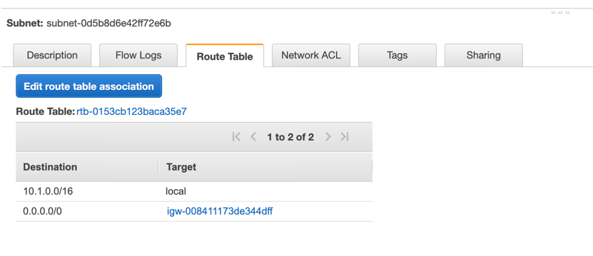
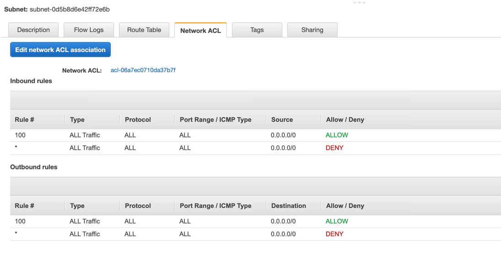
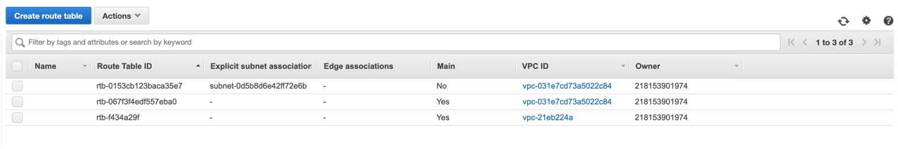
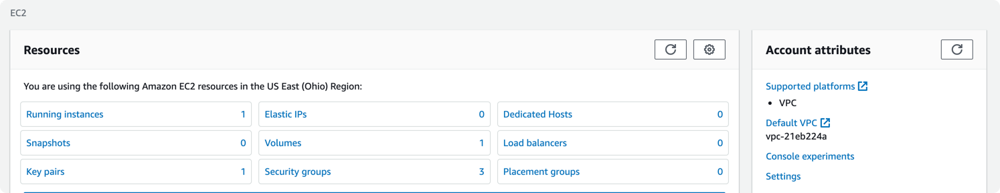
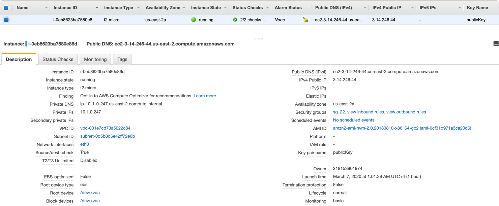
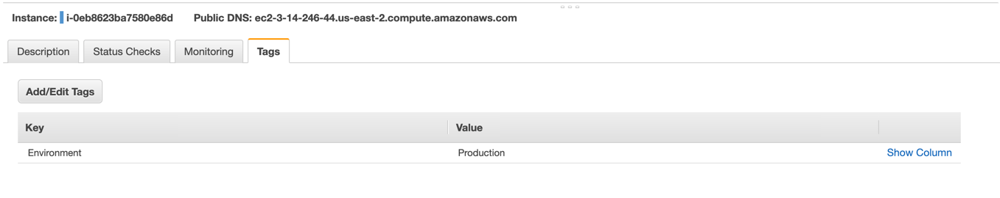
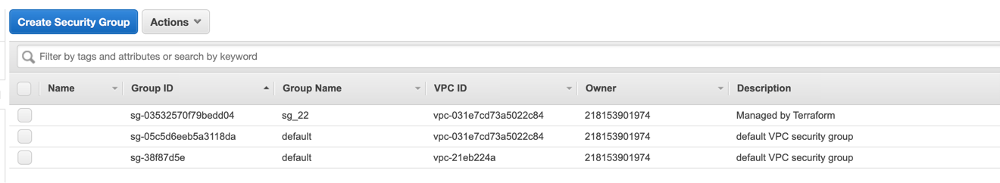
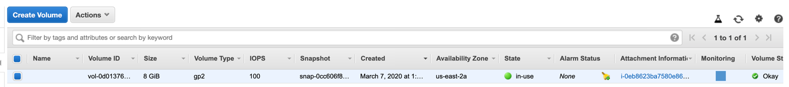
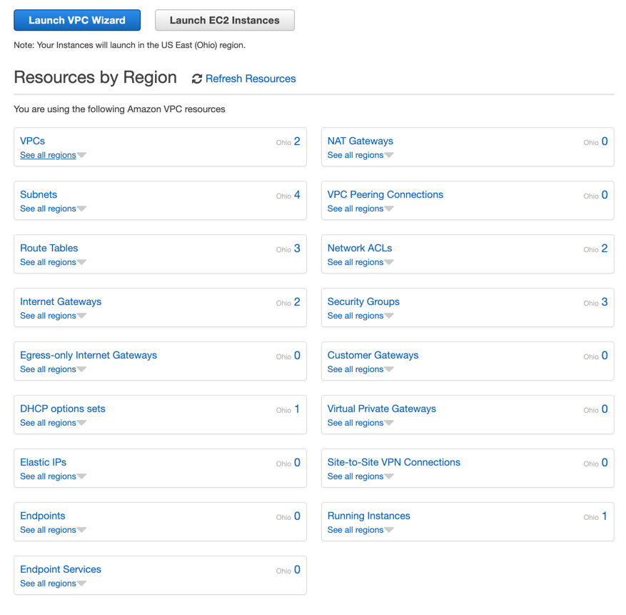

## OBJECTIVE : 
- To set up a custom VPC with given CIDR with attached internet gateway. 
- Associate a subnet (with subset CIDR) to the VPC.
- Create route-tables to make the subnet public
- Create security group (for ssh) and keypair (for ssh)
- Start EC2 instance in public subnet and login into the instance.

#### Before executing you should have created AWS_ACCESS_KEY_ID AND AWS_SECRET_ACCESS_KEY with administrative privileges.

- Export the keys in your current shell by using following commands

```bash
export AWS_ACCESS_KEY_ID=YOUR_ACCESS_KEY_ID
export AWS_SECRET_ACCESS_KEY=YOUR_SECRET_ACCESS_KEY
```

#### The following sequence of commands will be executed.
> terraform init

```bash
$ terraform init
Initializing the backend...
.
.
.
commands will detect it and remind you to do so if necessary.
```


> terraform plan

```bash
$ terraform plan
provider.aws.region
.
.
.
"terraform apply" is subsequently run.
```

> terraform apply

```bash
$ terraform apply
provider.aws.region
.
.
.
Plan: 8 to add, 0 to change, 0 to destroy.

Do you want to perform these actions?
  Terraform will perform the actions described above.
  Only 'yes' will be accepted to approve.

  Enter a value: yes
.
.
.
Apply complete! Resources: 8 added, 0 changed, 0 destroyed.
```


- Now login into the instance

```bash
$ ssh ec2-user@3.14.246.44                        
The authenticity of host '3.14.246.44 (3.14.246.44)' can't be established.
ECDSA key fingerprint is SHA256:B0bvqitocFpOItQbzZkFCXBrZV9xdb3b0VRwb/Ked0s.
Are you sure you want to continue connecting (yes/no)? yes
Warning: Permanently added '3.14.246.44' (ECDSA) to the list of known hosts.

       __|  __|_  )
       _|  (     /   Amazon Linux 2 AMI
      ___|\___|___|

https://aws.amazon.com/amazon-linux-2/
48 package(s) needed for security, out of 336 available
Run "sudo yum update" to apply all updates.
[ec2-user@ip-10-1-0-247 ~]$ 
```

- To destroy the resources
> terraform destroy

```bash
$ terraform destroy
.
.
.
Destroy complete! Resources: 8 destroyed.
```


#### Now let's login into the console and check

- VPC screen


- CIDR in VPC


- Internet Gateways


- Subnet created


- Route table association



- Network ACLs



- Route Tables



- Login EC2 dashboard



- EC2 instance screen



- Instance Tag



- Security groups



- Volumes Screen




- Finally Resources Screen




