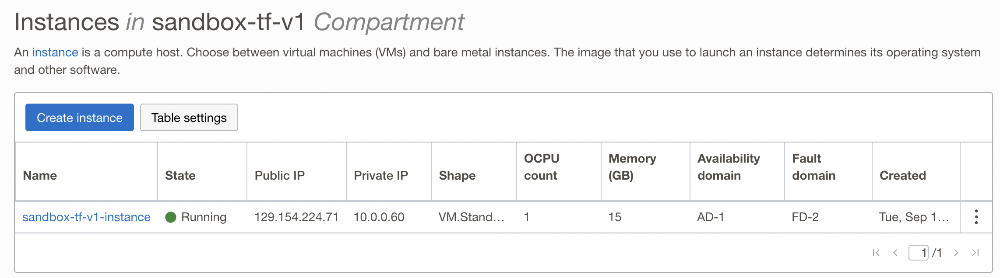
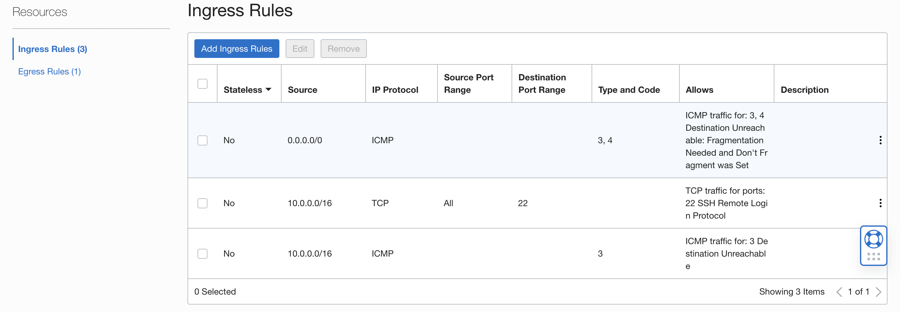

# Initialization Setup

# Terraform: Create a Compute Instance

[developer-tutorials/tutorials/tf-compute](https://docs.oracle.com/en-us/iaas/developer-tutorials/tutorials/tf-compute/01-summary.htm)

<br>

## Key tasks include how to:

- Create SSH keys.
- Create a virtual cloud network in your tenancy.
- Use Oracle Cloud Infrastructure Terraform provider to create a compute instance in the network.
- Connect to your instance.


<br>

### Begin

- Create SSH Key

```bash
╰─ ssh-keygen -t rsa -N "" -b 2048 -C oci-inst-pem -f oci-inst-pem.pem
```

- Terraform Apply

```bash
╰─ terraform apply -var-file=$OCI_TFVARS_LOCATION/terraform.tfvars
.
.
Apply complete! Resources: 1 added, 0 changed, 0 destroyed.

Outputs:

compartment-OCID = "**************************"
compartment-name = "sandbox-tf-v1"
instance-OCID = "******************"
instance-OCPUs = 1
instance-memory-in-GBs = 15
instance-name = "sandbox-tf-v1-instance"
instance-region = "****************"
instance-shape = "VM.Standard2.1"
instance-state = "RUNNING"
name-of-first-availability-domain = "tRhx:*********-1-AD-1"
public-ip-for-compute-instance = "129.154.224.71"
time-created = "2022-09-13 16:36:08.169 +0000 UTC"
```


- SSH into the instance

```bash
╰─ ssh -i oci-inst-pem.pem ubuntu@129.154.224.71                      
.
.
ubuntu@sandbox-tf-v1-instance:~$ 
```


- Following are some of the screenshots

- Instance




- VCN
  


- Network Visvualizer
  


- Subnets


- Security List of Public Subnet


- Security list of private subnet




- Route Tables


