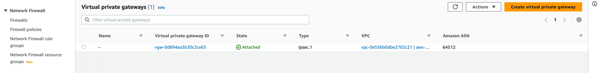

# Building a VPN Between Google Cloud and AWS with Terraform

[https://www.cloudskillsboost.google](https://www.cloudskillsboost.google)

[Select - Quest -  Managing Cloud Infrastructure with Terraform](https://www.cloudskillsboost.google/paths)

**High Level Objectives**
- Build custom VPC networks with user-specified CIDR blocks in Google Cloud and AWS
- Deploy a VM instance in each VPC network
- Create VPN gateways in each VPC network and related resources for two IPsec tunnels


**Skills**
- terraform
- vpc
- vpn gateways
- aws
- gcp


**Version Stack**

| Stack     | Version |
|-----------|---------|
| Terraform | v1.4.1  |


## Deployment architecture


## Intro

While Google Cloud uses routes to support equal-cost multi-path (ECMP) routing, 
AWS supports VPN gateways with two tunnels, active and standby, for redundancy and availability.

The lab configuration uses Cloud Router to demonstrate dynamic routing. 
Cloud Router exchanges your VPC network route updates with your environment in AWS using 
Border Gateway Protocol (BGP). Dynamic routing by Cloud Router requires a separate Cloud 
Router for each IPsec tunnel.


## Preparing your Google Cloud working environment

- Clone the tutorial code

```bash
gsutil cp gs://spls/gsp854/autonetdeploy-multicloudvpn2.tar .
tar -xvf autonetdeploy-multicloudvpn2.tar

cd autonetdeploy-multicloudvpn
```

- Verify the Google Cloud region and zone

## Preparing for AWS use


- aws compute


- aws vpc


- aws subnets


- aws internet gateway


- aws vpn connections


- aws customer gateways


- aws virtual private gateways




- gcp compute


- gcp network


- gcp peer vpn gateways


- gcp cloud vpn gateway


- gcp cloud vpn tunnels


- gcp cloud router


- gcp cloud router details


- gcp cloud firewall


- gcp cloud routes


- gcp cloud IP addresses

