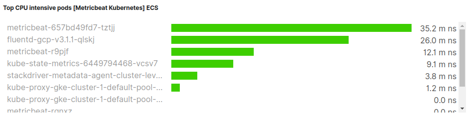

## Kubernetes Monitoring


| Stats                                                               | Visualization                                     |
|---------------------------------------------------------------------|---------------------------------------------------|
| [Nodes](#Nodes)                                                     |                             |
| [Deployments](#Deployments)                                         |                       |
| [Available Pods Per Deployment](#Available-pods-per-deployment)     |    |
| [Desired-pods](#Desired-pods)                                       |                      |
| [Available pods](#Available-pods)                                   |                    |
| [Unavailable pods](#Unavailable-pods)                               |                  |
| [Unavailable pods per deployment](#Unavailable-pods-per-deployment) |  |
| [CPU Usage by node](#CPU-usage-by-node)                             |                 |
| [Memory usage by node](#Memory-usage-by-node)                       |              |
| [Network out by node](#Network-out-by-node)                         |               |
| [Network in by node](#Network-in-by-node)                           |                |
| [Top CPU intensive pods](#Top-CPU-intensive-pods)                   |            |
| [Top memory intensive pods](#Top-memory-intensive-pods)             |         |


<br>

### Nodes

- kubernetes.node.name
  - Kubernetes node name
  - type: keyword

**Aggregation**
  
```bash
<br>

## Cardinality ##
a = Cardinality(kubernetes.node.name)

GroupBy-Everything
```

<br>

### Deployments

- kubernetes.deployment.name
  - Kubernetes deployment name
  - type: keyword
  
**Aggregation**
  
```bash
<br>

## Cardinality ##
a = Cardinality(kubernetes.deployment.name)

GroupBy-Everything
``` 

<br>

### Available-pods-per-deployment

- kubernetes.deployment.replicas.available
  - Deployment available replicas
  - type: integer

- kubernetes.deployment.name
  - Kubernetes deployment name
  - type: keyword

**Aggregation**

- Time field : @timestamp
- Interval : auto

```bash
<br>

## Average ##
a = Avg(kubernetes.deployment.replicas.available)

GroupBy-Terms : kubernetes.deployment.name
Top - 10000
OrderBy - Doc Count(default)
Desc
```

<br>

### Desired-pods

- kubernetes.deployment.replicas.desired
  - Deployment number of desired replicas (spec)  
  - type: integer
   
**Aggregation**

- Data timerange mode: Last value
- Time field : @timestamp
- Inverval : auto

```bash
<br>

## Sum ##
a = Sum(kubernetes.deployment.replicas.desired)

GroupBy-Everything
```
 
<br>

### Available-pods

- kubernetes.deployment.replicas.available
  - Deployment available replicas  
  - type: integer 

**Aggregation**

- Data timerange mode: Last value
- Time field : @timestamp
- Inverval : auto

```bash
<br>

## Sum ##
a = Sum(kubernetes.deployment.replicas.available)

GroupBy-Everything
```

<br>

### Unavailable-pods

- kubernetes.deployment.replicas.unavailable
  - Deployment unavailable replicas
  - type: integer
 
**Aggregation**

- Data timerange mode: Last value
- Time field : @timestamp
- Inverval : auto

```bash
<br>

## Sum ##
a = Sum(kubernetes.deployment.replicas.unavailable)

GroupBy-Everything
``` 
 
<br>

### Unavailable-pods-per-deployment

- kubernetes.deployment.replicas.unavailable
  - Deployment unavailable replicas
  - type: integer
  
**Aggregation**

- Time field : @timestamp
- Inverval : auto

```bash
<br>

## Average ##
a = Avg(kubernetes.deployment.replicas.unavailable)

GroupBy-Terms : kubernetes.deployment.name
Top : 10000
OrderBy : Doc Count(default)
Desc
``` 

<br>

### CPU-usage-by-node


- kubernetes.container.cpu.usage.nanocores
  - CPU used nanocores  
  - type: long

**Aggregation**

- Time field : @timestamp
- Inverval : auto
- Data Formatter : Custom          
- Format string : 0.0a
- Template : {{value}} nanocores
- Chart type : Line

```bash
<br>

## Sum ##
a = Sum(kubernetes.container.cpu.usage.nanocores)

GroupBy-Terms : kubernetes.node.name
Top : 10000
OrderBy : a
Desc
``` 

- kubernetes.node.cpu.capacity.cores
  - Node CPU capacity cores
  - Type: long
  
**Aggregation**

- Time field : @timestamp
- Inverval : auto
- Data Formatter : Custom          
- Format string : 0.0a
- Template : {{value}} nanocores
- Chart type : Line

```bash
<br>

## Average ##
cores = Average(kubernetes.node.cpu.capacity.cores)

<br>

## Bucket Script ##
expression = params.cores * 1000000000

GroupBy-Terms : kubernetes.node.name
Top : 10000
OrderBy : cores
Desc
``` 


<br>

### Memory-usage-by-node

- kubernetes.container.memory.usage.bytes
  - Total memory usage
  - type: long
  - format: bytes
  
**Aggregation**

- Time field : @timestamp
- Inverval : auto
- Data Formatter : Bytes          
- Template : {{value}}
- Chart type : Line


```bash
<br>

## Sum ##
a = Sum(kubernetes.container.memory.usage.bytes)

<br>

## CumulativeSum ##
b = CumulativeSum(a)

<br>

## Derivative ##
c = Derivative(b)/10s


GroupBy-Terms : kubernetes.node.name
Top : 10000
OrderBy : a
Desc
``` 

**Node Capacity**

- kubernetes.node.memory.capacity.bytes
  - Node memory capacity in bytes
  - type: long
  - format: bytes

**Aggregation**

```bash
<br>

## Sum ##
a = Sum(kubernetes.node.memory.capacity.bytes)

<br>

## CumulativeSum ##
b = CumulativeSum(a)

<br>

## Derivative ##
c = Derivative(b)/10s


GroupBy-Terms : kubernetes.node.name
Top : 10000
OrderBy : a
Desc
```

<br>

### Network-out-by-node

- kubernetes.pod.network.tx.bytes
  - Transmitted bytes
  - type: long
  - format: bytes

- kubernetes.node.name
  - Kubernetes node name
  - type: keyword
  
**Aggregation**

- Time field : @timestamp
- Inverval : auto
- Data Formatter : Bytes          
- Template : {{value}}
- Chart type : Line

```bash
<br>

## Max ##
a = Max(kubernetes.pod.network.tx.bytes)

<br>

## Derivative ##
b = Derivative(a)

<br>

## Positive Only ##
c = PositiveOnly(b)

GroupBy-Terms - kubernetes.node.name
Top - 10000
OrderBy : a
Desc
```


<br>

### Network-in-by-node

 - kubernetes.pod.network.rx.bytes
   - Received bytes
   - type: long   
   - format: bytes

**Aggregation**

- Time field : @timestamp
- Inverval : auto
- Data Formatter : Bytes          
- Template : {{value}}
- Chart type : Line

```bash
<br>

## Max ##
a = Max(kubernetes.pod.network.rx.bytes)

<br>

## Derivative ##
b = Derivative(a)

<br>

## Positive Only ##
c = PositiveOnly(b)

GroupBy-Terms - kubernetes.node.name
Top - 100000
OrderBy : a
Desc
```

#Top-CPU-intensive-pods

- kubernetes.container.cpu.usage.core.ns
  - Container CPU Core usage nanoseconds
  - type: long

**Aggregation**

- Data timerange mode : Last value
- Time field : @timestamp
- Inverval : auto
- Data Formatter : Custom    
- Format string : 0.0a      
- Template : {{value}} ns

```bash
<br>

## Max ##
a = Max(kubernetes.container.cpu.usage.core.ns)

<br>

## Derivative ##
b = Derivative(a)/1s

<br>

## Positive Only ##
c = PositiveOnly(b)

GroupBy-Terms - kubernetes.pod.name
Top - 10
OrderBy : a
Desc
```


<br>

### Top-memory-intensive-pods

- kubernetes.container.memory.usage.bytes
  - Total memory usage  
  - type: long  
  - format: bytes


**Aggregation**

- Data timerange mode : Last value
- Time field : @timestamp
- Inverval : auto
- Data Formatter : Bytes    

```bash
<br>

## Sum ##
a = Sum(kubernetes.container.memory.usage.bytes)

<br>

## Cumulative Sum ##
b = CumulativeSum(a)

<br>

## Derivative ##
c = Derivative(b)/10s

GroupBy-Terms - kubernetes.pod.name
Top - 10
OrderBy : a
Desc
```

