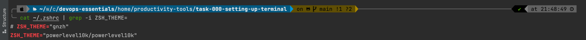

# Setting up your mac terminal

- Install [iterm2](https://iterm2.com)

- [Install ZSH](https://github.com/ohmyzsh/ohmyzsh)
- Run

```bash
$ sh -c "$(curl -fsSL https://raw.githubusercontent.com/ohmyzsh/ohmyzsh/master/tools/install.sh)"
.
$ echo $ZSH_CUSTOM
/Users/<yourusername>/.oh-my-zsh/custom
$ ls /Users/<yourusername>/.oh-my-zsh/custom
example.zsh plugins     themes
```

- [Install Powerline fonts](https://github.com/powerline/fonts)
- Run

```bash
git clone https://github.com/romkatv/powerlevel10k.git $ZSH_CUSTOM/themes/powerlevel10k
```

- [Set Theme to powerline10k](https://github.com/romkatv/powerlevel10k#manual)
- Once you do this you will have to restart `iTerm2` by pressing `CMD+Q`

```bash
╰─ cat ~/.zshrc | grep -i ZSH_THEME=
# ZSH_THEME="gnzh"
ZSH_THEME="powerlevel10k/powerlevel10k"
# Now restart your terminal
```

- Once you restart you should get prompt to customization of your powerline fonts to reach following state



- Now install some plugins

```bash
# download syntax highlighting extension
$ git clone https://github.com/zsh-users/zsh-syntax-highlighting.git ${ZSH_CUSTOM:-~/.oh-my-zsh/custom}/plugins/zsh-syntax-highlighting
.

# install autocompletions extension
git clone https://github.com/zsh-users/zsh-autosuggestions ${ZSH_CUSTOM:-~/.oh-my-zsh/custom}/plugins/zsh-autosuggestions
.
# once you have downloaded all the plugins, you can activate them in .zshrc by updating plugins like follows
$ cat ~/.zshrc | grep "plugins="
# Example format: plugins=(rails git textmate ruby lighthouse)
plugins=(git zsh-syntax-highlighting zsh-autosuggestions)
```
