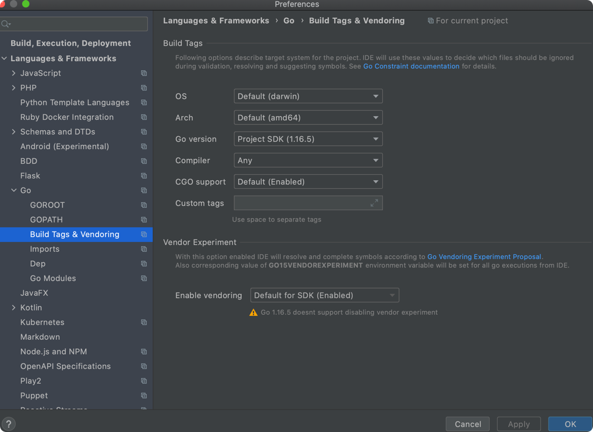

[Doc](https://semaphoreci.com/community/tutorials/building-and-testing-a-rest-api-in-go-with-gorilla-mux-and-postgresql)

To set up the IDE to be able to see the imported packages and set up a workspace ensure the following

```bash
$ go version
go version go1.16.5 darwin/amd64

$ which go
/usr/local/Cellar/go/1.16.5/libexec/bin/go
```

GOPATH


```bash
$ echo $GOPATH
/Users/ankitsinghrathi/Ankit/workspace/devops-essentials/languages/go/task-056-rest-api-gorilla-mix-postgres/goworkspace
```


Build Tags and Vendoring



Enable Dep integration


GOROOT

Intellij -> Preferences -> Languages -> Go -> GOROOT
```bash
$ echo $GOROOT
/usr/local/Cellar/go/1.16.5/libexec
```


Go modules


### Let's start building the application

```bash
$ pwd        
/Users/ankitsinghrathi/Ankit/workspace/devops-essentials/languages/go/task-056-rest-api-gorilla-mix-postgres/goworkspace

$ ls
bin pkg src

$ ls pkg                                                                            
mod   sumdb

$ tree src
src
└── proj
    ├── ReadMe.md
    ├── app.go
    └── main.go

$ go mod init github.com/codeaprendiz/rest-api-postgres
$ go get -u github.com/gorilla/mux 
$ go get -u github.com/lib/pq
```

- Run the following to get the dependencies
```bash
$ go get -u github.com/gorilla/mux 
$ go get -u github.com/lib/pq

### This should download the modules here 
$ ls pkg/mod/github.com/
gorilla lib
```

- Start docker postgres

```bash
$ mkdir -p /tmp/data
$ docker run -d --name my_postgres -v /tmp/data:/var/lib/postgresql/data -p 54320:5432 -e POSTGRES_PASSWORD=my_password postgres
## validate connection
$ psql -h 127.0.0.1 -p 54320 --username=postgres
Password for user postgres: 
psql (13.2, server 13.3 (Debian 13.3-1.pgdg100+1))
Type "help" for help.

postgres=#
```

- Create the environment variables

```bash
export APP_DB_USERNAME=postgres
export APP_DB_PASSWORD=my_password
export APP_DB_NAME=postgres
export APP_DB_PORT=54320          
```

- Now let's run some tests

```bash
$ go test -v                                    
testing: warning: no tests to run
PASS
ok      github.com/codeaprendiz/rest-api-postgres       0.365s
```


- Running the tests at the end 

```bash
$ go test -v
=== RUN   TestDeleteProduct
--- PASS: TestDeleteProduct (0.02s)
=== RUN   TestUpdateProduct
--- PASS: TestUpdateProduct (0.02s)
=== RUN   TestGetProduct
--- PASS: TestGetProduct (0.02s)
=== RUN   TestCreateProduct
--- PASS: TestCreateProduct (0.02s)
=== RUN   TestEmptyTable
--- PASS: TestEmptyTable (0.02s)
=== RUN   TestGetNonExistentProduct
--- PASS: TestGetNonExistentProduct (0.02s)
PASS
ok      github.com/codeaprendiz/rest-api-postgres       0.573s

```

- Let's insert a product into the database before we run the application

```bash
$ psql -h localhost -p 54320 --username=postgres
Password for user postgres: 
psql (13.2, server 13.3 (Debian 13.3-1.pgdg100+1))
Type "help" for help.
postgres=# \c postgres
psql (13.2, server 13.3 (Debian 13.3-1.pgdg100+1))
You are now connected to database "postgres" as user "postgres".

postgres=# INSERT INTO products(name, price) VALUES('green ball', 24);
INSERT 0 1
postgres=# select * from products;
 id |    name    | price 
----+------------+-------
  1 | green ball | 24.00
(1 row)


```


- Now if we try running the application after creating the binary

```bash
$ go install
$ ls ../../bin/rest-api-postgres 
../../bin/rest-api-postgres

$ ../../bin/rest-api-postgres
2021/06/18 22:07:01 Initializing the application ---------------------   Initialize()
2021/06/18 22:07:01 Initializing the routes -------------- initializeRoutes() 
2021/06/18 22:07:01 ----------- Starting the application on port 8010 --------- (a *App) Run(addr string)

```

- Now let's get the product using curl

```bash
$ curl http://localhost:8010/product/1
{"id":1,"name":"green ball","price":24}
```

- Application output for the call

```bash
$ ../../bin/rest-api-postgres
2021/06/18 22:07:01 Initializing the application ---------------------   Initialize()
2021/06/18 22:07:01 Initializing the routes -------------- initializeRoutes() 
2021/06/18 22:07:01 ----------- Starting the application on port 8010 --------- (a *App) Run(addr string)
2021/06/18 22:07:25 ------------- (a *App) getProduct(w http.ResponseWriter, r *http.Request)
2021/06/18 22:07:25 ---------------- (p *product) getProduct(db *sql.DB) error
2021/06/18 22:07:25 ----------------- respondWithJSON(w http.ResponseWriter, code int, payload interface{})
```