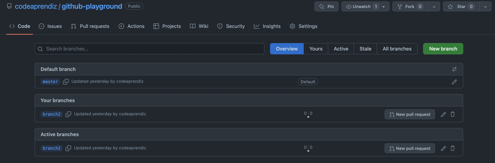

# Working with Github branches

- To check the branches locally

```bash
╰─ git --no-pager branch
* master

╰─ git branch           

## ZSH
╰─ gb
```


- To create a new branch `branch1` and `branch2` locally

```bash
╰─ git checkout -b branch1                                            
Switched to a new branch 'branch1'

╰─ git --no-pager branch  
* branch1
  main
  
## Zsh
╰─ gco -b branch2                 
Switched to a new branch 'branch2'

╰─ git --no-pager branch
  branch1
* branch2
  main
```


[What is origin in Git](https://stackoverflow.com/questions/9529497/what-is-origin-in-git)

- To show all the available remote origins

```bash
╰─ git remote -v        
origin  git@github.com:codeaprendiz/github-playground.git (fetch)
origin  git@github.com:codeaprendiz/github-playground.git (push)
```

- To push the `branch2` to remote 

```bash
# Get your current branch first
╰─ echo $(git_current_branch)
branch2
╰─ git push origin $(git_current_branch)
```

- Now if you go to the repo and check



- Now switch to branch1 locally and push the same to origin

```bash
### Zsh
╰─ gco branch1   
Switched to branch 'branch1'

## Zsh
╰─ ggpush     
```


- To list all the local and remote branches

```bash
## ZSH
╰─ gba          

╰─ git --no-pager branch -a
* branch1
  branch2
  master
  remotes/origin/HEAD -> origin/master
  remotes/origin/branch1
  remotes/origin/branch2
  remotes/origin/master
```

- To delete a branch from local

```bash


╰─ git branch -d branch2   
Deleted branch branch2 (was 4e2e8c1).

╰─ git --no-pager branch   
* branch1
  master
```

- To delete a branch from remote

```bash
# git push origin :branch2
╰─ git push -d origin branch2           
```

- To delete a branch from local again. [Worth checking](https://stackoverflow.com/questions/2003505/how-do-i-delete-a-git-branch-locally-and-remotely)

```bash
# from master
╰─ gco -b branch4

# from master
╰─ gco -b branch3            

╰─ gco master     

╰─ git --no-pager branch     
  branch1
  branch3
  branch4
* master

# delete both

╰─ gbd branch3 branch4  
Deleted branch branch3 (was 4e2e8c1).
Deleted branch branch4 (was 4e2e8c1).

╰─ git --no-pager branch
  branch1
* master
```

- To delete a branch forcefully, irrespective of merge status

```bash
# Or 
# > gbD branch1
╰─ git branch -D branch1        
Deleted branch branch1 (was 4e2e8c1).

# Delete from remote
╰─ git push origin :branch1    


╰─ git --no-pager branch -a
* master
  remotes/origin/HEAD -> origin/master
  remotes/origin/master         
```


- To see all remote branches

```bash
╰─ git --no-pager branch --remote
  origin/HEAD -> origin/master
  origin/branch5
  origin/master
  
## ZSH
╰─ gbr                           
```

- To find out which remote branch a local is tracking. [Here's the reference](https://stackoverflow.com/questions/171550/find-out-which-remote-branch-a-local-branch-is-tracking)

```bash
╰─ git remote -vv        
origin  git@github.com:codeaprendiz/github-playground.git (fetch)
origin  git@github.com:codeaprendiz/github-playground.git (push)
```

- Another way to check would be

```bash
╰─ git status -sb
## master...origin/master
```

- Yet another way to check

```vim
╰─ bat .git/config 
───────┬────────────────────────────────────────────────────────────────────────────────────────────────────────────────────────────────────────────────────────────────
       │ File: .git/config
───────┼────────────────────────────────────────────────────────────────────────────────────────────────────────────────────────────────────────────────────────────────
   1   │ [core]
   2   │     repositoryformatversion = 0
   3   │     filemode = true
   4   │     bare = false
   5   │     logallrefupdates = true
   6   │     ignorecase = true
   7   │     precomposeunicode = true
   8   │ [remote "origin"]
   9   │     url = git@github.com:codeaprendiz/github-playground.git
  10   │     fetch = +refs/heads/*:refs/remotes/origin/*
  11   │ [branch "master"]
  12   │     remote = origin
  13   │     merge = refs/heads/master
```

- Yet another way to track

```bash
╰─ git remote show origin
* remote origin
  Fetch URL: git@github.com:codeaprendiz/github-playground.git
  Push  URL: git@github.com:codeaprendiz/github-playground.git
  HEAD branch: master
  Remote branches:
    branch5 tracked
    master  tracked
  Local branch configured for 'git pull':
    master merges with remote master
  Local refs configured for 'git push':
    branch5 pushes to branch5 (up to date)
    master  pushes to master  (up to date)
```


