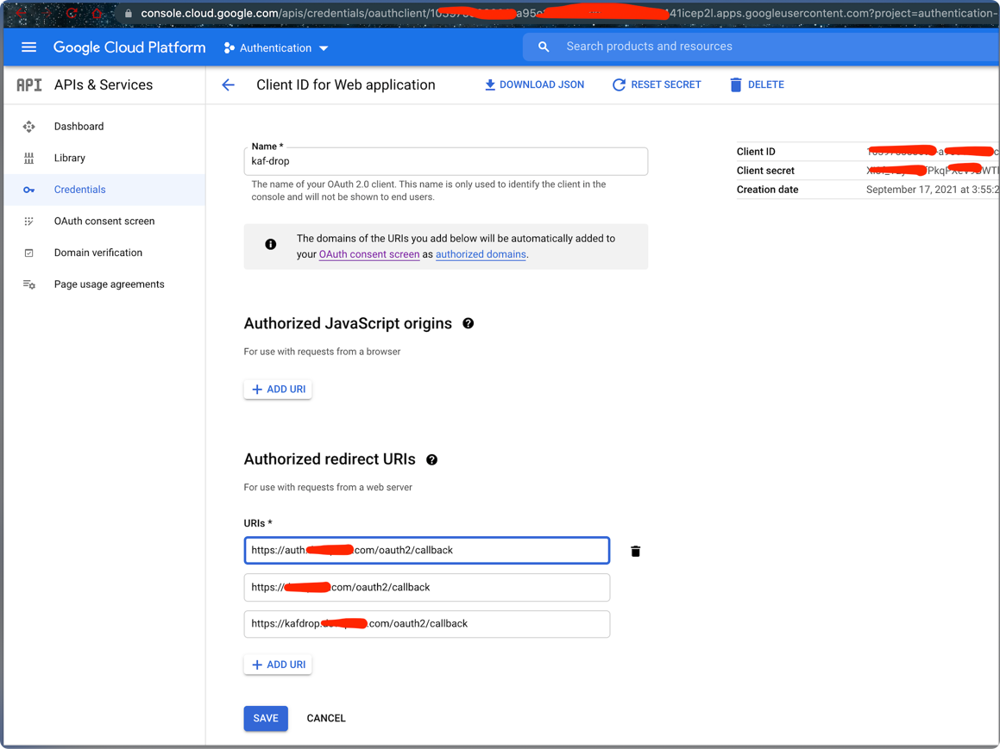
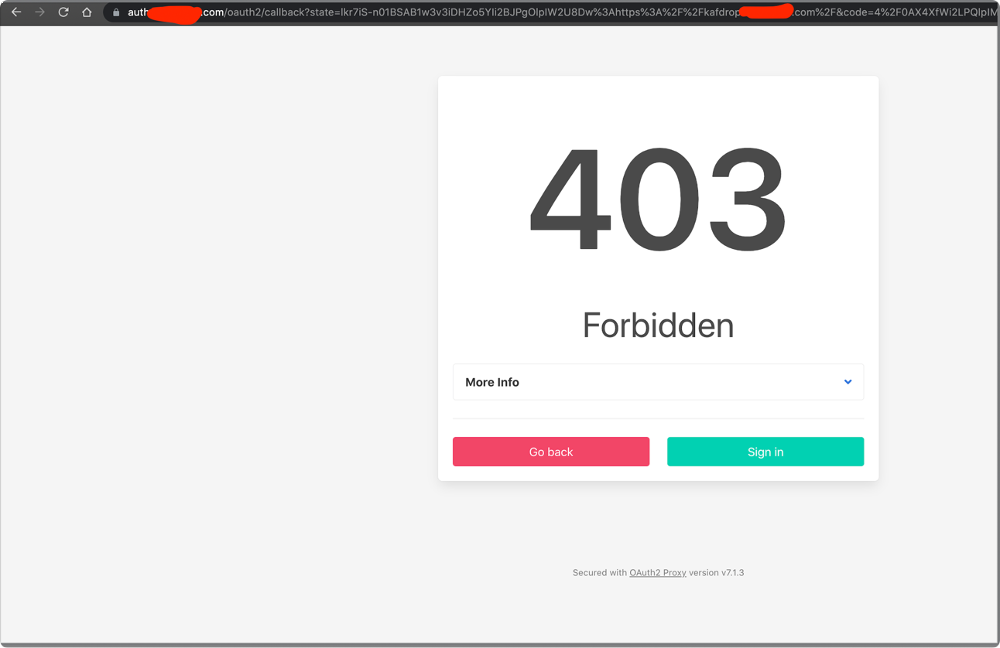

### Objective

- We will use open source kafdrop and to access kafka cluster deployed in kubernetes.
- kafdrop would be accessible on public URL domain using traefik as ingress
- The cluster would be deployed on 
- The URL domain would be protected by oauth2-proxy


[bitnami oauth2-proxy](https://github.com/bitnami/charts/tree/master/bitnami/oauth2-proxy/#installing-the-chart)

- Also you will need the following DNS records pointing to the LoadBalancer created by Traefik
```bash
*.somedomain.com     ALIAS A      to Loadbalancer
somedomain.com       ALIAS A      to Loadbalancer
```

- Install the following ACM certificate on the loadbalancer
```bash
*.somedomain.com, somedomain.com
```

- Load balancer Protocol settings

```bash
SSL	443	SSL	32280	Change	 something-2342-4a19-afee-8d40334323239e2db45c (ACM) Change
TCP	80	TCP	31211	N/A	N/A
```

- You will also need to create the google APIs Oauth Token where you will receive client ID and tokens




- First we deploy kafka and connect kafdrop to the same cluster using [task-009](../task-009-kafdrop)

Trying to access kafdrop from specified gmail


The Oauth screen


After login screen


If you try to login from any other gmail account

