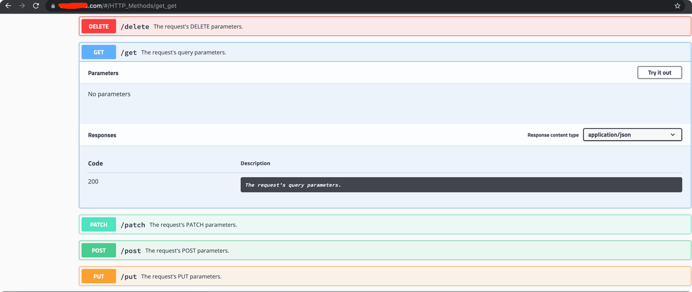

[traefik-helm-chart](https://github.com/traefik/traefik-helm-chart)

```bash
$ git clone https://github.com/traefik/traefik-helm-chart.git                                          
$ ls
ReadMe.md          traefik-helm-chart
$ cd traefik-helm-chart                      
$ mv traefik ../    
$ rm -rf traefik-helm-chart                 
$ mv traefik traefik-helm-chart                 
```

- Once you deploy echo-app

```bash
$ kubectl apply -f .                                
deployment.apps/echo created
ingressroute.traefik.containo.us/demo created
service/echo created
```
- Now we will hit the service

```bash
$ curl https://yourdomain.com/foo


Hostname: echo-5fc5b5bc84-b4xbv

Pod Information:
        node name:      ip-192-20-48-123.ap-south-1.compute.internal
        pod name:       echo-5fc5b5bc84-b4xbv
        pod namespace:  default
        pod IP: 200.96.1.6

Server values:
        server_version=nginx: 1.12.2 - lua: 10010

Request Information:
        client_address=200.96.1.5
        method=GET
        real path=/foo
        query=
        request_version=1.1
        request_scheme=http
        request_uri=http://yourdomain.com:8080/foo

Request Headers:
        accept=*/*  
        accept-encoding=gzip  
        host=yourdomain.com  
        user-agent=curl/7.64.1  
        x-forwarded-for=200.96.1.1  
        x-forwarded-host=yourdomain.com  
        x-forwarded-port=80  
        x-forwarded-proto=http  
        x-forwarded-server=traefik-v1-656557454c-dxpjk  
        x-real-ip=200.96.1.1  

Request Body:
        -no body in request-
```

The corresponding traefik access logs

```bash
$ kubectl logs -f traefik-v1-656557454c-dxpjk
.
200.96.1.1 - - [09/Oct/2021:10:06:59 +0000] "GET /foo HTTP/1.1" 200 741 "-" "-" 457 "default-demo-68f921d95eee7f144d1e@kubernetescrd" "http://200.96.1.6:8080" 1ms
```

- For adding the trace-id [trinnylondon/traefik-add-trace-id](https://github.com/trinnylondon/traefik-add-trace-id)

- We will make some changes as well. Build a custom docker image.

```bash
$ docker build --file Dockerfile -t codeaprendiz/traefik:v2.5.5 .
[+] Building 3.1s (8/8) FINISHED
.
.
 => => naming to docker.io/codeaprendiz/traefik:v2.5.5                                                                                                                                                             0.0s
```

- Push the image

```bash
$ docker push codeaprendiz/traefik:v2.5.5
The push refers to repository [docker.io/codeaprendiz/traefik]
.
.
v2.5.4: digest: sha256:c3f16e044a8e78cc56755ceda08002e12ae873c609d0711dae63f28f1e6e9f38 size: 1365
```

- Add the new middleware

```yaml
apiVersion: traefik.containo.us/v1alpha1
kind: Middleware
metadata:
  name: traceid
spec:
  plugin:
    traceid:
      headerName: X-Trace-Id
      headerPrefix: ""
      verbose: true
```

- Apply the new middleware

```bash
$ kubectl apply -f treafik-custom-image/middleware/.
middleware.traefik.containo.us/traceid created
```


- Deploy the `echo-app` with the new ingress and middleware 

```yaml
apiVersion: traefik.containo.us/v1alpha1
kind: IngressRoute
metadata:
  name: demo
spec:
  entryPoints:
    - web
    - websecure
  routes:
    - match: "HostRegexp(`yourdomain.com`) && PathPrefix(`/foo`)"
      kind: Rule
      services:
        - name: echo
          port: 80
      middlewares:
        - name: traceid
```

- Apply

```bash
$ kubectl apply -f echo-app/.                              
deployment.apps/echo unchanged
ingressroute.traefik.containo.us/demo configured
service/echo unchanged
```

- Now we hit the service again

```bash
$ curl https://yourdomain.com/foo


Hostname: echo-5fc5b5bc84-8gsnq

Pod Information:
        node name:      ip-192-20-48-123.ap-south-1.compute.internal
        pod name:       echo-5fc5b5bc84-8gsnq
        pod namespace:  default
        pod IP: 200.96.1.7

Server values:
        server_version=nginx: 1.12.2 - lua: 10010

Request Information:
        client_address=200.96.1.8
        method=GET
        real path=/foo
        query=
        request_version=1.1
        request_scheme=http
        request_uri=http://yourdomain.com:8080/foo

Request Headers:
        accept=*/*  
        accept-encoding=gzip  
        host=yourdomain.com  
        user-agent=curl/7.64.1  
        x-forwarded-for=200.96.1.1  
        x-forwarded-host=yourdomain.com  
        x-forwarded-port=80  
        x-forwarded-proto=http  
        x-forwarded-server=traefik-v1-846499dd44-ngbrh  
        x-real-ip=200.96.1.1  
        x-trace-id=7e0f6018-35b3-4896-b65a-5a514a481f31  

Request Body:
        -no body in request-
```

- Corresponding access log

```bash
2021/10/09 10:13:55 7e0f6018-35b3-4896-b65a-5a514a481f31
200.96.1.1 - - [09/Oct/2021:10:13:55 +0000] "GET /foo HTTP/1.1" 200 792 "-" "-" 3 "default-demo-68f921d95eee7f144d1e@kubernetescrd" "http://200.96.1.7:8080" 1ms
```


- Now lets deploy another amazing tool, http-bin

```bash
$ kubectl apply -f httpbin-app/.             
deployment.apps/httpbin created
ingressroute.traefik.containo.us/demo1 created
service/httpbin created
```

- Visit the site


- HTTP methods



- Get request


- Similarly for status code

```bash
$ curl -X GET "https://yourdomain.com/status/200" -H "accept: text/plain" -I
HTTP/1.1 200 OK
Access-Control-Allow-Credentials: true
Access-Control-Allow-Origin: *
Content-Length: 0
Content-Type: text/html; charset=utf-8
Date: Sat, 09 Oct 2021 10:33:42 GMT
Server: gunicorn/19.9.0
X-Trace-Id: f4a2c995-7780-4ad0-b4f2-40ae50364579
```

- For post request

```bash
$ curl -X POST "https://yourdomain.com/status/200" -H "accept: text/plain" -I
HTTP/1.1 200 OK
Access-Control-Allow-Credentials: true
Access-Control-Allow-Origin: *
Content-Length: 0
Content-Type: text/html; charset=utf-8
Date: Sat, 09 Oct 2021 10:36:45 GMT
Server: gunicorn/19.9.0
X-Trace-Id: 36242f47-64a4-450d-af92-37aeae0ca55f
```