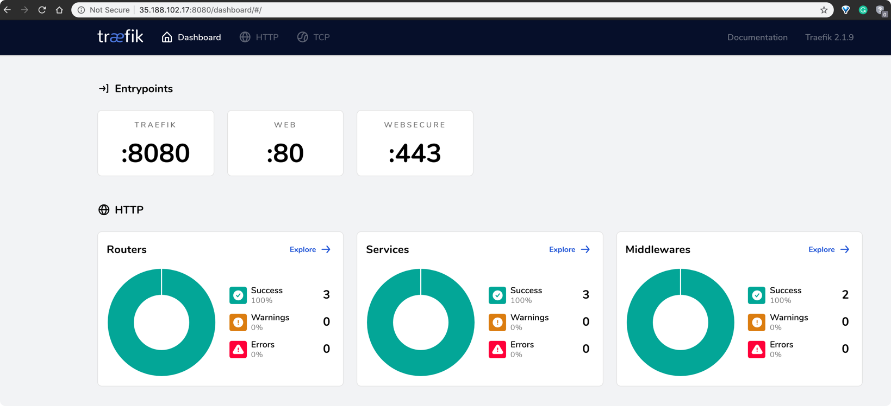
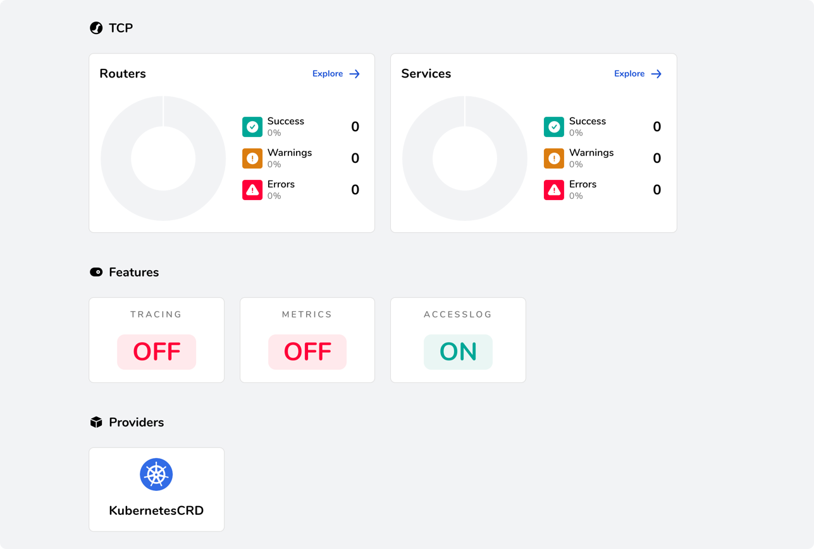
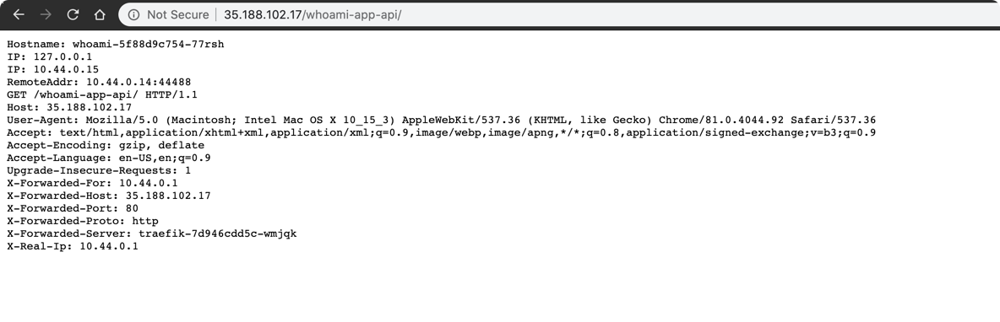

## To deploy traefik on GKE with whoami service


- Run the following command (you may run it again if you get error for the first time as some
custom resources take some time to get created)

```bash
kubectl apply -f .
```

- Get the public IP of Treafik-Service
```bash
$ kubectl get service
NAME         TYPE           CLUSTER-IP      EXTERNAL-IP     PORT(S)                                     AGE
kubernetes   ClusterIP      10.109.0.1      <none>          443/TCP                                     31m
traefik      LoadBalancer   10.109.10.37    35.188.102.17   80:30541/TCP,443:32703/TCP,8080:31141/TCP   84s
whoami       ClusterIP      10.109.10.217   <none>          80/TCP                                      84s
```


- Dashboard
    





- HTTP Routers


- HTTP Services


- HTTP Middlewares


- Accessing whoami service

