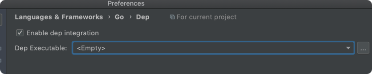

[Doc](https://semaphoreci.com/community/tutorials/building-and-testing-a-rest-api-in-go-with-gorilla-mux-and-postgresql)

To set up the IDE to be able to see the imported packages and set up a workspace ensure the following

```bash
$ go version
go version go1.16.5 darwin/amd64

$ which go
/usr/local/Cellar/go/1.16.5/libexec/bin/go
```

GOPATH


```bash
$ echo $GOPATH
/Users/ankitsinghrathi/Ankit/workspace/devops-essentials/languages/go/task-056-rest-api-gorilla-mix-postgres/goworkspace
```


Build Tags and Vendoring


Enable Dep integration




GOROOT

Intellij -> Preferences -> Languages -> Go -> GOROOT
```bash
$ echo $GOROOT
/usr/local/Cellar/go/1.16.5/libexec
```


Go modules


### Let's start building the application

```bash
$ pwd        
/Users/ankitsinghrathi/Ankit/workspace/devops-essentials/languages/go/task-056-rest-api-gorilla-mix-postgres/goworkspace

$ ls
bin pkg src

$ ls pkg                                                                            
mod   sumdb

$ tree src
src
└── proj
    ├── ReadMe.md
    ├── app.go
    └── main.go

$ go mod init github.com/codeaprendiz/rest-api-postgres
$ go get -u github.com/gorilla/mux 
$ go get -u github.com/lib/pq
```

- Run the following to get the dependencies
```bash
$ go get -u github.com/gorilla/mux 
$ go get -u github.com/lib/pq

### This should download the modules here 
$ ls pkg/mod/github.com/
gorilla lib
```

- Start docker postgres

```bash
$ mkdir -p /tmp/data
$ docker run -d --name my_postgres -v /tmp/data:/var/lib/postgresql/data -p 54320:5432 -e POSTGRES_PASSWORD=my_password postgres
## validate connection
$ psql -h 127.0.0.1 -p 54320 --username=postgres
Password for user postgres: 
psql (13.2, server 13.3 (Debian 13.3-1.pgdg100+1))
Type "help" for help.

postgres=#
```

- Create the environment variables

```bash
export APP_DB_USERNAME=postgre
export APP_DB_PASSWORD=my_password
export APP_DB_NAME=postgres
```