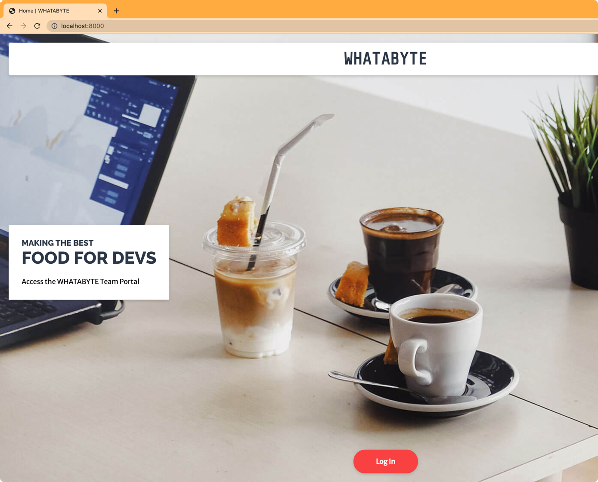
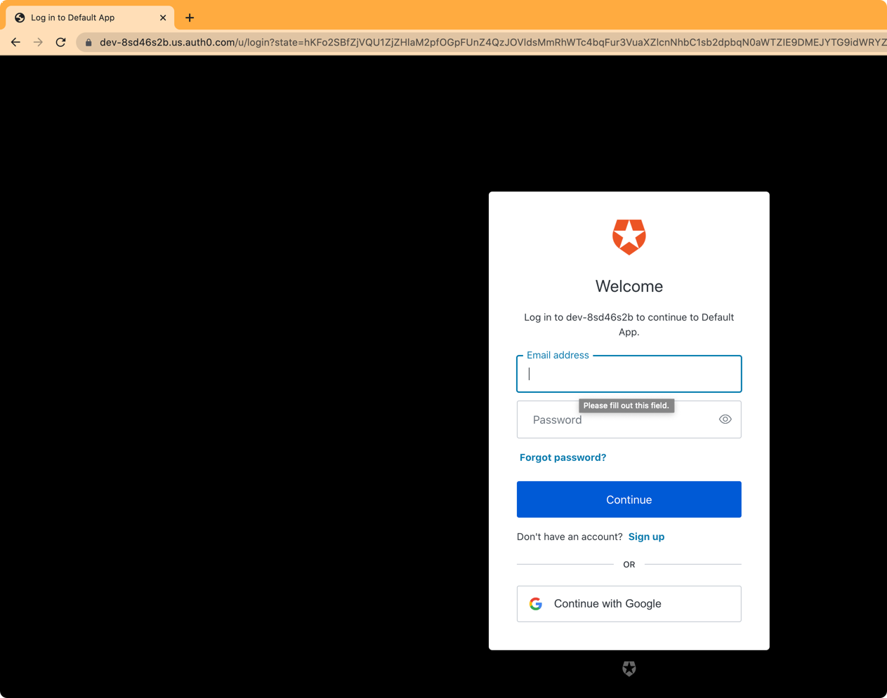

[https://auth0.com/blog/create-a-simple-and-secure-node-express-app/](https://auth0.com/blog/create-a-simple-and-secure-node-express-app/)

```bash
$ npm i passport passport-auth0 express-session dotenv
```

Login



Sign in



Sign in with google


Authorization screen


Logged-in-now

