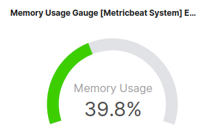
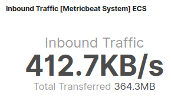
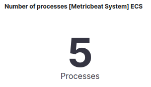
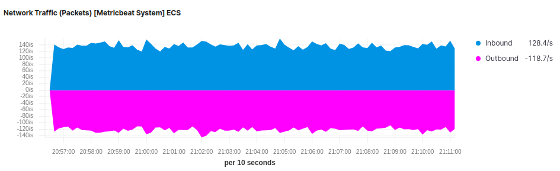
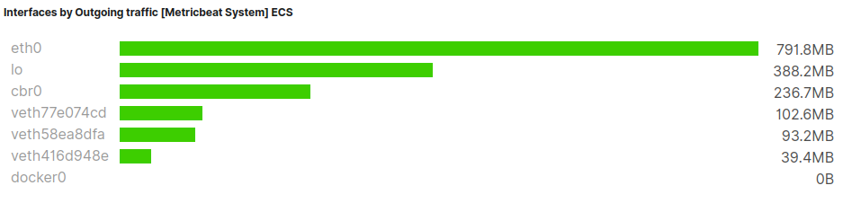

## Host Monitoring

|               Stats                                                |           Visualization                                                                                                                                     | 
|--------------------------------------------------------------------|------------------------------------------------------------------------------------------------------------------------------------------------------------ |
|[CPU Usage Guage](#CPU-Usage-Gauge)                                 |                                              | 
|[Memroy Usage Guage](#Memory-Usage-Gauge)                           |                                           | 
|[Load Guage](#Load-Guage)                                           |                                                   | 
|[Inbound Traffic](#Inbound-Traffic)                                 |                                              | 
|[Outbound Traffic](#Outbound-Traffic)                               |                                             | 
|[Packetloss](#Packetloss)                                           |                                                   | 
|[Swap Usage](#Swap-uage)                                            |                                                   | 
|[Memory usage vs total](#Memory-usage-vs-total)                     |                                        | 
|[Number of processes](#Number-of-processes)                         |                                          | 
|[Disk Used](#Disk-used)                                             |                                                    | 
|[Disk Usage](#Disk-Usage)                                           |                                                   | 
|[CPU Usage](#CPU-Usage)                                             |                                                    | 
|[System Load](#System-Load)                                         |                                                  | 
|[Memory Usage](#Memory-Usage)                                       |                                                 | 
|[Disk IO](#Disk-IO)                                                 |                                                      | 
|[Network Traffic Packets](Network-Traffic-Packets#)                 |                                      | 
|[Network Traffic Bytes](#Network-Traffic-Bytes)                     |                                        | 
|[Processes By Memory](#Processes-By-Memory)                         |                                          | 
|[Top Processes By CPU](#Top-Processes-By-CPU)                       |                                         | 
|[Interfaces By Incoming Traffic](#Interfaces-By-Incoming-Traffic)   |                               | 
|[Interfaces By Outgoing Traffic](#Interfaces-By-Outgoing-Traffic)   |                               | 


### CPU-Usage-Gauge

- system.cpu.user.pct: 
  - The percentage of CPU time spent in user space. On multi-core systems, you can have percentages that are greater than 100%. For example, if 3 cores are at 60% use, then the system.cpu.user.pct will be 180%. 
  - type: scaled_float
  - format: percent
  
- system.cpu.system.pct
  - The percentage of CPU time spent in kernel space.
  - type: scaled_float
  - format: percent

- system.cpu.cores
  - The number of CPU cores present on the host. The non-normalized percentages will have a maximum value of 100% * cores. The normalized percentages already take this value into account and have a maximum value of 100%.
  - type: long

**Aggregations**

- Timefield : @timestamp
- Inverval : auto
- Data timerange mode : last value

```bash
## Average ##
user = Avg(system.cpu.user.pct)

## Average ##
system = Avg(system.cpu.system.pct)

## Average ##
n = Avg(system.cpu.cores)

## Bucket Script ##
params.n > 0 ? (params.user+params.system)/params.n : null

GroupBy-Everything
```


| COLOR          |EXPRESSION                     |VALUE                        |
|----------------|-------------------------------|-----------------------------|
|GREEN           |: >= greater than or equal     |0                            |
|ORANGE          |: >= greater than or equal     |0.7                          |
|RED             |: >= greater than or equal     |0.85                         |

### Memory-Usage-Gauge

- system.memory.actual.used.pct
    - The percentage of actual used memory. 
    - type: scaled_float
    - format: percent
    

**Aggregation**

- Timefield : @timestamp
- Inverval : auto
- Data timerange mode : last value

```bash
## Average ##
a = Avg(system.memory.actual.used.pct)

GroupBy-Everything
```

| COLOR          |EXPRESSION                     |VALUE                        |
|----------------|-------------------------------|-----------------------------|
|GREEN           |: >= greater than or equal     |0                            |
|ORANGE          |: >= greater than or equal     |0.7                          |
|RED             |: >= greater than or equal     |0.85                         |


### Load-Guage

- system.load.5
    - CPU Load average for the last 5 minutes.
    - type: scaled_float

**Aggregation**

- Timefield : @timestamp
- Inverval : auto
- Data timerange mode : last value

```bash
## Average ##
a = Avg(system.load.5)

GroupBy-Everything
```
    
### Inbound-Traffic

*network*  network contains network IO metrics for a single network interface.

- system.network.in.bytes
    - The number of bytes received.

- system.network.name
  - The network interface name.
  - type: keyword
  - example: eth0
  
**Aggregation**
  
- Timefield : @timestamp
- Inverval : auto
- Data timerange mode : last value
  
```bash
## Max ##
a = Max(system.network.in.bytes)

## Derivative ##
b = Derivative(a)/1s

## PositiveOnly ##
c = PositiveOnly(b)

## Series Agg ##
Function : Sum             # c1 + c2 + c3 ....

GroupBy-Terms : system.network.name
Top : 10
OrderBy : Doc Count (default)
Decending
```


  
#### Total Transferred

**Aggregation**
  
- Dataformatter : Bytes
- Template : {{value}}         
- Data timerange mode : last value

```bash
## Max ##
a = Max(system.network.in.bytes)

## Derivative ##
b = Derivative(a)/1s

## PositiveOnly ##
c = PositiveOnly(b)

## Series Agg ##
Function : Overall Sum             # c1 + c2 + c3 ....

GroupBy-Terms : system.network.name
Top : 10
OrderBy : Doc Count (default)
Decending
```


### Outbound-Traffic


- system.network.out.bytes
    - The number of bytes sent.
    - type: long
    - format: bytes

**Aggregation**
  
- Timefield : @timestamp
- Inverval : auto
- Data timerange mode : last value
  
```bash
## Max ##
a = Max(system.network.out.bytes)

## Derivative ##
b = Derivative(a)/1s

## PositiveOnly ##
c = PositiveOnly(b)

## Series Agg ##
Function : Sum             # c1 + c2 + c3 ....

GroupBy-Terms : system.network.name
Top : 10
OrderBy : Doc Count (default)
Decending
```

#### Total Transferred

- system.network.name
  - The network interface name.
  - type: keyword
  - example: eth0

**Aggregation**
  
- Dataformatter : Bytes
- Template : {{value}}         
- Data timerange mode : last value

```bash
## Max ##
a = Max(system.network.out.bytes)

## Derivative ##
b = Derivative(a)/1s

## PositiveOnly ##
c = PositiveOnly(b)

## Series Agg ##
Function : Overall Sum             # c1 + c2 + c3 ....

GroupBy-Terms : system.network.name
Top : 10
OrderBy : Doc Count (default)
Decending
```


### Packetloss


#### In Packetloss

- system.network.in.dropped
  - The number of incoming packets that were dropped.
  - type: long

**Aggregation**
  
- Dataformatter : Number
- Template : {{value}}/s        
- Data timerange mode : last value

```bash
## Max ##
a = Max(system.network.in.dropped)

GroupBy-Everything
```


#### Out Packetloss

- system.network.out.dropped
  - The number of outgoing packets that were dropped. This value is always 0 on Darwin and BSD because it is not reported by the operating system
  - type: long
 
**Aggregation**

- Dataformatter : Number
- Template : {{value}}/s        
- Data timerange mode : last value

```bash
## Max ##
a = Max(system.network.out.dropped)

GroupBy-Everything
```

### Swap-usage

- system.memory.swap.used.pct
  - The percentage of used swap memory.  
  - type: scaled_float
  - format: percent

**Aggregation**

- Timefield : @timestamp
- Inverval : auto
- Data timerange mode : last value

```bash
## Average ##
a = Avg(system.memory.swap.used.pct)

GroupBy-Everything
```


| COLOR          |EXPRESSION                     |VALUE                        |
|----------------|-------------------------------|-----------------------------|
|GREEN           |: >= greater than or equal     |0                            |
|ORANGE          |: >= greater than or equal     |0.7                          |
|RED             |: >= greater than or equal     |0.85                         |


### Memory-usage-vs-total


- system.memory.actual.used.bytes
  - Actual used memory in bytes. It represents the difference between the total and the available memory. The available memory depends on the OS. For more details, please check system.actual.free.
  - type: long
  - format: bytes
  
- system.memory.actual.free
  - Actual free memory in bytes. It is calculated based on the OS. On Linux this value will be MemAvailable from /proc/meminfo, or calculated from free memory plus caches and buffers if /proc/meminfo is not available. On OSX it is a sum of free memory and the inactive memory. On Windows, it is equal to system.memory.free.
  - type: long
  - format: bytes
  
**Aggregation**

- Dataformatter : Bytes
- Data timerange mode : last value

```bash
## Average ##
a = Avg(system.memory.actual.used.bytes)

GroupBy-Everything
```
  
- system.memory.total
  - Total memory.
  - type: long
  - format: bytes

**Aggregation**

- Dataformatter : Bytes
- Data timerange mode : last value

```bash
## Average ##
a = Avg(system.memory.total)

GroupBy-Everything
```


### Number-of-processes


- system.process.pid
  - type: alias
  - alias to: process.pid
  
Metrics
```bash
a = UniqueCount(process.pid)
```


### Disk-used

- system.fsstat.total_size.used
  - Total used space.
  - type: long
  - format: bytes
  
- system.fsstat.total_size.total
  - Total space (used plus free).
  - type: long
  - format: bytes
 
**Aggregation**

- Dataformatter : Percent
- Data timerange mode : last value

```bash
## TopHit ##
a = TopHit(system.fsstat.total_size.used)         # Size=1, Aggregate with Avg, Order By : @timastamp, Desc

## TopHit ##
b = TopHit(system.fsstat.total_size.total)        # Size=1, Aggregate with Avg, Order By : @timastamp, Desc

Expression = a/b

GroupBy-Everything
```


| COLOR          |EXPRESSION                     |VALUE                        |
|----------------|-------------------------------|-----------------------------|
|GREEN           |: >= greater than or equal     |0                            |
|ORANGE          |: >= greater than or equal     |0.7                          |
|RED             |: >= greater than or equal     |0.85                         |

### Disk-Usage

- system.filesystem.used.pct
  - The percentage of used disk space.  
  - type: scaled_float
  - format: percent

- system.filesystem.mount_point
  - The mounting point. For example: /

**Aggregation**

- Data timerange mode : Entire Time Range
- Timefield : @timestamp

```bash
## TopHit ##
a = TopHit(system.filesystem.used.pct)   # Size=1, Aggregate with Avg, Order By : @timastamp


GroupBy-Term : system.filesystem.mount_point
Top : 10
OrderBy : Doc Count(default)
Desc
```


### CPU-Usage

- system.cpu.user.pct
  - The percentage of CPU time spent in user space. On multi-core systems, you can have percentages that are greater than 100%. For example, if 3 cores are at 60% use, then the system.cpu.user.pct will be 180%.
  - type: scaled_float
  - format: percent
  
**Aggregation**

- Timefield : @timestamp
- Inverval : auto

```bash
## Average ##
a = Avg(system.cpu.user.pct)

GroupBy-Everything
```


- system.cpu.system.pct
  - The percentage of CPU time spent in kernel space.
  - type: scaled_float 
  - format: percent

**Aggregation**

- Timefield : @timestamp
- Inverval : auto

```bash
## Average ##
a = Avg(system.cpu.system.pct)

GroupBy-Everything
```


- system.cpu.nice.pct
  - The percentage of CPU time spent on low-priority processes.
  - type: scaled_float
  - format: percent
  
**Aggregation**

- Timefield : @timestamp
- Inverval : auto

```bash
## Average ##
a = Avg(system.cpu.nice.pct)

GroupBy-Everything
```


- system.cpu.irq.pct
  - The percentage of CPU time spent servicing and handling hardware interrupts.
  - type: scaled_float
  - format: percent
**Aggregation**

- Timefield : @timestamp
- Inverval : auto

```bash
## Average ##
a = Avg(system.cpu.irq.pct)

GroupBy-Everything
```

- system.cpu.softirq.pct
  - The percentage of CPU time spent servicing and handling software interrupts. 
  - type: scaled_float 
  - format: percent
  
**Aggregation**

- Timefield : @timestamp
- Inverval : auto

```bash
## Average ##
a = Avg(system.cpu.softirq.pct)

GroupBy-Everything
```

- system.cpu.iowait.pct
  - The percentage of CPU time spent in wait (on disk).
  - type: scaled_float 
  - format: percent
**Aggregation**

- Timefield : @timestamp
- Inverval : auto

```bash
## Average ##
a = Avg(system.cpu.iowait.pct)

GroupBy-Everything
```


### System-Load

- system.load.1
  - CPU Load average for the last minute.
  - type: scaled_float
  
**Aggregation**

- Timefield : @timestamp
- Inverval : auto

```bash
## Average ##
a = Avg(system.load.1)

GroupBy-Everything
```

- system.load.5
  - CPU Load average for the last minute.
  - type: scaled_float
  
**Aggregation**

- Timefield : @timestamp
- Inverval : auto

```bash
## Average ##
a = Avg(system.load.5)

GroupBy-Everything
```

- system.load.15
  - CPU Load average for the last minute.
  - type: scaled_float
  
**Aggregation**

- Timefield : @timestamp
- Inverval : auto

```bash
## Average ##
a = Avg(system.load.15)

GroupBy-Everything
```


### Memory-Usage

- system.memory.actual.used.bytes
  - Actual used memory in bytes. It represents the difference between the total and the available memory. The available memory depends on the OS. For more details, please check system.actual.free.
  - type: long
  - format: bytes

Used Memory

**Aggregation**

- Timefield : @timestamp
- Inverval : auto

```bash
## Average ##
a = Avg(system.memory.actual.used.bytes)

GroupBy-Everything
```

- system.memory.free
  - Actual free memory in bytes. It is calculated based on the OS. On Linux this value will be MemAvailable from /proc/meminfo, or calculated from free memory plus caches and buffers if /proc/meminfo is not available. On OSX it is a sum of free memory and the inactive memory. On Windows, it is equal to system.memory.free. 
  - type: long 
  - format: bytes

Free Momory

**Aggregation**

- Timefield : @timestamp
- Inverval : auto

```bash
## Average ##
a = Avg(system.memory.free)

GroupBy-Everything
```

- system.memory.used.bytes
  - Used memory.
  - type: long
  - format: bytes

Cache 

**Aggregation**
```bash
## Bucket Script ##
actual = Avg(system.memory.actual.used.bytes)
used   = Avg(system.memory.used.bytes)

params.actual != null && params.used != null ? params.used - params.actual : null

GroupBy(everything)
```


### Disk-IO

Reads
- system.diskio.read.bytes
  - The total number of bytes read successfully. On Linux this is the number of sectors read multiplied by an assumed sector size of 512.
  - type: long
  - format: bytes

**Aggregation**

- Dataformatter : Bytes
- Template : {{value/s}}
- Chart type: Line

```bash
## Max ##
a = Max(system.diskio.read.bytes)

## Derivative ##
b = Derivative(a)/1s   

## PositiveOnly ##
c = PositiveOnly(b)

GroupBy-Everything
```


Writes

- system.diskio.write.bytes
  - The total number of bytes written successfully. On Linux this is the number of sectors written multiplied by an assumed sector size of 512.
  - type: long
  - format: bytes

**Aggregation**

- Dataformatter : Bytes
- Template : {{value/s}}
- Chart type: Line

```bash
## Max ##
a = Max(system.diskio.write.bytes)

## Derivative ##
rate = Derivative(a)/1s   

## Bucket Script ##
params.rate > 0 ? params.rate * -1 : 0

GroupBy-Everything
```


Aggregation
> rate = Derivative(a)/1s

Aggregation
> Bucket Script
> params.rate > 0 ? params.rate * -1 : 0

GroupBy(Everything)

### Network-Traffic-Packets

Inbound
- system.network.in.packets
  - The number or packets received.
  - type: long

- system.network.name
  - The network interface name.
  - type: keyword
  - example: eth0

**Aggregation**

- Dataformatter : Custom
- Format String : 0.[00]a
- Template : {{value/s}}
- Chart type: Line

```bash
## Max ##
a = Max(system.network.in.packets)

## Derivative ##
b = Derivative(a)/1s

## PositiveOnly ##
c = PositiveOnly(b)

## Series Agg ##
Function : Sum         # c1 + c2 + ...

GroupBy-Terms : system.network.name
Top : 10
OrderBy : Doc Count (default)
Desc
```


Outbound

- system.network.out.packets
  - The number of packets sent.
  - type: long

**Aggregations**

- Dataformatter : Custom
- Format String : 0.[00]a
- Template : {{value/s}}
- Chart type: Line

```bash
## Max ## 
a = Max(system.network.out.packets)

## Derivative ##
rate = Derivative(system.network.out.packets)/1s

## Bucket Script ##
params.rate != null && params.rate > 0 ? params.rate * -1 : null

## Serives Agg ##
Function : Sum            # params.rate1 + params.rate2 + ...

GroupBy-Term  :  system.network.name
Top : 10
Order By : Doc Count(default) 
Desc
```

### Network-Traffic-Bytes

Inbound

- system.network.in.bytes
  - The number of bytes received.
  - type: long
  - format: bytes

- system.network.name
  - The network interface name.
  - type: keyword
  - example: eth0
  
**Aggregations**

- Time field: @timestamp
- Interval : auto
- Data Formatter: Bytes
- Template : {{value}}/s

```bash
## Max ##
a = Max(system.network.in.bytes)

## Derivative ##
b = Derivative(a)/1s

## PositiveOnly ##
c = PositiveOnly(b)

## Series Agg ##
Function : Sum                  #  c1 + c2 + c3 + c4

GroupBy-Terms : system.network.name
Top : 10
OrderBy : DocCount(default)
Desc
```

Outbound

- system.network.out.bytes
  - system.network.out.bytes
    - The number of bytes sent.  
    - type: long
    - format: bytes

**Aggregations**

- Time field: @timestamp
- Interval : auto
- Data Formatter: Bytes
- Template : {{value}}/s


```bash
## Max ##
a = Max(system.network.out.bytes)

## Derivative ##
rate = Derivative(a)/1s

## Bucket Script ## 
params.rate != null && params.rate > 0 ? params.rate * -1 : null

## Series Agg ##
Function : Sum                  #  params.rate1 + params.rate2 ...

GroupBy-Terms : system.network.name
Top : 10
OrderBy : DocCount(default)
Desc
```

### Processes-By-Memory

- system.process.memory.rss.pct
  - The percentage of memory the process occupied in main memory (RAM).
  - type: scaled_float
  - format: percent

**Aggregations**

- Data timerange mode : Last value
- Time field : @timestamp
- Interval : auto

```bash
## Average ##
a = Avg(system.process.memory.rss.pct)

GroupBy-Terms: process.name
Top : 10
OrderBy : a
Desc
```

| COLOR          |EXPRESSION                     |VALUE                        |
|----------------|-------------------------------|-----------------------------|
|GREEN           |: >= greater than or equal     |0                            |
|ORANGE          |: >= greater than or equal     |0.7                          |
|RED             |: >= greater than or equal     |0.85                         |


### Top-Processes-By-CPU


- system.process.cpu.total.pct
  - The percentage of CPU time spent by the process since the last update. Its value is similar to the %CPU value of the process displayed by the top command on Unix systems
  - type: scaled_float
  - format: percent
  
**Aggregations**

- Data timerange mode : Last value
- Time field : @timestamp
- Interval : auto

```bash
## Avegage ##
a = Avg(system.process.cpu.total.pct)

GroupBy-Terms: process.name
Top : 10
OrderBy : a
Descending
```

### Interfaces-By-Incoming-Traffic

- system.network.in.bytes
  - The number of bytes received.
  - type: long
  - format: bytes

- system.network.name
  - The network interface name.
  - type: keyword
  - example: eth0
  

**Aggregation**

- Data timerange mode : Last value
- Time field : @timestamp
- Interval : auto

```bash
## Average ##
a = Avg(system.network.in.bytes)

GroupBy-Terms: system.network.name
Top : 10
OrderBy : a
Descending
```

### Interfaces-By-Outgoing-Traffic

- system.network.out.bytes
    - The number of bytes sent.
    - type: long
    - format: bytes

Aggregation
```bash
## Average ##
a = Avg(system.network.out.bytes)

GroupBy-Terms: system.network.name
Top : 10
OrderBy : a
Descending
```

