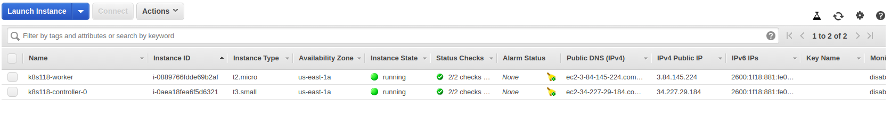
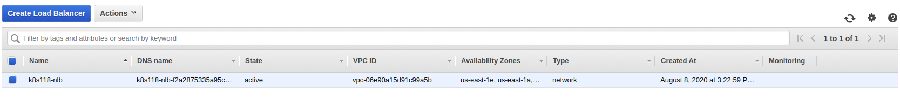
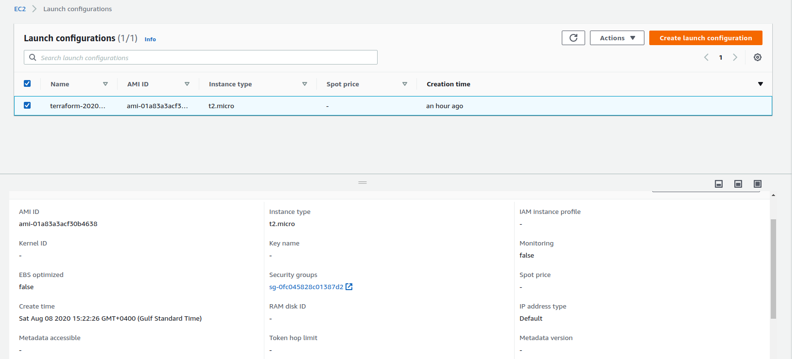
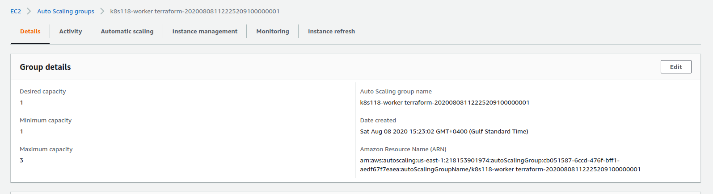
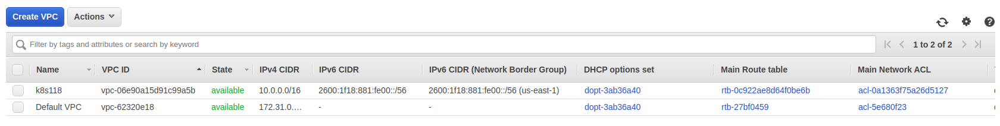
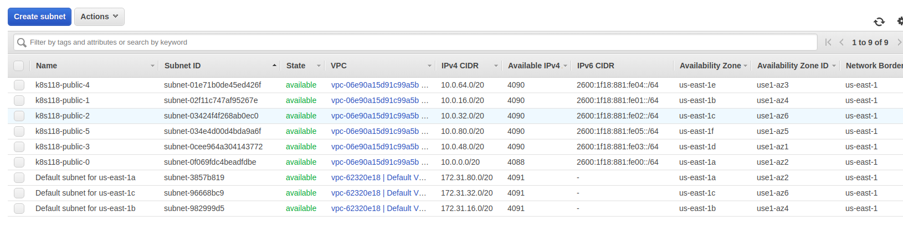
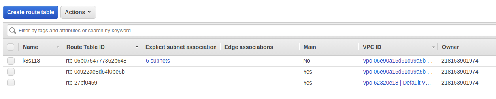

## Objective: To create a kubernetes cluster using typhoon

[Link Referred](https://typhoon.psdn.io/flatcar-linux/aws/)

[Git Repo](https://github.com/poseidon/typhoon/)

### Steps

- Create a DNS zone using [task-011-route53](../task-011-route53) and get the zone name and zone_id. The zone I created was `k118.tk`. Also I created the domain `k118.tk`
 in [myfreenom.com](https://my.freenom.com/). 
```bash
Apply complete! Resources: 1 added, 0 changed, 0 destroyed.

Outputs:

devopslink-name-servers = [
  "ns-1347.awsdns-40.org",
  "ns-1667.awsdns-16.co.uk",
  "ns-384.awsdns-48.com",
  "ns-999.awsdns-60.net",
]
devopslink-public-zone-id = Z099337627DO5QQDVQEVD

```

- Assign those values in the variables file in this task. Also make sure that you assign these nameservers to the domain `k118.tk` you created earlier. Visit the website
[https://my.freenom.com/](https://my.freenom.com/) and go to the setting for you domain. Check the setting for changing the nameservers from freenom's default
to the ones you just created above. For more details about this you can check the [task-22-route53-ec2](../task-022-route53-ec2)

- init
```bash
$ terraform init
```

- plan
```bash
$ TF_LOG=TRACE terraform plan
.
.
.
Plan: 91 to add, 0 to change, 0 to destroy.
```

- apply
```bash
$ TF_LOG=TRACE terraform apply
Apply complete! Resources: 91 added, 0 changed, 0 destroyed.
```

- You can access the nodes by using the following command
```bash
$ export KUBECONFIG=./auth/kubeconfig  
$ kubectl get nodes
NAME            STATUS   ROLES    AGE     VERSION
ip-10-0-0-102   Ready    <none>   2m21s   v1.18.5
ip-10-0-2-187   Ready    <none>   3m39s   v1.18.5
```

- Check the pods in kube-system namespace
```bash
✗ kubectl get pods -n kube-system
NAME                                    READY   STATUS    RESTARTS   AGE
calico-node-7w5jp                       1/1     Running   0          8m23s
calico-node-s25vl                       1/1     Running   0          7m5s
coredns-857c875bc7-k52vl                1/1     Running   0          8m31s
coredns-857c875bc7-qgb6q                1/1     Running   0          8m31s
kube-apiserver-ip-10-0-2-187            1/1     Running   0          7m1s
kube-controller-manager-ip-10-0-2-187   1/1     Running   0          7m41s
kube-proxy-476dh                        1/1     Running   1          8m23s
kube-proxy-rvkwf                        1/1     Running   1          7m5s
kube-scheduler-ip-10-0-2-187            1/1     Running   0          7m13s
```

- Route53 Records which got created in the hosted zone `k118.tk`


- Instances created


- Load Balancer Created



- Target Groups


- Launch Configuration


- Autoscaling groups created


- VPC Created


- Subnets Created


- Route Tables


