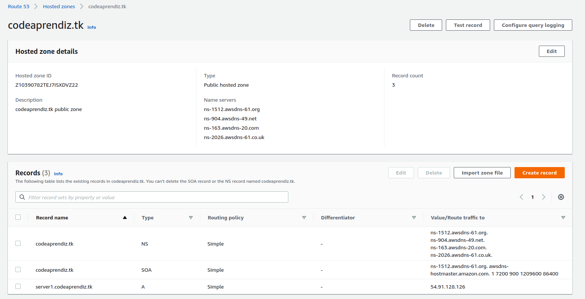
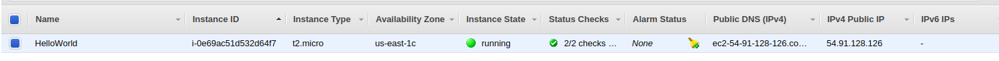

## Objective 

1) To create a DNS "A" record which is pointing to the EC2 instance created in default VPC default subnet.
2) When we do nslookup to the "A" record like `server1.codeaprendiz.tk`, it should resolve the public IP of the instance.

### PRE-REQUISITE
1) First we need to own a domain. So go to the link [https://my.freenom.com/](https://my.freenom.com/) and register a domain.
   I registered `codeaprendiz.tk`
   
   
- Init

```bash
$ terraform init   
```

- Plan

```                                 
$ terraform plan 

Apply complete! Resources: 3 added, 0 changed, 0 destroyed.
.
.
.
```


- Apply
```bash
$ terraform apply
.
Apply complete! Resources: 3 added, 0 changed, 0 destroyed.

Outputs:

devopslink-name-servers = [
  "ns-1512.awsdns-61.org",
  "ns-163.awsdns-20.com",
  "ns-2026.awsdns-61.co.uk",
  "ns-904.awsdns-49.net",
]
devopslink-public-zone-id = Z10390782TEJ7ISXDVZ22
```

- Once applied. You will be able to see the hosted zone as follows



- And the EC2 instance as well




- Now you go the list of nameserver in the output. These nameservers know to what IP address our `A` record `server1.codeaprendiz.tk` resolves to.
  So we will need to go back to [https://my.freenom.com/](https://my.freenom.com/) and manage the domain `codeaprendiz.tk` (specifically go to
  Management Tools -> Nameservers) and give the list of these nameservers there so it know where to look. Once this is completed.


  
  
```bash
$ nslookup server1.codeaprendiz.tk
Server:         127.0.0.53
Address:        127.0.0.53#53

Non-authoritative answer:
Name:   server1.codeaprendiz.tk
Address: 54.91.128.126

$ dig server1.codeaprendiz.tk

; <<>> DiG 9.11.3-1ubuntu1.12-Ubuntu <<>> server1.codeaprendiz.tk
;; global options: +cmd
;; Got answer:
;; ->>HEADER<<- opcode: QUERY, status: NOERROR, id: 12751
;; flags: qr rd ra; QUERY: 1, ANSWER: 1, AUTHORITY: 0, ADDITIONAL: 1

;; OPT PSEUDOSECTION:
; EDNS: version: 0, flags:; udp: 65494
;; QUESTION SECTION:
;server1.codeaprendiz.tk.       IN      A

;; ANSWER SECTION:
server1.codeaprendiz.tk. 300    IN      A       54.91.128.126

;; Query time: 149 msec
;; SERVER: 127.0.0.53#53(127.0.0.53)
;; WHEN: Sat Aug 08 00:42:49 +04 2020
;; MSG SIZE  rcvd: 68
```

