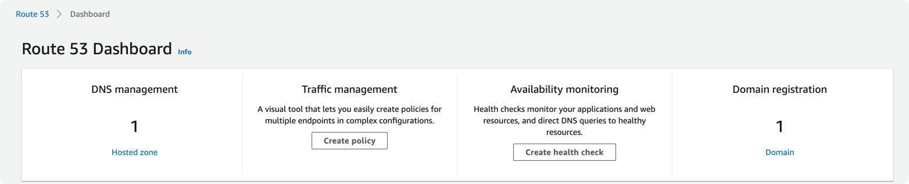
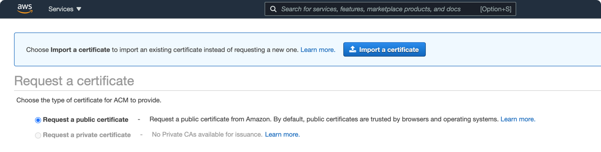
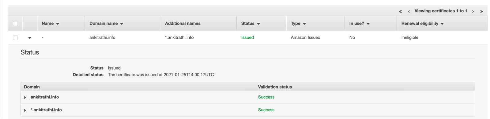

### Objective : Create a private certificate for your Domain using AWS Certificate Manager

#### PRE-REQUISITE
- You own a domain for example in following case I own - `ankitrathi.info`



- You should also have a default hosted zone


#### Let's Begin
- Go to AWS Certificate Manager

- Choose the region as `us-east-1`
```bash
### WHY
Error: error creating CloudFront Distribution: InvalidViewerCertificate: The specified SSL certificate doesn't exist, isn't in us-east-1 region, isn't valid, or doesn't include a valid certificate chain.
        status code: 400, request id: *****
```

- Click on `Get started`


- Now choose `Request a public certificate` and click on `Request a certificate`




- Now add the following domain names (assuming that you own the first domain, for which you are creating the public certificate)
  - ankitrathi.info
  - *.ankitrathi.info

  

- Choose the validation method as `DNS Validation` and hit next


- Give tags if required

- Review and confirm


- Now click on the `Create record in Route 53` for creating the records for validation


  
You will see a success message. Finally click on continue.

- Now you will see that the `Validation` is in pending state

- Wait for sometime and you should see `Validation Complete`. Meanwhile you can go to Route 53 and check the two CNAMES you just added




- Now you can use the certificate `ARN` visible on the above screen where-ever you need.
  It will be of following type
```bash
arn:aws:acm:us-east-1:***********:certificate/*****-****-****-****-********
```


 
