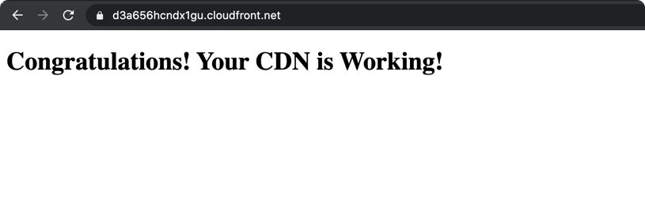

### Objective : Create a CDN using cloudposse module and ensure that sensitive variables are hidden

#### Pre-requisite

- Update values of in `secret.tfvars` as per your configuration (take reference from secret.tfvars.example)
- [Hosted Zone (default hosted zone would do)](../task-011-route53)
- You should own a domain (like in this case I own `ankitrathi.info`)
- [Create a private Certificate for your domain](../task-024-certificate-manager)


#### Let's Begin

- Terraform and Terragrunt versions

```bash
$ terraform --version
Terraform v0.14.4

Your version of Terraform is out of date! The latest version
is 0.14.5. You can update by downloading from https://www.terraform.io/downloads.html

$ terragrunt -version
terragrunt version v0.27.1
```

- Initialize

```bash
$ ./run.sh init
```

- Plan

```bash
$ ./run.sh plan -var-file="secret.tfvars" 
.

Plan: 8 to add, 0 to change, 0 to destroy.

Changes to Outputs:
  + cf-s3-test-domain-name  = (known after apply)
  + cf-s3-test-name         = (known after apply)
  + s3-user-test-access-id  = (sensitive value)
  + s3-user-test-secret-key = (sensitive value)
  + s3-user-test-username   = "backend-dev-test"

```

- Apply the changes

```bash
$ ./run.sh apply -var-file="secret.tfvars"
.
Apply complete! Resources: 8 added, 0 changed, 0 destroyed.

Outputs:

cf-s3-test-domain-name = "backend-dev-test-origin.s3.eu-west-1.amazonaws.com"
cf-s3-test-name = "backend-dev-test-origin"
s3-user-test-access-id = <sensitive>
s3-user-test-secret-key = <sensitive>
s3-user-test-username = "backend-dev-test"
```

### Screenshots




- You can also validate using the curl command

```bash
$ curl https://d3a656hcndx1gu.cloudfront.net/                                        
<!DOCTYPE html>
<html lang="en">
<head>
  <meta charset="UTF-8">
  <title>Working!</title>
</head>
<body>
<h1>Congratulations! Your CDN is Working!</h1>
</body>
</html>
```

- Also checkout the nslookup output

```bash
$ nslookup d3a656hcndx1gu.cloudfront.net                              
Server:         213.42.20.20
Address:        213.42.20.20#53

Non-authoritative answer:
Name:   d3a656hcndx1gu.cloudfront.net
Address: 13.33.93.127
Name:   d3a656hcndx1gu.cloudfront.net
Address: 13.33.93.55
Name:   d3a656hcndx1gu.cloudfront.net
Address: 13.33.93.52
Name:   d3a656hcndx1gu.cloudfront.net
Address: 13.33.93.35
```


- Now to destroy the resources

```bash
$ ./run.sh destroy -var-file="secret.tfvars"
.
Destroy complete! Resources: 8 destroyed.
```