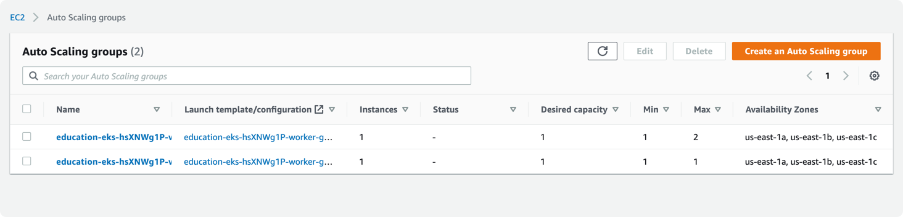

# Learn Terraform - Provision an EKS Cluster

[learn creating eks](https://learn.hashicorp.com/tutorials/terraform/eks)
[vpc](https://registry.terraform.io/modules/terraform-aws-modules/vpc/aws/latest)
[eks](https://registry.terraform.io/modules/terraform-aws-modules/eks/aws/latest)
[spot and on-demand blog](https://aws.amazon.com/blogs/compute/run-your-kubernetes-workloads-on-amazon-ec2-spot-instances-with-amazon-eks/)


- Init

```bash
./run.sh init
```

- Apply 

```bash
./run.sh apply
.
.
Apply complete! Resources: 51 added, 0 changed, 0 destroyed.
.
.

```

- Get the kubeconfig

```bash
$ aws eks --region $(terraform output -raw region) update-kubeconfig --name $(terraform output -raw cluster_name) --kubeconfig kubeconfig
```

- Get the nodes

```bash
$ kubectl get nodes --kubeconfig=./kubeconfig
NAME                         STATUS   ROLES    AGE     VERSION
ip-10-0-1-166.ec2.internal   Ready    <none>   5m2s    v1.20.4-eks-6b7464
ip-10-0-2-82.ec2.internal    Ready    <none>   4m39s   v1.20.4-eks-6b7464


$ kubectl get pods -n kube-system --kubeconfig=./kubeconfig
NAME                       READY   STATUS    RESTARTS   AGE
aws-node-k6btq             1/1     Running   0          4m52s
aws-node-r2rgs             1/1     Running   0          5m15s
coredns-65bfc5645f-lsghg   1/1     Running   0          20m
coredns-65bfc5645f-rw846   1/1     Running   0          20m
kube-proxy-lwxtx           1/1     Running   0          4m52s
kube-proxy-sf5dl           1/1     Running   0          5m15s
```


### Screenshots

- Autoscaling groups



- Launch configuration


- Instances


- Spot requests


